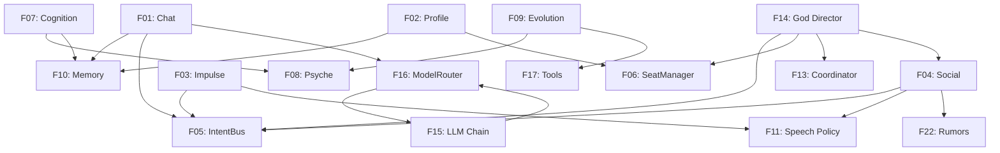

# Sensewright v2 — Complete Recreation Technical Specification

> **Date:** 2026-10-01
> **Scope:** Clean from-scratch recreation of the Sensewright mod (The Sims 4 AI Companion & World Director).
> **Premise:** Every feature is specified for a clean build, without legacy inheritances or fields from v1.
> **Status:** Consolidated and Revised Specification (Architecture, IPC, Save Lifecycle, Dream Engine, Hybrid Cognition, Asymmetric Direction `god.puppeteer`, Native TS4 Integration, and Dual UI).

---

## Table of Contents

1. [Vision & Engineering Principles](#1-vision--engineering-principles)
2. [Architecture, Threading & Dual Clocks](#2-architecture-threading--dual-clocks)
3. [Wire Contract (HTTP) & Transactional Save Lifecycle](#3-wire-contract-http--transactional-save-lifecycle)
4. [F01: Multichannel Chat, `Hidden SimInfo` & Continuous UI](#f01-multichannel-chat-hidden-siminfo--continuous-ui)
5. [F02: Profile Generation & Minute-Zero Bootstrap](#f02-profile-generation--minute-zero-bootstrap)
6. [F03: Initiative / Impulse](#f03-initiative--impulse)
7. [F04: Social Layer & Asymmetric Dialogue](#f04-social-layer--asymmetric-dialogue)
8. [F05: IntentBus](#f05-intentbus)
9. [F06: SeatManager](#f06-seatmanager)
10. [F07: Hybrid Cognition, Native Agenda & Dream Engine](#f07-hybrid-cognition-native-agenda--dream-engine)
11. [F08: Personality System & Psyche](#f08-personality-system--psyche)
12. [F09: Evolution, Demeanor & Native Preferences](#f09-evolution-demeanor--native-preferences)
13. [F10: Memory System, FTS5 & Shadow DB Save Sync](#f10-memory-system-fts5--shadow-db-save-sync)
14. [F11: Speech Policy (Pre-Flight) & Visual Routing](#f11-speech-policy-pre-flight--visual-routing)
15. [F12: Presence Policy & Capability Matrix](#f12-presence-policy--capability-matrix)
16. [F13: Coordinator & Asymmetric Arbitration](#f13-coordinator--asymmetric-arbitration)
17. [F14: God Director, Soft Influence & `god.puppeteer`](#f14-god-director-soft-influence--godpuppeteer)
18. [F15: LLM Provider Chain, TPM & Language Prevention](#f15-llm-provider-chain-tpm--language-prevention)
19. [F16: ModelRouter, Tiers, Scheduler & ContextAssembler](#f16-modelrouter-tiers-scheduler--contextassembler)
20. [F17: Tools, Levers, `ArchetypeResolver` & Native Hooks](#f17-tools-levers-archetyperesolver--native-hooks)
21. [F18: i18n System & Automatic STBL Compilation](#f18-i18n-system--automatic-stbl-compilation)
22. [F19: Observability, Trace ID & Log Rotation](#f19-observability-trace-id--log-rotation)
23. [F20: Build, Deploy & Silent Autoboot](#f20-build-deploy--silent-autoboot)
24. [F21: Dual UI Architecture (Quick Menu + Web Studio)](#f21-dual-ui-architecture-quick-menu--web-studio)
25. [F22: World Layer & Rumor Epidemiology](#f22-world-layer--rumor-epidemiology)
26. [Canonical Catalog of the 33 Purposes](#canonical-catalog-of-the-33-purposes)
27. [Implementation Milestones, Cuts & Safety Nets](#implementation-milestones-cuts--safety-nets)

---

## 1. Vision & Engineering Principles

### 1.1 Mission

Transform every Sim into a sovereign agent with an inner life, dreams, daily routine tied to *The Sims 4* native engine, transactional memory synchronized with the player's save, and an emergent narrative guided by a World Director acting through soft influence on agents and active control over catalyst NPCs — all without mandatory financial cost.

### 1.2 Design Principles

| # | Principle | Engineering Rule |
| --- | --- | --- |
| **P1** | **Two Processes, Zero Blocking** | Mod (Python 3.7, stdlib + S4CL + Lot 51) ↔ HTTP Worker Thread ↔ Sidecar (Python 3.10+, FastAPI, SQLite FTS5). The game's Main Thread (`GAME_TICK`) never executes network I/O. |
| **P2** | **Purposes and Intents, Not Raw Commands** | The LLM emits semantic Intents; the `ArchetypeResolver` and `GameLever` in the Mod translate them into 64-bit Tuning IDs and native TS4 situations. |
| **P3** | **Diegetic Symbiosis with TS4** | The AI never competes with game autonomy, career, or UI; it feeds native Moodlets, Sentiments, Likes/Dislikes, Mailbox, Mirrors, Gravestones, Diary, and Relationships. |
| **P4** | **Asymmetric Direction (Agent Sovereignty)** | The `God Director` never hijacks active household Sims' will (applying only *Soft Influence* via dreams, subtext, and inclination). Hard control (`god.puppeteer`) operates on catalyst NPCs injected into the scene to provoke genuine reactions from agents. |
| **P5** | **Temporal and Transactional Fidelity** | The SQLite database advances or rolls back in exact lockstep with the native game Save (`Shadow DB`) and scales all gameplay timers by the game clock (`clock_speed`). |
| **P6** | **Structural Language Prevention** | No post-generation lexical detectors (`lexicon.json` eliminated). Correct language response is guaranteed by translated enums at input, native *1-shot* examples, and a recency lock on the prompt's final line. |
| **P7** | **Two-Layer Configuration & 0-Key Fallback** | Layer 1 = providers, secrets, and API limits (RPM/RPD/TPM). Layer 2 = routes, tiers, and gameplay budgets. Every generator possesses a deterministic localized fallback to operate even without an API key. |

---

## 2. Architecture, Threading & Dual Clocks

```
┌─ The Sims 4 (Game Process - Python 3.7) ─────────────────┐      ┌─ Sidecar (FastAPI, 127.0.0.1:8765 - Python 3.12+) ──────┐
│ Main Thread (GAME_TICK - Lot 51):                        │      │  routers/          → lifecycle / chat / autonomy / god  │
│  ├─ state_collector (pulse deltas, census, events)       │      │  LLMScheduler      → single queue, tiers, SLOs, deep win│
│  ├─ tool_executor   (GameLever, ArchetypeResolver)       │      │  ContextAssembler  → profile slicing & TPM budget cap   │
│  ├─ native_hooks    (Hidden SimInfo, Diary, Sentiments)  │      │  ModelRouter       → purpose → RoutePlan                │
│  ├─ ui_manager      (4 visual channels, Chained chat)    │      │  ProviderChain     → RPM/RPD/TPM, circuit breaker, swap │
│  └─ in-memory queues (outbound_q / inbound_intents_q)    │      │  SaveVault         → Working DB ↔ Committed DB + FTS5   │
│         │▲ ( < 0.1ms lock-free )                         │      │  WebStudio (/ui)   → Inspector SPA, Script & Setup      │
│ Worker Threads (outbound worker + inbound delivery):     │ HTTP │                                                         │
│  └─ urllib.request ──────────────────────────────────────┼─────▶│                                                         │
└──────────────────────────────────────────────────────────┘      └─────────────────────────────────────────────────────────┘
```

### Architecture Requirements (`REQ-ARCH-*`)

* **REQ-ARCH-01 (Mod Thread Isolation):** The `GAME_TICK` callback on TS4's Main Thread only deposits payloads into the outbound lanes (bounded realtime FIFO + coalescing slots) and consumes `inbound_intents_q` (`get_nowait()`). All HTTP communication takes place in **at most two** secondary daemon threads: the outbound worker and a single inbound delivery thread (today the idle intent pull; later SSE + pull fallback in the same thread). No network thread may block indefinitely (`timeout=None` is forbidden) so TS4 shutdown never hangs.
* **REQ-ARCH-02 (Python 3.7 Constraints):** Code in `sensewright_mod` must not contain `:=` (walrus), `match/case`, union types (`int | str`), `from __future__ import annotations`, or third-party libraries outside S4CL and Lot 51 Core.
* **REQ-ARCH-03 (Dual-Clock Rule):**
  * **Wall-Clock (Real Seconds):** Used exclusively for infrastructure (HTTP timeouts, tier SLOs, RPM/RPD/TPM rate limits, and circuit breaker).
  * **Sim-Clock (`world_sim_tick` / `sim_minutes`):** Used for all gameplay mechanics (balloon delay `delay_sim_minutes`, scene duration, social cooldowns, Intent TTL, and memory/psyche decay).
  * **Canonical tick unit:** `TICKS_PER_SIM_MINUTE = 1000` (`TICKS_PER_SIM_DAY = 1,440,000`). Every conversion between sim-minutes/days and `world_sim_tick` must use these constants; raw arithmetic that assumes `1 tick = 1 sim-minute` is forbidden. Wire fields expressed in sim-minutes (`delay_sim_minutes`, `ttl_sim_minutes`, `lease_min_sim_minutes`) stay in sim-minutes and are converted only at the point of comparison with a tick.
* **REQ-ARCH-04 (Pause Freeze):** When `clock_speed == 0` (game paused), the Intent dispatcher in the Mod freezes delay counters and suspends autonomy pulse transmissions.
* **REQ-ARCH-05 (Interaction Injection):** Because the Mod structurally depends on `S4CL` and `Lot 51 Core`, programmatic interaction injections should primarily utilize native mechanisms of these libraries (e.g., *Interaction Registration* and *Snippet Injections*). However, `XML Injector` remains an explicitly permitted fallback option if purely scriptless XML Tuning injection is desired.

---

## 3. Wire Contract (HTTP) & Transactional Save Lifecycle

### 3.1 Complete Endpoints Table (`/v1/*` + `/ui`)

| Endpoint | Method | Input Payload | Response |
| --- | --- | --- | --- |
| `/v1/lifecycle/attach` | POST | `{game_pid}` | `{ok: true}` (arms termination watchdog) |
| `/v1/lifecycle/session-start` | POST | `{player_id, save_id, world_sim_tick, lang}` | `{ok, restored_tick, bootstrap_needed, recap_job_id}` |
| `/v1/lifecycle/zone-transition` | POST | `{player_id, save_id, new_zone_id, world_sim_tick}` | `{ok, cleared_spatial_intents}` |
| `/v1/lifecycle/save` | POST | `{player_id, save_id, previous_save_id?, world_sim_tick}` | `{ok, committed_tick, snapshot_rev}` |
| `/v1/census` | POST | `{player_id, save_id, world_sim_tick, sims[{sim_id, name, species, age_stage, traits, likes, dislikes, career, schedule_blocks, family_links, household_id, is_player}], households[], relationships[]}` | `{ok, hydrated_count}` |
| `/v1/autonomy/tick` | POST | `{trace_id, player_id, save_id, world_sim_tick, clock_speed, active_sim_id, player_confidant_sim_id, sims_delta[{sim_id, mood, needs, room_id, pos, activity, queue, is_sleeping, is_off_lot_duty, wants, obligatory_tasks}], lang}` | `{ok, scheduled, intents[], social_sessions[]}` |
| `/v1/autonomy/intents` | GET | `?player_id=&save_id=&world_sim_tick=` | `{intents[]}` |
| `/v1/chat` | POST | `{trace_id, sim_id, channel("phone_sms"|"pc_chat"|"pc_email"), player_id, save_id, world_sim_tick, message, lang}` | `{response, thought, intents[], trust_delta, deferred:bool, message_key?}` |
| `/v1/hey` | POST | Fast alias of `/v1/chat` (`channel="phone_sms"`) | Same as `/v1/chat` |
| `/v1/events` | POST | `{trace_id, sim_id, target_sim_id?, player_id, save_id, world_sim_tick, event_category, content{}, impact, witnesses[], lang}` | `{ok, salience, triggered_jobs[]}` |
| `/v1/profile` | POST | `{sim_id, player_id, save_id, seed?, force_interactive:bool, lang}` | `{profile{}}` |
| `/v1/evolve` | POST | `{sim_id, player_id, save_id, world_sim_tick, trigger("sleep"|"mirror"), lang}` | `{reflection{}, demeanor_drift?, preference_change?, trait_proposal?}` |
| `/v1/memory/consolidate` | POST | `{sim_id, player_id, save_id, world_sim_tick, lang}` | `{consolidated{}}` |
| `/v1/god/tick` | POST | `{trace_id, player_id, save_id, world_sim_tick, lang}` | `{directives[], active_arc{}, active_catalyst_leases[]}` |
| `/v1/god/direct-scene` | POST | `{player_id, save_id, world_sim_tick, catalyst_sim_ids[], target_sim_ids[], prompt_text, mode("soft_catalyst"|"sandbox_full"), lang}` | `{ok, scene_id, intents[]}` |
| `/v1/god/arc/steer` | POST | `{player_id, save_id, action("approve_beat"|"skip_beat"|"rewrite_beat"|"abort_arc"), beat_id?, custom_instruction?, lang}` | `{ok, updated_arc{}}` |
| `/v1/god/controls` | GET/POST | GET: — / POST: `{key, value}` | `{controls[{key, category, type, value, options, label, description}]}` |
| `/v1/god/zeitgeist` | POST | `{player_id, save_id, zeitgeist_text, lang}` | `{tags[], preset, weather_preference}` |
| `/v1/agency/seats` | GET/POST | POST: `{seats: int}` | `{seats[{sim_id, role, tier, lease_expires_tick}], pool}` |
| `/v1/config/player-activity` | POST | `{player_id, save_id, idle: bool, clock_speed: int}` | `{deep_window_open: bool}` |
| `/v1/config/lang` | POST | `{lang}` | `{ok, active_locale}` (Sets active language and reloads translations) |
| `/v1/health` | GET | — | `{status: "ok", version, game_pid}` |
| `/v1/status` | GET | — | `{chain[], providers{}, limits{}, pool{}, routes{}, tiers{}, queue{}, active_save}` |
| `/v1/i18n/reload` | POST | — | `{ok, reloaded_locales[]}` (Hot-reload locale files without restarting game) |
| `/v1/i18n/compile-addon` | POST | `{locale}` | `FileResponse` (.package STBL for specified locale) |
| `/ui` | GET | — | Serves the `Sensewright Web Studio` (local HTML/JS/CSS SPA) |

### Wire Contract Requirements (`REQ-WIRE-*`)

* **REQ-WIRE-01 (Delta Tick + Integrated Pull):** The `POST /v1/autonomy/tick` endpoint transmits volatile data only (`sims_delta`) and returns ready `intents[]` directly within its response, eliminating duplicate HTTP round-trips. Static data (`traits`, `career`, `species`, `age_stage`) travels only via `/v1/census` or upon change.
* **REQ-WIRE-02 (Strict Sanitization):** Every payload passes through `_sanitize_payload` ensuring JSON primitives only (`int`, `float`, `str`, `bool`, `list`, `dict`), 1 canonical key per argument (zero aliases), and a mandatory `lang` language code.
* **REQ-WIRE-03 (Confidant Identity Persistence):** The Sidecar must persist `player_confidant_sim_id` (received on `/v1/autonomy/tick`) in the save's SQLite `metadata` table and return it in the `/v1/lifecycle/session-start` response, so the Mod resolves the Hidden SimInfo by ID instead of a last-name search and can garbage-collect duplicate confidants (BUG-12). *Status: not yet implemented — the Sidecar currently ignores the field (doc-review ACT-01).*

---

## F01: Multichannel Chat, `Hidden SimInfo` & Continuous UI

### Description

The player acts within the game universe as a **Remote Digital Confidant** (virtual friend / out-of-town advisor) natively represented in the engine by a hidden `SimInfo` (Model A), conversing with Sims via **Phone (`phone_sms`)** or **Computer (`pc_chat` / `pc_email`)**.

### Detailed Implementation

#### 1. Native Representation (`Hidden Household SimInfo` — Model A)

* During save bootstrap, the Mod creates (or retrieves) a dedicated `SimInfo` in a hidden household (`hidden = True`) equipped with the physical spawn blocking trait `Trait_Hidden_NoWalkby` and anti-culling protection (`player_confidant_sim_id`).
* **Automatic Native Integration:**
  * Appears in the Sims' **Relationships** panel under the player's chosen name.
  * Chatting natively increases the Sim's **Social (`motive_social`)** and **Fun** motive bars.
  * The native friendship bar rises or falls based on the conversation's `trust_delta` and displays native **Sentiments** toward the player (*Adoration, Closeness, Hurt, Grudge*).
  * The TS4 Wants engine spontaneously generates the native want *"Text [Player]"* when the Sim feels tense, sad, or lonely.

#### 2. Channels & Context Slicing

| Channel | Physical TS4 Action | Loaded Profile Template | Behavior |
| --- | --- | --- | --- |
| **`phone_sms`** | Sim holds phone (`phone_Text`) | **Micro-Profile (~250 tok):** Only `speech_style`, mood, current activity, critical need, and trust level with the player. | Short response (1–2 colloquial sentences). If Sim is sleeping (`is_sleeping`) or at work/school (`is_off_lot_duty`), returns an automated busy note (`deferred = true`) and delivers the actual answer when the Sim wakes up or returns. |
| **`pc_chat` / `pc_email`** | Sim sits at computer typing (`computer_Chat`) | **Deep-Profile (~1,200 tok):** Full profile, `core_personality`, `current_demeanor`, `life_story`, `psyche_blocks`, `dream_residue`, `daily_plan`, and FTS5 memories. | Dense, confessional response (2–5 sentences). The Sim vents about traumas, narrates morning dreams, asks for advice, and may adopt new goals in their `Daily Plan`. |

#### 3. Epistemic Bond Progression (`Player Persona`)

* **Level 1 (`Acquaintance`, Friendship < 25):** The Sim barely knows the player, keeps deep `secrets[]` guarded, and asks questions.
* **Level 2 (`Confidant`, Friendship 25–65):** Shares daily dilemmas and neighborhood rumors. `mem.consolidate` extracts player facts (`player_facts[]`) for future recall.
* **Level 3 (`Advisor / Soulmate`, Friendship > 65):** Confides traumas (`F08`), deepest secrets, and accepts direct daily goal changes (`set_goal`).

#### 4. Continuous UI Loop & Short-Term Buffer

* **Short-Term Chat Buffer:** Keeps the last 8 conversation turns in RAM as structured `user`/`assistant` messages until 300s of silence triggers `mem.consolidate`.
* **Chained UI Workflow:**
  1. Upon sending a message, the Sim immediately displays a native thought balloon with ellipses (`...`) showing they are typing.
  2. The response arrives in a notification with the Sim's portrait and a native action button **`[↩️ Reply Now]`** (`ui_responses`).
  3. Clicking `[Reply Now]` instantly re-opens the `UiDialogTextInputOkCancel` modal with **the Sim's latest line in the dialog header**, allowing 10 consecutive dialogue turns without having to re-click the Sim.

### F01 Requirements (`REQ-CHAT-*`)

* **REQ-CHAT-01:** `[thought]...[/thought]` is extracted, saved as private memory, and never shown in the UI.
* **REQ-CHAT-02:** Clean dialogue, free of asterisks, respecting channel boundaries (`phone_sms` $\le 2$ sentences; `pc_chat` $\le 5$ sentences).
* **REQ-CHAT-03:** Realistic asynchrony: Sims sleeping or in work/school *rabbit holes* do not reply to `phone_sms` in real-time; the reply is deferred until the Sim becomes available.
* **REQ-CHAT-04:** All tool calls emitted in chat are fire-and-forget (directly converted into Intents, without a second HTTP round-trip).
* **REQ-CHAT-05:** The player's `Hidden SimInfo` must never physically instantiate on any lot (`Trait_Hidden_NoWalkby`).

---

## F02: Profile Generation & Minute-Zero Bootstrap

### Description

Generates the Sim identity JSON (`PROFILE_SHAPE`), decoupling immutable essence (`core_personality`) from current life phase (`current_demeanor`) and populating newly seated Sims without choking rate limits.

### Canonical `PROFILE_SHAPE`

```json
{
  "name": "",
  "species": "HUMAN",
  "age_stage": "YOUNGADULT",
  "backstory": "",
  "core_personality": "",
  "current_demeanor": "",
  "speech_style": "",
  "goals": [],
  "secrets": [],
  "quirks": [],
  "traits": [],
  "likes": [],
  "dislikes": [],
  "life_story": [],
  "source": "template|llm",
  "generated_at_tick": 0
}
```

### F02 Requirements (`REQ-PROF-*`)

* **REQ-PROF-01:** `normalize_profile(raw)` ensures every profile is consistently valid, populating missing keys with safe defaults.
* **REQ-PROF-02:** Native game data (`traits`, `likes`, `dislikes`, `age_stage`, `career`) constitutes non-negotiable *ground truth*.
* **REQ-PROF-03 (Two-Stage Bootstrap):** When newly seated Sims arrive on a lot, they receive an instantaneous deterministic `fallback_profile` (`source="template"`) at tick 0 and enter the **`bg`** queue for LLM generation. The **`interactive`** tier is used only if the player triggers `/v1/chat` or executes `sw.profile` on that Sim before the background job completes.
* **REQ-PROF-04 (Diegetic Revelation):** Running the native social interaction **"Get to Know" (`sim_GetToKnow`)** between two Sims progressively unlocks entries from `secrets[]` and `backstory` into `relationships.known_secrets`.

---

## F03: Initiative / Impulse

### Description

Autonomous thinking and action initiative for Sims with an active seat in the `full` tier.

### F03 Requirements (`REQ-IMP-*`)

* **REQ-IMP-01:** The `idle` impulse produces internal thoughts only (`[thought]...[/thought]`) and at most 1 non-verbal Intent (`set_mood`, `bias_interaction`, `act_out`, `queue_interaction`). **It never emits speech.**
* **REQ-IMP-02:** The `reaction` impulse (triggered by events with `salience >= 1.5`) is allowed to emit a `speak` Intent directed at the instigator.
* **REQ-IMP-03 (Survival & Punctuality Guard):** If any basic need is critical (`< -70`) or less than **45 in-game minutes** remain before work or school (`schedule_blocks`), `sim.impulse` is prohibited from issuing physical actions, yielding full priority to TS4 native autonomy.
* **REQ-IMP-04:** In the `realtime` tier, `thinking_budget = 0` (no prolonged hidden reasoning) and `IMPULSE_MAX_TOKENS = 200`.
* **REQ-IMP-05:** Any text generated outside `[thought]...[/thought]` tags in `idle` mode is stripped via regex.

---

## F04: Social Layer & Asymmetric Dialogue

### Description

Generates contextual multi-turn dialogue between pairs of Sims natively conversing in-game, supporting rumor propagation and asymmetric clashes between Sovereign Agents and Puppeteer NPCs.

### Detailed Implementation

1. **Pre-Flight Gate (Prior to LLM):** Verifies both Sims are eligible under the `Capability Matrix` (`HUMAN`, `CHILD+`), share the same `room_id`, stand $\le 4.0	ext{m}$ apart, reside within `hearing_radius` ($\le 20.0	ext{m}$ from the active Sim), and stay below the lines-per-minute threshold defined in **F11**. If the hearing gate fails, logs deterministic memory without invoking the LLM.
2. **Dialogue Modes:**
   * **Symmetric (`Agent` $\leftrightarrow$ `Agent`):** Both Sims speak according to their individual personalities, moods, and relationship history (`P29`).
   * **Asymmetric (`Sovereign Agent` $\leftrightarrow$ `Puppet NPC`):** When one Sim holds a catalyst lease from `god.puppeteer` (`P18`), the prompt directs the NPC to steer the exchange toward the `puppeteer_objective` (e.g., *dig for a secret, sow discord, flirt*), whereas the Sovereign Agent responds freely following their own psyche and morals.
3. **Pacing and Visual Grouping:**
   * The output JSON `{"a_line": "...", "b_line": "...", "topic": "...", "event_summary": "...", "impact": 0.0-2.0}` produces balloons with staggered `delay_sim_minutes` on Sim B and surfaces a **single Compact Dialogue Card** containing both spoken lines together.

### F04 Requirements (`REQ-SOC-*`)

* **REQ-SOC-01:** Sims never hold conversations across rooms or through walls (`room_id` check + maximum distance of $4.0	ext{m}$).
* **REQ-SOC-02:** If Sim A knows a `RumorNode` (`P24`) unknown to Sim B and the social tone is compatible (`friendly`, `gossip`, `mean`), the rumor enters dialogue and infects Sim B upon conclusion.
* **REQ-SOC-03:** Session teardown (`sim.social.close`) executes on the `bg` tier (preventing blocking on the `realtime` tier).

---

## F05: IntentBus

### Description

Unified bus through which Agents, the Social Layer, and the God Director transmit semantic action intentions to the Mod.

### Canonical Intent Shape

```json
{
  "id": "hex-uuid",
  "trace_id": "tr_9a8f12",
  "sim_id": 12345,
  "kind": "speak | approach | set_mood | bias_interaction | prefer_target | set_goal | command | spawn_npc",
  "target_sim_id": 67890,
  "params": {"text": "...", "tone": "friendly", "archetype": "..."},
  "thought": "...",
  "narration": "...",
  "delay_sim_minutes": 0.0,
  "ttl_sim_minutes": 15.0,
  "expires_on": "ttl | next_sleep | zone_transition",
  "priority": 0,
  "source": "agent | god | puppeteer | social"
}
```

### F05 Requirements (`REQ-INT-*`)

* **REQ-INT-01:** No legacy fields (root `name`/`args` eliminated).
* **REQ-INT-02:** Physical/social Intents (`speak`, `approach`, `command`) expire at `ttl_sim_minutes = 15.0` or immediately upon `zone_transition`. Cognitive Intents (`bias_interaction`, `prefer_target`, `set_goal`) expire at `next_sleep`.
* **REQ-INT-03:** `command` is an escape-hatch restricted strictly to world levers lacking behavioral mapping.
* **REQ-INT-04 (Memory Is Sidecar-Internal):** `remember` / `forget` are **not** Intent kinds. Memory lives in the Sidecar (SQLite + FTS5), so these operations write/archive rows in the `memories` table directly inside the Sidecar (and are exposed to MCP clients as `sim.remember` / `sim.forget`). They never travel through the IntentBus nor execute on the TS4 main thread. *Transition: the Mod still accepts the legacy wire kinds as a no-op until they are removed from `INTENT_KINDS`.*

---

## F06: SeatManager

### Description

Oversees the finite agent seat pool (`agent_seats`, default 12).

### F06 Requirements (`REQ-SEAT-*`)

* **REQ-SEAT-01:** Strict priority: Active household (`household`) > Active Arc Catalyst NPCs (`catalyst`) > Close visitors > Casual visitors.
* **REQ-SEAT-02 (Anti-Thrashing Protection):** A visitor is **never** evicted while engaged in an active `ConversationSession` (F04), acting as a scene catalyst (`god.puppeteer`), or within their minimum lease duration (`lease_min_sim_minutes = 60`).
* **REQ-SEAT-03 (Distance Eviction):** When pool vacancy is required, the evicted visitor is the eviction-eligible Sim **physically furthest from the active Sim** without active social interaction.

---

## F07: Hybrid Cognition, Native Agenda & Dream Engine

### Description

Couples Sim planning with native TS4 responsibilities (work, school, daily tasks, *Wants & Fears*) and uses the **Dream Engine (`sim.dream`)** to inject narrative entropy and break robotic routine loops.

### 10.1 Dream Engine (`P07: sim.dream`)

Runs during sleep windows prior to `sim.cognition`. Blends 4 weighted inputs scaled by the **Surrealism** index:

$$	ext{Surrealism} = 	ext{clamp}_{0..1}\left(	ext{Base}_{	ext{traits}} + (	ext{God}_{	ext{chaos}} 	imes 0.4) + (	ext{Psyche}_{	ext{trauma}} 	imes 0.3) + 	ext{Mood}_{	ext{stress}}
ight)$$

1. **Daytime Residue (0.40):** High-intensity events from the past 24 hours.
2. **Déjà Vu / Shadow (0.25):** Faded memory (`strength < 0.2`) retrieved from F10 or active `Psyche Block` from F08.
3. **God Whisper (`god_whisper`, 0.20):** Omen or temptation injected by the active God Director Arc (Soft Influence).
4. **Zeitgeist (0.15):** Neighborhood thematic tags.

**Dream Output & Native Coupling:**

```json
{
  "archetype": "epiphany | surreal | omen | nightmare",
  "dream_narrative": "First-person narration of the dream...",
  "wakeup_mood": "inspired | tense | flirty | sad | dazed",
  "dream_urge": {"goal": "Divert from routine to search for Bella or paint something bizarre", "weight": 0.8}
}
```

* **Base Game Effects:**
  1. Alters thought balloon icons while the Sim sleeps (`balloon_requests`).
  2. Upon waking, applies a **Native Morning Moodlet** (*"Echoes of a Dream"*, *"Vivid Nightmare"*, *"Morning Epiphany"*) whose **native UI tooltip** displays `dream_narrative` (zero intrusive popups).
  3. If `dream_urge.weight > 0.7`, overrides a free block in the `Daily Plan` to break routine.

### 10.2 Three-Layer Routine & Autonomy Arbitration (`P08: sim.cognition`)

`sim.cognition` ingests `schedule_blocks[]` (work/school hours), `obligatory_tasks[]` (career daily task/homework), `native_wants[]`, and `dream_urge`:

```json
{
  "day_focus": "Finish painting before 2 PM shift, but unsettled by the dream.",
  "attitude_toward_duty": "compliant | procrastinating | overwhelmed",
  "blocks": {
    "morning": {"goal": "Paint 1 canvas (Daily Task)", "linked_native": "career_daily_task", "done": false},
    "afternoon": {"goal": "Work Shift (2 PM - 8 PM)", "linked_native": "hard_schedule", "done": false},
    "evening": {"goal": "Follow dream urge and visit the lounge", "linked_native": "dream_urge", "done": false}
  },
  "autonomy_biases": ["painting", "social_friendly"]
}
```

### F07 Requirements (`REQ-COG-*` & `REQ-DRM-*`)

* **REQ-DRM-01:** Every active household Sim who sleeps processes `sim.dream` (with deterministic fallback on 0-key) and wakes up with the matching Moodlet carrying dream text in its tooltip.
* **REQ-COG-01:** The daily plan is split into time blocks (`morning`, `afternoon`, `evening`), each containing a `"done": bool` flag updated automatically when `state_collector` detects task completion.
* **REQ-COG-02 (Soft Steering of Native Autonomy):** `autonomy_biases[]` emit `bias_interaction` Intents, applying hidden *Commodity Buffs* from `Sensewright.package` so TS4 native autonomy naturally favors target objects on the lot.
* **REQ-COG-03 (`is_off_lot_duty`):** While Sims are off-lot at work/school (*rabbit hole*), local impulses and speech remain suspended.

---

## F08: Personality System & Psyche

### Description

Manages psychological blocks (`trauma` and `belief`) scaled from `0.0` to `1.0` alongside cumulative biography (`Life Story`).

### F08 Requirements (`REQ-PSY-*`)

* **REQ-PSY-01 (Structured Metadata Salience):** Salience never relies on keyword parsing; it is calculated from base weights of native `event_category` (`death=2.5`, `betrayal=2.2`, `fire=2.0`, `romance=1.6`, `promotion=1.4`) plus generator-emitted `impact`. Events with `salience >= 1.5` spawn or reinforce `Psyche Blocks`.
* **REQ-PSY-02:** Exponential decay $I(t) = I_0 \cdot e^{-\lambda \cdot \Delta	ext{sim\_days}}$ strictly uses in-game time (`sim_tick`). Blocks falling below `0.05` are pruned.
* **REQ-PSY-03:** `Life Story` is capped at 20 lines / 2,000 characters total (injecting the 5 most salient lines into `ContextAssembler`).

---

## F09: Evolution, Demeanor & Native Preferences

### Description

Reflects on experienced events to evolve the Sim's demeanor (`current_demeanor`), update **native Likes/Dislikes**, and propose personality trait adjustments.

### F09 Requirements (`REQ-EVO-*`)

* **REQ-EVO-01 (Essence Immutability):** `evo.reflect` executes at most 1x per sleep cycle (or when the Sim performs the physical **"Reflect / Psych Self Up" interaction at a Mirror**). It never mutates `core_personality`; it only updates `current_demeanor`, preventing model collapse caused by iterative rewrites.
* **REQ-EVO-02 (Native Likes and Dislikes Evolution):** When a Sim gathers intensely positive or traumatic experiences around an activity, `evo.trait` natively adds or removes **Likes/Dislikes** in Base Game `trait_tracker` (e.g., *Likes Painting*, *Dislikes Cooking*).
* **REQ-EVO-03 (Core Trait Swap Proposal):** When a `Psyche Block` sustains intensity $> 0.85$ across 3+ in-game days, it triggers a `SPECIAL_MOMENT` notification with interactive buttons **`[Accept Change]`** / **`[Reject]`** to swap a primary trait.

---

## F10: Memory System, FTS5 & Shadow DB Save Sync

### Description

Persistence in SQLite with native full-text search via **FTS5 (BM25)**, gradual memory decay, and strict transactional synchronization with *The Sims 4* Saves.

### 13.1 SQLite Database Tables (`slot_<save_id>.db`)

* `metadata`: `{save_id, world_sim_tick, last_committed_at, schema_version}`
* `memories`: `{id, sim_id, type, content(JSON), search_text, importance, strength, created_sim_tick, last_accessed_sim_tick, consolidated, archived}` + Virtual Table **`memories_fts` (FTS5 BM25)** indexing `search_text`.
* `relationships`: `{sim_id, target_id, friendship, romance, known_traits(JSON), known_secrets(JSON), dynamic_label, qualitative_note, updated_sim_tick}`
* `sims`: `{sim_id, profile(JSON), background, updated_sim_tick}`
* `arcs`: `{id, theme, beats(JSON), current_beat_idx, cast(JSON), status, created_sim_tick}`
* `neighborhoods`: `{save_id, zeitgeist(JSON), chronicles(JSON), rumors(JSON), updated_sim_tick}`

### 13.2 Transactional Synchronization with Native Save (`Shadow DB`)

Within `data/saves/`, each TS4 save slot operates with transactional isolation using `sqlite3.Connection.backup()` (< 5ms):

1. **`slot_<save_id>.committed.db` (Vault):** Exact state from the player's last confirmed "Save Game" in TS4.
2. **`slot_<save_id>.working.db` (Active Session):** Working copy where all reads and writes occur during gameplay.
3. **`slot_<save_id>.rev1..rev3.db` (Ring Buffer):** Last 3 saved checkpoints indexed by `world_sim_tick`.

### F10 Requirements (`REQ-MEM-*`)

* **REQ-MEM-01 (Discard on Exit Without Saving):** Upon receiving `/v1/lifecycle/session-start` (save load from Main Menu), the Sidecar discards any lingering `.working.db`, clones `.committed.db` $
ightarrow$ `.working.db`, and clears all in-memory buffers (`IntentBus`, `Short-Term Chat Buffer`, `ConversationManager`).
* **REQ-MEM-02 (Preservation Across Zone Travel):** Upon receiving `/v1/lifecycle/zone-transition` (travel between lots within the same session), `.working.db` is preserved untouched; only lot-specific sessions and spatial intents are cleared.
* **REQ-MEM-03 (Commit and "Save As..."):** Upon receiving `/v1/lifecycle/save`, flushes in-memory buffers to `.working.db` and promotes `.working.db` $
ightarrow$ `.committed.db`. If `previous_save_id != save_id` (*Save As*), preserves the old `committed.db` and initializes the new slot pair.
* **REQ-MEM-04 (Backup Rewind `.ver0`):** If on `session-start` the game's `world_sim_tick` is lower than `.committed.db`, restores the matching snapshot from the Ring Buffer (`rev1..rev3`) or executes `rewind_to_tick(world_sim_tick)`.
* **REQ-MEM-05 (Zero-Dependency FTS5 Search):** When `embeddings = "none"`, memory recall uses `memories_fts` with native SQLite BM25 ranking.
* **REQ-MEM-06 (Safe Retention):** The 180 in-game day pruning pass deletes trivial raw records only (`archived = true AND importance < 1.0`). Consolidated memories, compacted summaries, diaries, and legacy milestones are never deleted.

---

## F11: Speech Policy (Pre-Flight) & Visual Routing

### Description

Filters when Sims may audibly/visibly speak and routes every output type to its appropriate visual channel, eliminating notification board clutter.

### F11 Requirements (`REQ-SPE-*` & `REQ-UI-*`)

* **REQ-SPE-01 (Pre-Flight Gate):** Limits `hearing_radius` ($20.0	ext{m}$ of active Sim), `max_lines_per_minute` (12), and `min_interval_between_lines` (30s) are checked **before** submitting speech jobs to `LLMScheduler`.
* **REQ-SPE-02 (4 Visual Channel Routing):**
  1. **Silent Channel (Tooltips & Objects):** `idle` thoughts (`P03`), Dreams (`P07`), Diary (`P10`), Biography (`P11`), and Chronicle (`P23`) never create screen popups; they remain in Moodlet Tooltips, Mailboxes, and objects.
  2. **Compact Social Channel (`visual_type = SPEECH`):** `F04` dialogues bundle lines from Sim A and Sim B into a single compact card per turn.
  3. **Director Channel (`visual_type = SPECIAL_MOMENT`):** God narrations (`P20`), Recaps (`P32`), Scene Clapperboards, and Trait swap proposals (`P31`) use an amber/purple banner.
  4. **Phone/PC Channel (`information_level = SIM`):** Chat responses (`F01`) and SMS gossip (`P24`) present the Sim's 2D portrait alongside the interactive **`[Reply]`** button.

---

## F12: Presence Policy & Capability Matrix

### Description

Establishes agency tiers for visitors (`full`, `reactive`, `off`) and enforces capability constraints by species and life stage.

### F12 Requirements (`REQ-PRE-*`)

* **REQ-PRE-01:** Visitors with `friendship >= 20.0` across relationships `family`, `friend`, `romantic`, `spouse`, or `partner` are promoted from `reactive` to `full`.
* **REQ-PRE-02 (Capability Matrix):**
  * `BABY`: Excluded from `SeatManager`.
  * `INFANT` / `TODDLER` and `DOG` / `CAT` / `HORSE`: Instinctual/sensory thoughts only and `set_mood`; blocked from verbal `F04 Social` and `F07` career duties.
  * `CHILD`: Absolute hard-block on `flirty` and `intimate` social categories; agenda limited to school and play.

---

## F13: Coordinator & Asymmetric Arbitration

### Description

Ensures the player holds overriding priority, household Agents preserve cognitive sovereignty, and `god.puppeteer` controls Catalyst NPCs exclusively.

### Control Leases Matrix

| Priority | Lease | Permitted Target | Behavior |
| --- | --- | --- | --- |
| **1 (Highest)** | `PLAYER_MANUAL` | Any Sim | Any manual player click on a Sim aborts active AI actions on that Sim and locks autonomy for `player_lock_seconds` (15s). |
| **2 (Sandbox)** | `SANDBOX_OVERRIDE` | Any player-selected Sim | Active **only** when the player explicitly invokes the *"Direct Scene Here (Sandbox Mode)"* tool. As an explicit player order it preempts every AI lease below. |
| **3 (Catalyst)** | `GOD_CATALYST_PUPPET` | **NPCs / Visitors Only** assigned by God (`catalyst_sim_ids`) | `god.puppeteer` takes direct control of the NPC (moving them to the lot, engaging a Sovereign Agent, and driving a dramatic objective in dialogue). |
| **4 (Agent)** | `SOVEREIGN_AGENT` | Active household Sims, `full` seats and Agency MCP seats | Act 100% on their own volition (`sim.impulse`, `sim.reaction`, `sim.social`). Receive only **Soft Influence** from the God Director. |
| **5 (Lowest)** | `RULE_AUTOMATION` | Any Sim targeted by a user rule (MCP `rules`) | Soft Influence only, or physical action only while the Sim is `idle`, always honoring REQ-IMP-03. |

### F13 Requirements (`REQ-COORD-*`)

* **REQ-COORD-01:** The `God Director` in autonomous mode never cancels or overrides a `SOVEREIGN_AGENT` action queue; it acts upon agents solely via *Soft Influence* and through Catalyst NPCs (`GOD_CATALYST_PUPPET`).
* **REQ-COORD-02:** `GOD_CATALYST_PUPPET` and `SOVEREIGN_AGENT` target disjoint Sim sets (catalyst NPCs vs. household/`full` seats); a numerically higher catalyst priority therefore never grants God control over an agent.
* **REQ-COORD-03:** Lease durations are configured in sim-minutes and converted to ticks with `TICKS_PER_SIM_MINUTE` (REQ-ARCH-03).

---

## F14: God Director, Soft Influence & `god.puppeteer`

### Description

Invisible director orchestrating narrative arcs, shaping neighborhood atmosphere (`Zeitgeist`), exerting **Soft Influence** over Sovereign Agents, and puppeteering **Catalyst NPCs (`god.puppeteer`)** to trigger organic dramatic situations.

### 17.1 The 4 Levers of Soft Influence (Over Sovereign Agents)

1. **Dream Whispers (`god_whisper` $
ightarrow$ `P07: sim.dream`):** Seeds omens, temptations, or paranoia into the Sim's dream on the night preceding a Beat.
2. **Spatial and Thematic Gravity (`prefer_target` + `bias_interaction`):** Applies subtle *Commodity Buffs* encouraging native autonomy to seek specific targets or activities.
3. **Subtext Injection (`scene_subtext` in `ContextAssembler`):** Adds 1 line of environmental perception to the Agent's prompt (e.g., *"You sense an uneasy tension whenever {Name} checks their phone"*). The Agent decides how to react.
4. **World Pressure (`set_weather`, `world.gossip`):** Modulates weather to fit scene mood or routes a rumor to the Sim's phone via SMS.

### 17.2 The "Bait & React" Flow of `god.puppeteer` (`P18`)

When an Arc `Beat` executes:

1. **Intelligent Casting (`P16: god.cast`):** Prioritizes recruiting an existing Townie from `/v1/census` suited for the role (avoiding save bloat) or instantiates a new NPC if required.
2. **Physical Insertion (`VisitSituation`):** Directs the Catalyst NPC down the sidewalk to ring the doorbell (or approach the Sim on a community lot).
3. **Directed Approach (`P18: god.puppeteer`):** Under `GOD_CATALYST_PUPPET` lease, the NPC walks up to the Sovereign Agent, delivers an opening provocation, and pursues the `puppeteer_objective` throughout the `ConversationSession` in **F04**.
4. **Post-Reaction Adaptation (`P19: god.react`):** Because the Sovereign Agent remains free to accept, reject, or confront the Catalyst NPC, `god.react` observes the agent's actual reaction at session's end and branches the next Arc Beat accordingly.

### 17.3 Director Operation Modes (`director_mode`)

* `AUTONOMOUS` (Spectator): The God drives arcs and dispatches catalyst NPCs without revealing spoilers.
* `CO_DIRECTOR` (Showrunner): Before launching a Catalyst NPC Beat, displays a `SPECIAL_MOMENT` banner with **`[🎬 Start Scene]`**, **`[⏳ Postpone]`**, and **`[🔄 Change Course]`** buttons.
* `SANDBOX` (Scriptwriter): The God acts only when manually triggered by the player via *"Direct Scene Here"* or through the `Web Studio`.

### F14 Requirements (`REQ-GOD-*`)

* **REQ-GOD-01:** 7 genre presets provided (`novela`, `sitcom`, `drama`, `chaos`, `horror`, `romance`, `teen_movie`) + 5 dials (`intervention_frequency`, `intensity`, `mood_influence`, `autonomy_degree`, `chaos_degree`).
* **REQ-GOD-02:** Prioritized reuse of existing Townies in `god.cast` before creating new `SimInfo` instances.
* **REQ-GOD-03:** `BackgroundScheduler` operates strictly within the `bg` tier following priority `PLAYER > HOUSEHOLD > ACTIVE > RELATED`.

---

## F15: LLM Provider Chain, TPM & Language Prevention

### Description

Resilient provider chain (`openrouter`, `gemini`, `groq`, `ollama`, `deepseek`) featuring triple rate limiting and structural language adherence.

### F15 Requirements (`REQ-LLM-*`)

* **REQ-LLM-01 (Triple Rate Limiter — RPM, RPD, and TPM):** `ProviderRateLimiter` tracks Requests per Minute, Requests per Day, and **Tokens per Minute (TPM)** (estimating input tokens before dispatch and reconciling with `usage.total_tokens`). If a job exceeds the provider's remaining minute TPM budget, the chain advances to the next provider without generating an HTTP 429 error.
* **REQ-LLM-02:** Circuit breaker marks a provider `cold` for 60s after 3 consecutive failures; per-model cooldown (120s after 2 failures) automatically hot-swaps to alternative models discovered via `/models`.
* **REQ-LLM-03 (`free_only` Guard):** When `free_only = true`, blocks client calls to paid models.
* **REQ-LLM-04 (Structural Language Prevention — Zero `lexicon.json`):** Adherence to target language `lang` is structurally enforced at input via:
  1. Translation of all state enums (`mood`, `traits`, `activity`) before prompt assembly.
  2. Inclusion of 1 short output format example (*1-shot*, ~15 tokens) written in `lang` (`prompt.one_shot_*`).
  3. Placement of the localized imperative directive (`prompt.anchor`) as the **absolute final line** of the prompt.

---

## F16: ModelRouter, Tiers, Scheduler & ContextAssembler

### Description

Central LLM call orchestrator with 2-layer configuration decoupling, per-tier input token budgets (`ContextAssembler`), and quota guards.

### Tier Table & `ContextAssembler` Budget

| Tier | SLO (Wall) | Input Cap (`ContextAssembler`) | Concurrency | Timeout Behavior |
| --- | --- | --- | --- | --- |
| **`interactive`** | 3s | $\le 1,500$ tokens | 4 | Timeout $
ightarrow$ Instant template. |
| **`realtime`** | 12s | $\le 700$ tokens (compact profile) | 2 | Timeout $
ightarrow$ Template/Defer. `thinking_budget = 0`. |
| **`bg`** | 60s | $\le 1,500$ tokens | 1 | Silent retry / backoff. |
| **`deep`** | Window | $\le 4,000$ tokens (full context) | 1 | Runs in `sleep`, `idle`, or `session-start` windows. |

### F16 Requirements (`REQ-SCHED-*`)

* **REQ-SCHED-01 (Two-Layer Configuration):** Layer 1 (`[llm.providers.*]`) holds credentials and technical limits only. Layer 2 (`[llm.routes.*]`, `[llm.tiers.*]`) holds purpose routing and generation parameters only.
* **REQ-SCHED-02 (Asymmetric Refund Rule):** On `LLMTimeout` or network failure after sending an HTTP request, the Sim's **Game Budget** receives a **refund** (protecting the player), but the **Provider Rate Limit (RPM/RPD/TPM)** **does not receive a refund** (as the external server consumed the quota).
* **REQ-SCHED-03:** Mandatory queue deduplication using `dedup_key = player:save:scope:id:purpose`.

---

## F17: Tools, Levers, `ArchetypeResolver` & Native Hooks

### Description

Sim and World action levers, decoded by a semantic resolver (`ArchetypeResolver`) and linked to native *The Sims 4* objects (Base Game).

### 20.1 `ArchetypeResolver` (No Raw Tuning IDs in LLM)

The LLM outputs standardized semantic categories only (`mood: "flirty"`, `activity: "painting"`, `sentiment: "bitter"`, `weather: "thunderstorm"`). The `ArchetypeResolver` in the Mod translates each category into 64-bit Tuning IDs installed in the game or custom resources compiled into `Sensewright.package`.

### 20.2 Base Game Native Object Coupling Matrix

| System / Purpose | Native TS4 Resource (Base Game) | Technical Implementation (`native_hooks.py` / `tool_executor.py`) |
| --- | --- | --- |
| **Chat (`F01`)** | Phone, Computer + Relationships Panel | `Hidden SimInfo` + native `motive_social` gain + *Wants* |
| **Dreams (`P07`)** | Sleep Balloons + Morning UI Moodlet | `balloon_requests` + dream narrative in morning Buff `Tooltip` |
| **Routine (`P08`)** | Native Autonomy + Career/School/Wants | Hidden *Commodity Buffs* (`bias_interaction`) + `career_tracker` |
| **Diary (`P10`)** | Computer / Bedside Book (+ *GP05* Journal) | `TooltipComponent` with real text + hook on **"Snoop"** interaction |
| **Biography (`P11`)** | Physical Autobiography Book on Bookshelf | Instantiates tangible Book object on lot for guests/descendants to read |
| **Past (`P13`)** | Social Interaction **"Get to Know" (`sim_GetToKnow`)** | Unlocks 1 formative memory/secret alongside native trait |
| **NPCs/Scenes (`P16/P18`)** | Live Visitor Ringing Doorbell | `SituationManager` (`VisitSituation`) — NPC approaches via sidewalk |
| **Chronicle/Gossip (`P23/P24`)** | **Mailbox** + **Phone SMS** | *"Neighborhood Stories"* menu on Mailbox + SMS from friends |
| **Legacy/Death (`P28`)** | **Native Urn / Gravestone** | Automatically engraves poetic epitaph on the Sim's Gravestone |
| **Relations (`P29`)** | **Native Sentiments** | Applies *Adoration, Closeness, Hurt, Guilt, Grudge* to profile |
| **Evolution (`P30/P31`)** | **Likes and Dislikes** + **Mirrors** | Updates preferences in `trait_tracker` + reflection at Mirror |

### F17 Requirements (`REQ-TOOL-*`)

* **REQ-TOOL-01:** All 7 legacy read tools are removed from tool-calling and injected directly into the context snapshot.
* **REQ-TOOL-02:** Every handler in `tool_executor.py` runs guarded by `_safe_call` and `_safe_getattr` (never raising unhandled exceptions on TS4's Main Thread).

---

## F18: i18n System & Automatic STBL Compilation

### 1. Zero-Hardcode Design Principles

| # | Rule | Enforcement Mechanism |
|---|---|---|
| **I1** | **No Literal Locales in Code** | Hardcoded literals such as `"en"`, `"pt-BR"`, `"0x00"`, or `"0x11"` are forbidden in `.py` files. All language discovery occurs by dynamically reading `manifest.json`. |
| **I2** | **100% Data-Driven Prompts** | No Sidecar Python file may contain inline System Prompt strings or LLM instructions. Every prompt renders from localized data catalogs. |
| **I3** | **4-Layer Resolution Cascade** | Missing keys in incomplete translations never break the game; they degrade in order: `User Overlay` $
ightarrow$ `Active Locale` $
ightarrow$ `Base Language` (e.g., `pt`) $
ightarrow$ `Manifest Default`. |
| **I4** | **Hot-Reload & Drop-in Without Recompiling** | The Mod reads translations from an external folder (`data/locales/`) with priority over the packaged `.ts4script`, allowing creation and editing of translations while the game is running. |
| **I5** | **Determinism with Variety and Inflection** | Any text key accepts a string or `list[str]` (deterministically picked via seed) and supports grammatical gender inflection macros (`{g:m|f|n}`). |

### 2. File Topology & Priority Cascade

The system decouples UI/STBL Strings (consumed by the Mod and compiled into `.package`) from Semantic Content & Prompts (consumed by the Sidecar and Web Studio), while sharing a unified master manifest and accepting overrides from `data/locales/`:

```text
Mods/Sensewright/
├── Sensewright.ts4script          # Embedded fallback (internal locales/)
├── Sensewright.package            # Generated STBLs from locales/stbl/
├── data/
│   └── locales/                   # [LAYER 1 - USER / COMMUNITY OVERLAY]
│       ├── manifest.override.json # Optional: register new languages without rebuild
│       ├── ui/                    # Drop-in: <locale>.json (overrides Mod UI)
│       └── content/               # Drop-in: <locale>.json (overrides Prompts/Fallbacks)
└── sidecar/
    └── locales/                   # [LAYER 2 - OFFICIAL BUNDLE]
        ├── manifest.json          # Single source of truth for supported languages
        ├── ui/
        │   ├── en-US.json
        │   └── pt-BR.json
        └── content/
            ├── en-US.json
            └── pt-BR.json
```

**Key Resolution Order (`t(key)`):**
When any module requests key `"chat.fallback.tense"` for active language `pt-BR`:
1. `data/locales/content/pt-BR.json` (User custom override or community translation).
2. `sidecar/locales/content/pt-BR.json` (Official package bundle for exact locale).
3. **Base Language Subtag (`pt`)**: If the game runs in `pt-PT` and only `pt-BR` exists with `base_subtag: "pt"`, resolves via declared parent lineage.
4. **Manifest Default Locale** (defined in `manifest.json` → `default_locale`).
5. **Safety Literal**: Returns `[missing:chat.fallback.tense]` and logs `validation_log("i18n.missing_key")` without raising an exception.

### 3. Unified `manifest.json` Contract (Single Source of Truth)

The `manifest.json` eliminates hardcoding Maxis binary language bytes, LLM prompt language labels, or TS4 client detection tokens:

```json
{
  "schema_version": 2,
  "default_locale": "en-US",
  "locales": [
    {
      "code": "en-US",
      "base_subtag": "en",
      "display_name": "English (US)",
      "llm_language_name": "English",
      "ts4_stbl_byte": "0x00",
      "ts4_client_tokens": ["eng_us", "en_us", "en-us", "en"],
      "direction": "ltr"
    },
    {
      "code": "pt-BR",
      "base_subtag": "pt",
      "display_name": "Português (Brasil)",
      "llm_language_name": "Português do Brasil (pt-BR)",
      "ts4_stbl_byte": "0x11",
      "ts4_client_tokens": ["por_br", "pt_br", "pt-br", "pt"],
      "direction": "ltr"
    }
  ]
}
```

How each subsystem uses this manifest:
- **Auto-Detection in Mod (`mod/i18n.py`)**: Reads the game client language string and matches against `ts4_client_tokens[]` using word boundaries (``).
- **DBPF Compiler (`mod/build_package.py`)**: Iterates through `locales[]`, parses `int(entry["ts4_stbl_byte"], 16)` to construct the STBL Resource Key, and compiles each language automatically.
- **Sidecar Prompt Shaping (`ContextAssembler`)**: Uses `llm_language_name` to populate model instruction variables and `display_name` to render the Web Studio language selector (`/ui`).

### 4. Content & Prompt Catalog Structure (`locales/content/<code>.json`)

To eliminate hardcoded prompt text in Sidecar Python files, `content/` files are partitioned into 4 standardized sections:

```json
{
  "meta": {
    "locale": "en-US",
    "version": "2.2.0"
  },

  "anchors": {
    "strict_language": "[MANDATORY SYSTEM DIRECTIVE: Think and respond EXCLUSIVELY in {llm_language_name}. Never use another language.]",
    "json_only": "[Respond STRICTLY with a valid JSON object matching the requested schema, without conversational markdown.]",
    "one_shot": {
      "sim.chat": "[thought]I'm exhausted today, but glad {player_name} texted.[/thought]
Great to hear from you! Work was hectic today, how have things been on your end?",
      "sim.impulse": "[thought]The sink is full of dishes and my energy is low, better brew coffee before my shift.[/thought]"
    }
  },

  "prompts": {
    "sim.chat": {
      "system": "You are {sim_name} ({age_label}, {career_label}), a Sim living your real routine. Your core personality is: {core_personality}. Your current phase is: {current_demeanor}. Speech style: {speech_style}.
{one_shot_block}
{strict_language_anchor}",
      "user_phone_sms": "[Channel: Quick Phone SMS | Trust with {player_name}: {trust_label}]
Current state: Mood {mood_label}, {activity_label}.
Message received from {player_name}: "{message}""
    },
    "sim.dream": {
      "system": "You are the subconscious dream mind of {sim_name}. Dream surrealism level: {surrealism_index}. Create a first-person dream blending day residue, distant memories, and neighborhood mood ({zeitgeist_tags}).
{json_only}
{strict_language_anchor}"
    },
    "god.puppeteer": {
      "asymmetric_directive": "ATTENTION: In this dialogue, {catalyst_name} acts with the hidden dramatic objective: "{puppeteer_objective}". Meanwhile, {agent_name} must respond 100% of their own volition, following their own psyche and values."
    }
  },

  "enums": {
    "mood": {
      "fine": "Fine",
      "flirty": "Flirty",
      "tense": "Tense",
      "sad": "Sad",
      "angry": "Angry",
      "inspired": "Inspired",
      "uncomfortable": "Uncomfortable",
      "dazed": "Dazed"
    },
    "age_stage": {
      "CHILD": "Child",
      "TEEN": "Teen",
      "YOUNGADULT": "Young Adult",
      "ADULT": "Adult",
      "ELDER": "Elder"
    }
  },

  "fallbacks": {
    "sim.chat.tense": [
      "Sorry, my head is spinning right now, I'm really stressed out. Can we talk later?",
      "Today has been way too overwhelming, I can barely focus on my phone.",
      "I need a moment to breathe before catching up, I'm at my limit today."
    ],
    "sim.impulse.idle": [
      "I should organize my day better before time slips away.",
      "I wonder what will happen around here later today.",
      "I feel like I'm forgetting to take care of something important."
    ]
  }
}
```

### 5. Advanced Translation Engine Mechanisms (`i18n_engine.py`)

#### 5.1 Gender Inflection Micro-Grammar (`{g:masc|fem|neutral}`)
Romance and Slavic languages lose immersion when templates enforce static masculine forms for all Sims.
How it operates without hardcoding: The string renderer incorporates a lightweight regex postprocessor (`\{g:([^|{}]+)\|([^|{}]+)(?:\|([^|{}]+))?\}`) taking `gender="M"|"F"|"N"` from `SimInfo`:
- In English (en-US), translators omit the macro ("Bella is tired").
- In gendered languages, translators write `"{name} is {g:tired_m|tired_f}"` and the engine automatically resolves the appropriate inflection.

#### 5.2 Deterministic List Rotation (Anti-Repetition in 0-Key Mode)
Any JSON key can map to a single string or an array of strings.
When mapped to a list, `t(lang, key, seed=...)` selects an item via `hash(f"{sim_id}:{world_sim_tick // 60}:{key}") % len(items)`.
**Impact:** A community translator can supply 15 dialogue variations for a category simply by appending items to the JSON list, without touching Python code.

#### 5.3 Hybrid Resolution of Native TS4 Terms (Zero DLC Maintenance)
The Sims 4 includes over 70 packs with hundreds of careers and traits. To avoid manually translating every EA trait into custom enums:
1. `state_collector` in the Mod forwards semantic identifiers along with the raw name extracted from the local tuning instance: `{"id": "trait_Loner", "raw_name": "Loner"}`.
2. `i18n_engine` attempts to resolve `enums.trait.trait_Loner` in the active locale JSON; if absent (e.g., from a brand new DLC), it gracefully uses the clean game-extracted string.

### 6. Dynamic STBL Compilation (`.package`) Without Hardcoding

In The Sims 4, native Pie Menu labels, Buff/Moodlet names, and Traits require binary STBL tables inside a `.package` file, indexed by FNV-32 hashes (0x811C9DC5).
How `build_package.py` operates:
In `locales/ui/<code>.json`, all keys under the `"stbl.*"` namespace are compiled into the `.package`:

```json
{
  "stbl": {
    "pie_menu.root": "Sensewright...",
    "pie_menu.chat_sms": "Send Text...",
    "pie_menu.direct_scene": "Provoke Scene Here...",
    "buff.dream_epiphany.name": "Morning Epiphany",
    "buff.dream_epiphany.desc": "A vivid dream left a brilliant idea behind.",
    "buff.dream_nightmare.name": "Vivid Nightmare",
    "buff.dream_nightmare.desc": "Shadows from the night still send chills down the spine."
  }
}
```

The compiler computes `FNV-32("sensewright:" + key)` for each `"stbl"` key in `default_locale` and injects this numeric ID into Tuning XML files during build.
For each locale registered in `manifest.json` (and `data/locales/manifest.override.json`), the compiler emits the binary STBL using the declared `ts4_stbl_byte`.
**Web Studio Export Tool (`POST /v1/i18n/compile-addon`)**: If a user creates a Spanish translation (`es-ES.json`) inside `data/locales/`, clicking "Export Language Package (.package)" in Web Studio builds `Sensewright_Locale_es-ES.package` directly into the `Mods/` directory.

### 7. Formal Internationalization Requirements (Revised REQ-I18N-*)

* **REQ-I18N-01 (Zero Literal Locales):** No Python file in the Mod or Sidecar may contain hardcoded locale codes (`"en"`, `"pt-BR"`) or STBL bytes (`0x00`, `0x11`). An automated AST check (`test_no_hardcoded_locales.py`) fails the build if locale literals are detected outside JSON files.
* **REQ-I18N-02 (Zero In-Code Prompts):** All prompt templates (system, user, Puppeteer directives, and language anchors) must reside in `locales/content/<code>.json` under `"prompts"`, dynamically loaded by `ContextAssembler`.
* **REQ-I18N-03 (External Overlay & Hot-Reload):** Both Mod and Sidecar must monitor `data/locales/`. Files placed there take immediate precedence over bundled versions, supporting hot-reload via `POST /v1/config/lang` or the Web Studio "Reload Translations" button.
* **REQ-I18N-04 (4-Level Fallback Cascade):** Key resolution traverses `User Overlay` $
ightarrow$ `Exact Locale` $
ightarrow$ `Base Subtag` $
ightarrow$ `Default Locale` before returning the diagnostic placeholder `[missing:<key>]`.
* **REQ-I18N-05 (List Support and Grammatical Inflection):** The engine `t(lang, key, **kwargs)` natively supports list values (deterministic seed selection) and resolves `{g:m|f|n}` macros based on the target Sim's gender.
* **REQ-I18N-06 (Parity and Placeholder Validation):** The test suite (`test_locales_parity.py`) validates all locales in `manifest.json`, verifying:
  1. 100% of keys in `default_locale` exist in all official locales.
  2. Formatting variables `{...}` in translated strings strictly mirror the original string's variables (preventing runtime `KeyError` exceptions).
* **REQ-I18N-07 (Manifest-Driven STBL Compilation):** The `.package` builder reads `ts4_stbl_byte` from `manifest.json` and calculates FNV-32 hashes from the UI JSON `"stbl"` section, enabling addon package compilation for community languages.

---

## F19: Observability, Trace ID & Log Rotation

### F19 Requirements (`REQ-OBS-*`)

* **REQ-OBS-01 (Unified `trace_id`):** Every pulse or chat generates an 8-character hex `trace_id` in the Mod, passed through HTTP headers/payloads into Sidecar logs (`llm.route`, `llm.job`, `llm.attempt`, `audit.jsonl`) and back onto the `Intent`, enabling end-to-end inspection via `grep <trace_id>`.
* **REQ-OBS-02 (Disk Rotation):** All loggers across Mod and Sidecar use `RotatingFileHandler` with limits of **10 MB per file and a maximum of 3 backups**, preventing unbounded disk growth during extended sessions.

---

## F20: Build, Deploy & Silent Autoboot

### F20 Requirements (`REQ-BLD-*`)

* **REQ-BLD-01:** `mod/build.py` produces `dist/Sensewright.ts4script` with Python 3.7 bytecode (`magic 42 0d 0d 0a`); `mod/build_package.py` produces `dist/Sensewright.package` (DBPF containing zlib-compressed Tuning XML + STBL).
* **REQ-BLD-02 (Silent Autoboot Without Console Window):** On Mod startup, the Worker Thread calls `GET /v1/health` (0.5s timeout). If the Sidecar is not running, it launches the process reading `sidecar/python.txt` via `subprocess.Popen` with the **`CREATE_NO_WINDOW` (`0x08000000`)** flag on Windows, avoiding command prompt flashes over the game.
* **REQ-BLD-03 (Process Watchdog):** The Sidecar monitors the `game_pid` attached via `/v1/lifecycle/attach`; when TS4 terminates, the Sidecar cleanly closes SQLite and exits immediately.

---

## F21: Dual UI Architecture (Quick Menu + Web Studio)

### Description

Eliminates v1's deep nested dialog mazes by partitioning interactions across two surfaces: a minimalist **In-Game Quick Menu** (maximum 2 clicks) and the **`Sensewright Web Studio`** served locally by the Sidecar at `http://127.0.0.1:8765/ui`.

### 24.1 Surface 1: In-Game Quick Menu (S4CL) and Clean Pie Menu

1. **Pie Menu on Sim:** A single root item `✨ Sensewright...` holding at most 3 actions:
   * `💬 Chat / Send SMS` (opens visual portrait picker `UiSimPicker` if invoked from phone)
   * `🎬 Provoke Scene Here...` (selects Catalyst NPC + target Sim + 1-line prompt)
   * `⚙️ Sensewright Quick Menu`
2. **Quick Menu Modal (`sw.panel`):**
   * Displays live diagnostic summary header (`P33: ops.panel.summary`).
   * One-click buttons to change the **Director Preset** (`Novela`, `Sitcom`, `Drama`, `Horror`, `Romance`, `Chaos`, `Off`).
   * One-click buttons to toggle the **Director Mode** (`Spectator`, `Showrunner`, `Sandbox`) and **Autonomy**.
   * Button **`🌐 Open Sensewright Web Studio (Full Panel)`** (`webbrowser.open("http://127.0.0.1:8765/ui")`).

### 24.2 Surface 2: `Sensewright Web Studio` (`GET /ui` on Sidecar)

Local single-page application (zero-dependency HTML/CSS/JS bundled inside the Sidecar):

* **Tab 1 — Sim Mind (Inspector & Editor):** Inspects and edits any Sim's Profile in real-time, `Core Personality` vs. `Current Demeanor`, `Psyche Blocks` intensity bars (traumas/beliefs), the **Night Dream (`P07`)**, the **Day Plan (`P08`)**, **Diary entries (`P10`)**, and the **Relationship graph (`P29`)**.
* **Tab 2 — Director's Room (`God Director`):**
  * Toggle **`Spoiler Shield` (Spoiler-free mode ON/OFF)**. When OFF, reveals Arc `Beat` cards, allowing editing, skipping, or AI rewrites for any Beat.
  * Continuous sliders for the 5 God dials, feature power checkboxes, `Zeitgeist` tag editor, and Casting Gallery (`god.cast`).
* **Tab 3 — Providers, Routes & Diagnostics:** Secure fields for API Keys (Layer 1), **"Test Connection"** buttons per provider, live RPM/RPD/TPM telemetry gauges, and per-Tier route configurations (Layer 2).

### F21 Requirements (`REQ-PNL-*`)

* **REQ-PNL-01:** Modifications made via the Quick Menu or Tabs 1 and 2 of Web Studio persist overrides to `data/panel.toml` and `.working.db` without corrupting base `config.toml`.
* **REQ-PNL-02:** Credential editing (Layer 1) is accessible only via local Web Studio (`127.0.0.1`), never exposed in in-game dialogs or logs.

---

## F22: World Layer & Rumor Epidemiology

### Description

Keeps the neighborhood alive in the background (`bg`), generating stories for Townies, daily family chronicles, rumors traveling from Sim to Sim, and post-climax fallout.

### F22 Requirements (`REQ-WLD-*`)

* **REQ-WLD-01:** Rumors created by `world.gossip` (`P24`) track a `known_by_sim_ids[]` list. A Sim may only mention or text about a rumor if their `sim_id` is present in that rumor's known list.
* **REQ-WLD-02:** The Family Chronicle (`P23`) and active rumors can be read diegetically by interacting with the lot's **Mailbox**.

---

## Canonical Catalog of the 33 Purposes

No purpose produces orphaned data. Every purpose possesses a defined `ContextAssembler` input contract, output JSON schema, 0-Key fallback, SQLite destination, and an active in-game consumer:

### Domain 1: `sim.*` — Agency, Dreams, Routine and Inner Life (13)

| # | Purpose | Tier | Token Budget (In / Out) | Trigger | Artifact & Destination | TS4 Native Consumer / Vehicle |
| --- | --- | --- | --- | --- | --- | --- |
| **P01** | `sim.chat` | 🟢 `interactive` | 1,500 / 250 | Phone / PC (`sw.chat`) | `thought` Memory + Speech + Intents | Chat Card w/ `[Reply]` button + `Hidden SimInfo` |
| **P02** | `sim.profile` | 🟣 `bg` / 🟢 `int` | 600 / 400 | New seat (`bg`) / Chat (`int`) | `sims.profile` (`PROFILE_SHAPE`) | All Sim prompts + *"Get to Know"* action |
| **P03** | `sim.impulse` | 🔵 `realtime` | 700 / 200 | Zone pulse (`full` tier) | `thought` Memory + 1 non-verbal Intent | Sim Mood/Action on lot (`thinking_budget=0`) |
| **P04** | `sim.reaction` | 🔵 `realtime` | 700 / 200 | Event with `salience >= 1.5` | `thought` Memory + `speak` Intent | Immediate reaction toward event instigator |
| **P05** | `sim.social` | 🔵 `realtime` | 800 / 220 | Conversing pair (Pre-Flight OK) | JSON `{a_line, b_line, topic, impact}` | Compact Dialogue Card (w/ Puppet NPC support) |
| **P06** | `sim.social.close` | 🟣 `bg` | 500 / 120 | End of `ConversationSession` | Social memory + rumor contagion | Social history + `world.gossip` |
| **P07** | `sim.dream` | 🟠 `deep` | 900 / 250 | Sleep start (1x/night) | `dream` Memory + `dream_urge` | Sleep balloons + **Morning Moodlet Tooltip** |
| **P08** | `sim.cognition` | 🟠 `deep` | 1,000 / 300 | Post-dream / Bootstrap | `profile.daily_plan` + Biases | *Commodity Buffs* on Native Autonomy + Web Studio |
| **P09** | `sim.sleep` | 🟠 `deep` | 1,200 / 350 | Sleep (if salient event occurred) | `profile.psyche_blocks` | Sim prompts + `evo.trait` trigger |
| **P10** | `sim.diary` | 🟣 `bg` | 800 / 200 | Write in Diary / End of day | `diary` Memory (1st person voice) | Diary/PC Tooltip + **"Snoop"** Interaction |
| **P11** | `sim.lifestory` | 🟠 `deep` | 1,800 / 400 | Every 7 sim days / `mem.legacy` | `profile.life_story` (chapters) | `ContextAssembler` + **Physical Bookshelf Book** |
| **P12** | `sim.aspiration` | 🟠 `deep` | 900 / 250 | Aspiration Change / Milestone | `profile.ambition` | Guides mid-term goals in `sim.cognition` |
| **P13** | `sim.background.expand` | 🟣 `bg` | 1,000 / 400 | 1x for family/close friends | 3 `backstory` memories (childhood) | Unlocked via native **"Get to Know"** |

### Domain 2: `god.*` — Dramatic Direction, Soft Influence & Catalysts (8)

| # | Purpose | Tier | Token Budget (In / Out) | Trigger | Artifact & Destination | TS4 Native Consumer / Vehicle |
| --- | --- | --- | --- | --- | --- | --- |
| **P14** | `god.zeitgeist` | 🟣 `bg` | 600 / 200 | Onboarding / Panel edit | `neighborhoods.zeitgeist` | Dreams (`P07`), weather (`set_weather`), `god.plan` |
| **P15** | `god.plan` | 🟠 `deep` | 2,500 / 600 | No active arc / Arc ended | `arcs` (Beats + `god_whisper_hint`) | `god.scene` + Dream whispers (`P07`) |
| **P16** | `god.cast` | 🟣 `bg` | 800 / 300 | Beat requires Catalyst NPC | `arcs.cast` (`NpcSheet` / Townie link) | Lever `spawn_npc` (`VisitSituation` doorbell) |
| **P17** | `god.scene` | 🟣 `bg` | 1,000 / 350 | Beat reaches `armed` state | `beat.scene_draft` + `scene_subtext` | Prepares Catalyst NPC objective for `P18` |
| **P18** | `god.puppeteer` | 🔵 `realtime` | 1,200 / 400 | Catalyst NPC + Target on lot | Lease on NPC + Approach + Objective | Puppeteers Catalyst NPC & feeds subtext to Agent |
| **P19** | `god.react` | 🔵 `realtime` | 900 / 250 | End of Beat interaction / Deviation | Next `beat` branched (`pivot`) | Adapts arc to Sovereign Agent's free choice |
| **P20** | `god.narration` | 🔵 `realtime` | 400 / 80 | Beat start / Intervention | 1 atmospheric line (≤ 80 tok) | Director's `SPECIAL_MOMENT` Banner |
| **P21** | `god.background` | 🟣 `bg` | 800 / 300 | `BackgroundScheduler` queue | `sims.background` (Lot/Family) | Scene context & chronicles |

### Domain 3: `world.*` — Ecosystem and Living Neighborhood (4)

| # | Purpose | Tier | Token Budget (In / Out) | Trigger | Artifact & Destination | TS4 Native Consumer / Vehicle |
| --- | --- | --- | --- | --- | --- | --- |
| **P22** | `world.npc.backstory` | 🟣 `bg` | 600 / 250 | Recurring townie lacking story | `sims.background` (NPC) | Seed for `sim.profile` and `god.cast` |
| **P23** | `world.household.chronicle` | 🟣 `bg` | 1,200 / 300 | End of in-game day | `neighborhoods.chronicles` | **Mailbox** + `ops.recap` + `god.plan` |
| **P24** | `world.gossip` | 🟣 `bg` | 700 / 200 | Salient public event / Snoop | `RumorNode` in `neighborhoods` | `sim.social` dialogues + **Phone SMS** |
| **P25** | `world.aftermath` | 🟣 `bg` | 1,000 / 300 | Post-climax (`salience >= 2.0`) | Durable Intents + Zeitgeist shift | Alters relationships & weather after big events |

### Domain 4: `mem.*` — Consolidation, FTS5 and Legacy (4)

| # | Purpose | Tier | Token Budget (In / Out) | Trigger | Artifact & Destination | TS4 Native Consumer / Vehicle |
| --- | --- | --- | --- | --- | --- | --- |
| **P26** | `mem.consolidate` | 🟣 `bg` | 1,200 / 300 | 300s chat silence / Zone switch | `consolidated` memory + `player_facts` | FTS5 index + bond evolution with player |
| **P27** | `mem.compact` | 🟠 `deep` | 2,000 / 400 | $\ge 20$ consolidated memories | `compact` memory (archives 15 old) | Keeps context window lean |
| **P28** | `mem.legacy` | 🟠 `deep` | 1,200 / 300 | Death, marriage, birth | `legacy` memory (immune to decay) | Triggers `sim.lifestory` + **Gravestone Epitaph** |
| **P29** | `mem.relationship.review` | 🟠 `deep` | 1,000 / 250 | Deep window (active edges today) | `relationships.qualitative_note` | Grants **Native Sentiments** + Chat/Social |

### Domain 5: `evo.*` — Psychological Evolution and Preferences (2)

| # | Purpose | Tier | Token Budget (In / Out) | Trigger | Artifact & Destination | TS4 Native Consumer / Vehicle |
| --- | --- | --- | --- | --- | --- | --- |
| **P30** | `evo.reflect` | 🟠 `deep` | 1,200 / 300 | Sleep ($\ge 8$ ev) / **Mirror** | Updates `current_demeanor` | Shifts demeanor while preserving `core_personality` |
| **P31** | `evo.trait` | 🟠 `deep` | 1,000 / 250 | Trauma/Belief $> 0.85$ / Habit | Updates **Likes/Dislikes** / Swap | Native `trait_tracker` + Banner w/ `[Accept]` |

### Domain 6: `ops.*` — Meta-Narrative and Operations (2)

| # | Purpose | Tier | Token Budget (In / Out) | Trigger | Artifact & Destination | TS4 Native Consumer / Vehicle |
| --- | --- | --- | --- | --- | --- | --- |
| **P32** | `ops.recap` | 🟣 `bg` | 1,000 / 200 | `/v1/lifecycle/session-start` | JSON `{headline, recap_text}` | *"Previously on..."* Banner on save load |
| **P33** | `ops.panel.summary` | 🟣 `bg` | 600 / 120 | State transition / Panel open | 2-line diagnostic summary | Header on Quick Menu (`sw.panel`) & Web Studio |

---

## Implementation Milestones, Cuts & Safety Nets

### 27.1 Definitive Cuts (v1 $
ightarrow$ v2.2)

* **Eliminated `lexicon.json` and language retry passes:** Replaced by translated enums at input + native 1-shot example + recency lock on the prompt's last line.
* **Eliminated 7 read tools from tool-calling:** Core data is injected directly into context snapshots, making remaining tools purely fire-and-forget.
* **Eliminated legacy fields in `Intent Shape` (`name`, `args` at root) and endpoint `/v1/autonomy/directives`:** Unified into `IntentBus` returned directly in `/v1/autonomy/tick`.
* **Eliminated purpose duplicates:** `#10 sim.reflect` merged into `P30: evo.reflect`; `#11 sim.relationship.review` and `#29 mem.relationship.graph` merged into `P29: mem.relationship.review`.
* **Eliminated deep nested configuration dialogs in TS4:** Replaced by the clean **Quick Menu (1-click)** + **`Sensewright Web Studio` (`/ui`)**.

### 27.2 Non-Negotiable Safety Nets

1. **`Shadow DB` (`working` vs. `committed`):** Exiting without saving or encountering a crash never corrupts or rolls forward save history.
2. **Asynchronous Worker Thread in Mod:** Network latency or LLM slowness never impairs *The Sims 4* frame rate.
3. **Player & Agent Sovereignty (`PLAYER_MANUAL` & `SOVEREIGN_AGENT`):** A player click cancels any scene instantly; the God Director never hijacks active household Sims' volition.
4. **`FallbackMemory` & 0-Key Templates:** If SQLite fails or no API keys are provided, 100% of the 33 purposes answer with localized deterministic templates.

### 27.3 Construction Milestone Sequence (M0 $
ightarrow$ M8)

| Milestone | Focus | Key Deliverables |
| --- | --- | --- |
| **M0** | **Foundation, IPC & Save Vault** | HTTP Worker Thread in Mod; Dual-Clock (`sim_tick`); `SaveVault` (`working` ↔ `committed` + Ring Buffer); endpoints `/v1/lifecycle/*`. |
| **M1** | **Routing, TPM & Language** | 2-layer config; `ModelRouter`; `ProviderChain` with RPM/RPD/TPM; 1-shot anchors in `locales_content` (`en` and `pt-BR`). |
| **M2** | **Scheduler, ContextAssembler & Intents** | Single `LLMScheduler`; Asymmetric refund (Game Budget vs. API Rate Limit); `ContextAssembler` by tier; anti-thrashing `SeatManager`; `IntentBus`. |
| **M3** | **Hybrid Cognition, Dreams & FTS5** | SQLite tables with `FTS5`; native agenda/wants collection (`F07`); Dream Engine (`P07: sim.dream`); `P08: sim.cognition`; `F08` and `F09`. |
| **M4** | **God Director & Catalysts (`god.puppeteer`)** | `Coordinator` with asymmetric leases; Arcs and Beats (`P15`–`P20`); Catalyst NPC control (`GOD_CATALYST_PUPPET`) + *Soft Influence* over Agents. |
| **M5** | **Levers, `ArchetypeResolver` & Base Game Hooks** | Tuning ID mapper; `Sensewright.package` (Commodity Buffs, Dream Moodlets, Hidden Trait); `VisitSituation`; Mirror, Sentiments, Preferences, and Gravestones. |
| **M6** | **Chat `Hidden SimInfo`, Diary & World** | Player `Hidden SimInfo` (Model A); channels `phone_sms` and `pc_chat`; chained UI loop w/ `[Reply]` button; Diary w/ *"Snoop"*; Mailbox and gossip SMS. |
| **M7** | **Dual UI (Quick Menu + Web Studio) & Logs** | Quick modal `sw.panel`; `Sensewright Web Studio` on `GET /ui` (Inspector, Script Room w/ *Spoiler Shield*, and Key Setup); `trace_id` and `RotatingFileHandler`. |
| **M8** | **In-Game Validation & Release** | Zone transition tests, *Save As*, *Alt+F4* rollback, invisible autoboot (`CREATE_NO_WINDOW`), automatic STBL compilation, and final documentation. |

---

# VIABILITY ANALYSIS AND ADJUSTMENTS

# Sensewright v2 — Viability Analysis, Cohesion, and Adjustment Proposals

> **Analyst:** Antigravity AI  
> **Date:** 2026-10-01  
> **Base Document:** [`specification.md`](specification.md) (this specification)

---

## 1. Overall Verdict

> [!IMPORTANT]
> **The plan is ambitious, but fundamentally viable.** The dual-process architecture (Mod ↔ Sidecar) is the optimal choice for this type of integration. All 33 purposes are well-justified without orphan purposes. However, there are **7 high-risk areas** and **12 recommended adjustments** to avoid traps during implementation.

### Cohesion Summary

| Dimension | Rating | Commentary |
|---|---|---|
| Architectural Coherence | ✅ Excellent | Dual-process with local HTTP is the correct pattern. Clock separation is elegant. |
| Cross-Feature Cohesion | ✅ Very Good | All 33 purposes cross-reference without circular dependencies. |
| TS4 Technical Viability | ⚠️ Good with Caveats | 5 native integrations require in-game validation and potential workarounds. |
| Sidecar Viability | ✅ Excellent | Python 3.12 + FastAPI + SQLite FTS5 is a solid, proven stack. |
| LLM Viability | ✅ Very Good | The tier system with 0-key fallback is robust. TPM tracking is sophisticated and necessary. |
| Milestone Sequence | ⚠️ Good with Adjustments | M5 and M6 carry tight coupling; M8 requires explicit acceptance criteria. |
| Completeness | ⚠️ Details Needed | Testing, error handling, and user onboarding require specification. |

---

## 2. Viability Analysis by Layer

### 2.1 Dual-Process Architecture (REQ-ARCH-01 to 04) — ✅ VIABLE

**Strengths:**
- Separating Mod (Python 3.7) ↔ Sidecar (Python 3.12+) is the **only viable architecture** for this scope. The embedded Python in TS4 is constrained and strictly single-threaded.
- Using `urllib.request` on a Worker Thread (Python 3.7 stdlib) is dependable — `threading.Thread(daemon=True)` with a lock-free `queue.Queue` is standard and verified in TS4.
- Choosing FastAPI in the Sidecar with SQLite FTS5 forms a mature, performant foundation.

**Risks and Adjustments:**

> [!WARNING]
> **HIGH RISK — `subprocess.Popen` inside TS4 Mod (REQ-BLD-02):**  
> Research confirms that `subprocess` is technically accessible in TS4 Python, but is **strongly discouraged**. The runtime environment is semi-sandboxed: antivirus software may flag it, the game can freeze, and zombie processes can linger. The document specifies `CREATE_NO_WINDOW (0x08000000)` which is valid on Windows, but:
> - There is no guarantee that `subprocess.Popen` works consistently across all user environments.
> - There is no handling for macOS (where `CREATE_NO_WINDOW` does not exist).

**Adjustment A1 — Resilient Autoboot:**
```
PROPOSAL: Implement 3-layer autoboot:
  1. Preferred: External launcher (standalone executable that starts Sidecar before the game)
  2. Fallback: subprocess.Popen with CREATE_NO_WINDOW (Windows) / Popen without flag (macOS)
  3. Final fallback: User instructions to launch Sidecar manually

The Mod must operate in degraded mode whenever the Sidecar is unreachable
(the 0-key fallback already covers this — good).
```

---

### 2.2 Python 3.7 Constraints in Mod (REQ-ARCH-02) — ✅ VIABLE

**Validation:** The listed constraints are accurate and complete:
- ❌ `:=` (walrus) — Python 3.8+
- ❌ `match/case` — Python 3.10+
- ❌ `int | str` — Python 3.10+
- ❌ `from __future__ import annotations` — causes runtime issues with TS4 loader

> [!TIP]
> **Adjustment A2 — Additional constraints to enforce:**
> - ❌ `f-strings` with `=` debug (e.g., `f"{x=}"`) — Python 3.8+
> - ❌ `functools.cached_property` — Python 3.8+  
> - ❌ `typing.TypedDict` class syntax — Python 3.8+ (use functional `TypedDict()`)
> - ❌ `asyncio.run()` — Available but irrelevant (TS4 lacks an event loop)
> - ✅ `dataclasses` — Available in Python 3.7, safe and useful

---

### 2.3 Dual Clocks (REQ-ARCH-03/04) — ✅ VIABLE AND ELEGANT

Excellent engineering choice. Decoupling Wall-Clock (infrastructure) from Sim-Clock (gameplay) solves a core problem inherent to simulation mods.

**Adjustment A3 — Specify pause freeze behavior in greater detail:**
```
The specification notes "when clock_speed == 0, freezes delay counters".
Must define:
- What happens to Intents with running delay_sim_minutes?
  (RECOMMENDATION: pause timer, do not cancel)
- What happens to Intents expiring during pause?
  (RECOMMENDATION: TTL does not decay during pause)
- Does Sidecar continue processing bg/deep jobs during pause?
  (RECOMMENDATION: Yes, because the player may be configuring Web Studio)
```

**Adjustment A4 — Interaction Injection and Dependency Flexibility:**
```
PROPOSAL: Given that S4CL and Lot 51 Core are established as base dependencies,
their native programmatic utilities (e.g., "Interaction Registration" and "Snippet Injections")
should be prioritized to minimize external dependencies.
However, XML Injector is expressly PERMITTED as a fallback or preference
whenever a specific injection is better suited to pure XML Tuning.
```

---

## 3. Feature-by-Feature Analysis

### F01: Multichannel Chat & Hidden SimInfo — ⚠️ VIABLE WITH CAVEATS

| Aspect | Status | Detail |
|---|---|---|
| Hidden Household SimInfo | ✅ Viable | `SimInfo` in a hidden household with blocking trait is an established pattern used by mods like MCCC |
| `Trait_Hidden_NoWalkby` | ⚠️ Validate | The trait must be authored in `Sensewright.package` — does not exist natively under this name. Viable via XML Tuning |
| `motive_social` Gain | ✅ Viable | Accessible via `statistic_component.add_value()` on `SimInfo` |
| Native Sentiments | ✅ Viable | API confirmed via `RelationshipService.add_relationship_bit()` |
| Native Wants (*"Text [Player]"*) | ⚠️ Difficult | The Wants/Fears system is not cleanly extensible via Python. No documented API exists to register custom Wants. |
| Chained `UiDialogTextInputOkCancel` | ✅ Viable | `UiDialogTextInput` is accessible via Python. Re-opening modal with prior text in the header is feasible |
| Button `[↩️ Reply Now]` in Notification | ✅ Viable | `UiDialogNotification` supports `ui_responses` with callbacks |

> [!WARNING]
> **MEDIUM RISK — Native Wants (REQ-CHAT, section 1):**  
> The specification mentions: *"The TS4 Wants engine spontaneously generates the native want 'Text [Player]'"*. This implies registering a custom Want in the Wants/Fears system. The internal API is undocumented and prone to patch breakage.

**Adjustment A4 — Wants as an Optional Enhancement:**
```
PROPOSAL: Move custom native Wants generation to a future enhancement (M8+).
Instead, display a visible Moodlet ("Missing [Player]") as a diegetic trigger
when the Sim is lonely/sad. This is simpler to implement and narratively equivalent.
```

---

### F02: Profile Generation — ✅ FULLY VIABLE

`PROFILE_SHAPE` is well structured. The 2-stage bootstrap (instant template + bg LLM) elegantly prevents load-time freezing.

**No adjustments required.**

---

### F03: Initiative/Impulse — ✅ VIABLE

The survival guard (REQ-IMP-03) reflects mature design — honoring TS4 basic needs and schedules before acting is essential to avoid breaking gameplay.

**Adjustment A5 — Clarify `queue_interaction` in REQ-IMP-01:**
```
The Intent `queue_interaction` is classified as "non-verbal", but depending on the mapped
archetype, it could trigger an interaction involving native speech.
RECOMMENDATION: Rename to `bias_activity` to preserve "soft influence" semantics
and prevent confusion with direct dialogue.
```

---

### F04: Social Layer — ✅ VIABLE

The Symmetric (Agent↔Agent) vs Asymmetric (Sovereign↔Puppet) distinction is central to the mod and clearly specified.

**Verification:** 
- `room_id` — Accessible via TS4 routing component decompilation ✅
- Sim distance — Calculable via `sim.position` (Vector3) ✅
- `hearing_radius` of 20m — Balanced and reasonable ✅

---

### F05: IntentBus — ✅ VIABLE

The canonical Intent Shape is clean and unambiguous. Eliminating legacy fields (`name`/`args`) is the right choice.

**Adjustment A6 — Add `retry_count` Field:**
```
If an Intent fails to execute (e.g., Sim busy, path blocked), the Mod needs
to know whether to re-enqueue or discard. Add:
  "retry_count": 0,       // increments per failure
  "max_retries": 2         // default; discarded once reached
```

---

### F06: SeatManager — ✅ VIABLE

The anti-thrashing protection (REQ-SEAT-02) prevents grant/eviction oscillations that would waste tokens.

**No adjustments required.**

---

### F07: Hybrid Cognition & Dream Engine — ⚠️ VIABLE WITH CAVEATS

| Aspect | Status | Detail |
|---|---|---|
| `sim.dream` with 4 Weighted Inputs | ✅ Viable | Pure Sidecar logic, no TS4 engine dependency |
| Surrealism Formula | ✅ Viable | Straightforward arithmetic in Sidecar |
| Sleep Balloons | ⚠️ Complex | `balloon_requests` during sleep animations requires hooking into the animation system |
| Morning Moodlet with Dream Tooltip | ⚠️ Complex | Dynamic text in Buff tooltips requires `TunableLocalizedStringFactory` with tokens |
| `dream_urge` Overriding Daily Plan Block | ✅ Viable | Pure Sidecar logic |

> [!WARNING]
> **MEDIUM RISK — Dynamic Buff Tooltip:**  
> The specification requires the dream narrative to appear in the native Moodlet tooltip. This is possible via `TunableLocalizedStringFactory`, but requires removing and re-applying the buff for each dream with new tokens. It works, but is a workaround rather than an official API.

**Adjustment A7 — Tooltip Strategy:**
```
PROPOSAL: Create a pool of 4 pre-tuned Buffs in Sensewright.package:
  - buff_dream_epiphany (tooltip with {0.String} token)
  - buff_dream_surreal
  - buff_dream_omen
  - buff_dream_nightmare

The Sidecar selects the archetype, the Mod applies the corresponding buff and injects
dream_narrative via the {0.String} token. This is more robust than a single generic buff.
```

---

### F08: Personality & Psyche — ✅ FULLY VIABLE

Exponential decay $I(t) = I_0 \cdot e^{-\lambda \cdot \Delta	ext{sim\_days}}$ is elegant and efficient. Calculating salience from structured metadata (REQ-PSY-01) rather than NLP eliminates language dependencies.

**No adjustments required.**

---

### F09: Evolution & Demeanor — ⚠️ VIABLE WITH CAVEAT

| Aspect | Status | Detail |
|---|---|---|
| Update Native Likes/Dislikes | ✅ Viable | `sim_info.add_trait()` / `remove_trait()` functions as expected for preferences |
| Trait Swap Proposal (REQ-EVO-03) | ✅ Viable | `SPECIAL_MOMENT` notification + `add_trait/remove_trait` |
| Mirror Reflection | ⚠️ Hooking | Requires detecting when a Sim executes "Mirror > Practice Speech" or similar |

**Adjustment A8 — Custom Mirror Interaction:**
```
Instead of fragile hooks into native Mirror interactions across game patches,
ADD a custom interaction via XML Injector:
  "✨ Reflect on Life" on Mirrors
This is more resilient and provides full control to the mod.
```

---

### F10: Memory System & Shadow DB — ✅ EXCELLENT

> [!NOTE]
> **This is the best-specified subsystem in the entire document.** The transactional cycle `working ↔ committed` with a 3-revision Ring Buffer provides a robust answer to TS4 save consistency. "Save As" handling (REQ-MEM-03) and Rewind capability (REQ-MEM-04) demonstrate exceptional architectural maturity.

**SQLite FTS5:**
- Available natively in Python 3.12 via standard `sqlite3` ✅
- BM25 ranking functions out-of-the-box ✅
- High performance for anticipated storage volumes (hundreds to thousands of records) ✅

**Adjustment A9 — Add Automatic `VACUUM`:**
```
Following each `mem.compact` (P27) that archives 15+ memories, execute:
  PRAGMA incremental_vacuum;
This prevents monotonic .db file growth across very long saves.
```

---

### F11: Speech Policy — ✅ VIABLE

Limits `max_lines_per_minute = 12` and `min_interval_between_lines = 30s` are well-calibrated. 4-channel visual routing prevents notification spam.

**No adjustments required.**

---

### F12: Presence Policy — ✅ VIABLE

Species/age Capability Matrix is sound. Hard-blocking `CHILD` Sims from `flirty`/`intimate` categories is a non-negotiable safeguard.

**No adjustments required.**

---

### F13: Coordinator — ✅ VIABLE

The 4-tier Control Leases matrix is coherent and aligns with principle P4 (Asymmetric Direction).

**No adjustments required.**

---

### F14: God Director — ⚠️ VIABLE WITH HIGH COMPLEXITY

| Aspect | Status | Detail |
|---|---|---|
| 4 Soft Influence Levers | ✅ Viable | Pure Sidecar implementation + IntentBus |
| `VisitSituation` for NPCs | ✅ Viable | `SituationManager.create_situation()` is a known API |
| Intelligent Townie Casting | ✅ Viable | Census inspection + Sidecar filtering |
| `set_weather` | ⚠️ EP-Dependent | **Requires Seasons EP.** If player lacks Seasons, this lever requires a fallback. |
| 3 Operation Modes | ✅ Viable | Sidecar configuration, independent of TS4 |

> [!WARNING]
> **LOW RISK — Expansion Pack Dependencies:**  
> `set_weather` requires Seasons. Several Sentiment hooks require recent base game patches. Fallbacks must exist for players without specific packs.

**Adjustment A10 — Expansion Pack Guard:**
```
PROPOSAL: Add an `installed_packs[]` array to Census.
The Sidecar uses this to:
  1. Automatically disable levers requiring uninstalled EPs
  2. Prevent generating Arcos reliant on missing EP features
  3. Emit observability warnings when an action is bypassed due to missing EPs
```

---

### F15: LLM Provider Chain — ✅ EXCELLENT

The Triple Rate Limiter (RPM/RPD/TPM) is necessary and well-designed. Pre-request token estimation with post-response reconciliation represents mature engineering practice.

Structural Language Prevention (translated enums + 1-shot + terminal anchor) is elegant and superior to `lexicon.json`.

**No adjustments required.**

---

### F16: ModelRouter & ContextAssembler — ✅ VIABLE

Tier table with SLOs and token budgets is clear and calibrated:
- `interactive` (3s / 1500 tok) → Player chat
- `realtime` (12s / 700 tok) → Impulses and reactions
- `bg` (60s / 1500 tok) → Profiles, consolidation
- `deep` (window / 4000 tok) → Dreams, cognition

Asymmetric Refund Rule (REQ-SCHED-02) is well reasoned — refund Game Budget without refunding Provider Rate Limit.

**No adjustments required.**

---

### F17: Tools & ArchetypeResolver — ✅ VIABLE

`ArchetypeResolver` is the critical bridge translating LLM semantics to TS4 Tuning IDs. Coupling with 11 native Base Game objects is ambitious but achievable.

**Adjustment A11 — Prioritize Hooks by Impact:**
```
HIGH PRIORITY (M5):
  ✅ Moodlets/Buffs (straightforward: add_buff)
  ✅ Sentiments (RelationshipBit)
  ✅ Likes/Dislikes (add_trait)
  ✅ VisitSituation (SituationManager)
  ✅ Autonomy Biases (Commodity Buffs via Sensewright.package)

MEDIUM PRIORITY (M6):
  ⚠️ Diary (requires object with custom TooltipComponent)
  ⚠️ Mailbox (custom interaction via XML Injector)
  ⚠️ Autobiography Book (custom package object)

LOW PRIORITY (M6+):
  ⚠️ Gravestone Epitaph (hook on "Engrave Epitaph" interaction)
  ⚠️ Sleep Balloons (hook on animation system)
```

---

### F18: i18n & STBL — ✅ VIABLE

Tooling such as `s4py` and S4TK confirms programmatic STBL → DBPF packaging is practical. `build_package.py` implements the STBL binary format standard.

**No adjustments required.**

---

### F19: Observability — ✅ VIABLE

8-character hex `trace_id` with `RotatingFileHandler` (10MB × 3 backups) is standard and robust.

**No adjustments required.**

---

### F20: Build & Deploy — ⚠️ VIABLE WITH ADJUSTMENT

See Adjustment A1 regarding autoboot.

**Additional Adjustment — Magic Number Verification:**
```
REQ-BLD-01 specifies bytecode magic "42 0d 0d 0a" (Python 3.7.x).
RECOMMENDATION: Build script must assert the magic number of generated .pyc files
and fail with a descriptive error if compiled under an incorrect Python version.
```

---

### F21: Dual UI — ✅ VIABLE

Partitioning into Quick Menu (in-game, 2 clicks) + Web Studio (browser, full control) avoids dialog stacking issues.

Serving Web Studio as a zero-dependency HTML/CSS/JS SPA via FastAPI is clean and effective.

**No adjustments required.**

---

### F22: World Layer & Rumors — ✅ VIABLE

Epidemiological rumor propagation with `known_by_sim_ids[]` prevents impossible information leaks across dialogues.

**No adjustments required.**

---

## 4. Cross-Feature Cohesion Analysis

### 4.1 Critical Dependencies (Validated)



> [!NOTE]
> **No circular dependencies were discovered.** The dependency graph forms a valid DAG under primary data flows. System cohesion is high.

### 4.2 Identified Cohesion Gaps

| Gap | Features Involved | Impact | Proposal |
|---|---|---|---|
| **Gap 1:** Specification omits behavior when **LLM provider changes mid-session** | F15 ↔ F01, F04 | Medium | Add specification: "Mid-session provider swaps are transparent. ContextAssembler re-assembles the complete prompt for the newly active model." |
| **Gap 2:** `player_facts[]` extracted in F01 (Chat) lacks specification on how they are **used** in F04 (Social) | F01 ↔ F04 | Low | Specify: "Sims may bring up known player facts in social conversations if friendship ≥ 50." |
| **Gap 3:** `Zeitgeist` (F14) feeds `sim.dream` (F07) but initial **Zeitgeist seeding** for new saves is unspecified | F14 ↔ F07 | Medium | Add to M0 bootstrap: "Initial Zeitgeist is generated deterministically based on the save's active World/Neighborhood." |

---

## 5. Consolidated Risk Matrix

| # | Risk | Likelihood | Impact | Feature | Mitigation |
|---|---|---|---|---|---|
| R1 | `subprocess.Popen` blocked by antivirus | High | High | F20 | Adjustment A1: External launcher |
| R2 | Native Wants cannot be cleanly extended via API | Medium | Medium | F01 | Adjustment A4: Moodlet instead of Want |
| R3 | Dynamic Buff tooltip unstable across patches | Medium | Medium | F07 | Adjustment A7: Pool of 4 typed Buffs |
| R4 | Mirror hook breaking across game updates | Medium | Low | F09 | Adjustment A8: Custom interaction via XML Injector |
| R5 | `set_weather` invoked without Seasons EP | Low | Low | F14 | Adjustment A10: EP Guard |
| R6 | macOS lacking `CREATE_NO_WINDOW` | Medium | High | F20 | Adjustment A1: Popen without flag + manual fallback |
| R7 | .db growth over saves exceeding 100 sim days | Low | Medium | F10 | Adjustment A9: `VACUUM` after `mem.compact` |

---

## 6. Suggested Complementary Features

### FC1: Onboarding Wizard (Recommended — Add to M7)

```
The specification lacks a guide for first-time player setup.
PROPOSAL: On first save load (bootstrap_needed = true):
  1. SPECIAL_MOMENT Notification: "✨ Sensewright is active! Would you like to configure now?"
  2. Option 1: "[⚡ Quick Mode]" → Opens Quick Menu with defaults
  3. Option 2: "[🌐 Configure in Browser]" → Opens Web Studio to Setup tab
  4. Option 3: "[🎮 Play First]" → Closes; uses 0-key fallbacks until configured
```

### FC2: Sim Export/Import (Future — M8+)

```
Allow exporting a Sim's "cognitive bundle" (profile + memories + psyche)
as JSON to:
  1. Share developed Sims with other players
  2. Back up favorite Sims manually
  3. Restore state after save corruption
```

### FC3: Rate of Spend Dashboard (Add to Web Studio — M7)

```
Web Studio Tab 3 displays live RPM/RPD/TPM, but lacks:
  - Estimated session cost in USD (for paid providers)
  - Historical consumption by day/week
  - Projected remaining monthly budget
PROPOSAL: Add a "Usage & Cost" widget to Tab 3
```

### FC4: Panic Button / Emergency Disable (Add to M5)

```
Keyboard shortcut (e.g., Ctrl+Shift+S) that:
  1. Immediately pauses all LLMScheduler jobs
  2. Flushes the pending Intent queue
  3. Displays notification: "Sensewright paused. Open Quick Menu to resume."
Useful if unexpected behavior arises during live play.
```

### FC5: Compatibility Layer for Popular Mods (M8+)

```
Interaction with other prevalent community mods should be noted:
  - MCCC (MC Command Center): May overlap with trait management
  - Wicked Whims: May interact with Social Layer and autonomy
  - Slice of Life: May overlap with custom Moodlets
PROPOSAL: Add detection and compatibility notices to Census
```

---

## 7. Milestone Sequence Adjustments

### Original Milestones vs. Proposed Adjustments

| Milestone | Original | Proposed Adjustment |
|---|---|---|
| **M0** | Foundation, IPC & Save Vault | ✅ OK as designed. Foundational layer. |
| **M1** | Routing, TPM & Language | ✅ OK as designed. |
| **M2** | Scheduler, ContextAssembler & Intents | ✅ OK. **Add:** `retry_count` field in IntentBus (A6). |
| **M3** | Cognition, Dreams & FTS5 | ⚠️ **Add:** Dream Buff Pool in package (A7), VACUUM (A9). |
| **M4** | God Director & Catalysts | ⚠️ **Add:** EP Guard (A10). |
| **M5** | Levers & ArchetypeResolver | ⚠️ **Prioritize** hooks by impact (A11). Add Panic Button (FC4). |
| **M6** | Chat, Diary & World | ⚠️ **Defer** native Wants to M8+ (A4). Longing moodlet as alternative. |
| **M7** | Dual UI & Logs | ⚠️ **Add:** Onboarding Wizard (FC1), Spend Dashboard (FC3). |
| **M8** | Validation & Release | ⚠️ **Add:** Explicit acceptance criteria (below), compatibility notices (FC5). |

### Acceptance Criteria for M8

```
Test Scenario             | Acceptance Criteria
--------------------------|--------------------------------------------------
Save & Reload             | Working.db discarded, Committed.db restored, 0 orphan records
Save As (new slot)        | New committed.db created, previous slot intact
Alt+F4 (crash)            | Working.db discarded upon next session, 0 corruption
Zone Transition           | Spatial intents cleared, memories preserved, 0 duplicates
10-minute AFK             | Sidecar deep tier leverages window, no unbounded job build-up
No API Key                | 100% of 33 purposes answer with 0-key templates
Network Timeout           | Game Budget refunded, FPS unaffected, transparent fallback
macOS                     | Sidecar starts cleanly without console window errors
6h+ Session               | Logs rotated, .db < 50MB, stable memory footprint
12 Sims on Lot            | Seat eviction functions, no thrashing, < 100ms in GAME_TICK
```

---

## 8. Conclusion

**Sensewright v2** is a **meticulously engineered** software project for a The Sims 4 mod. The design principles are sound, the dual-process partition is the only viable architecture for this scope, and the 33-purpose catalog with 0-key fallbacks demonstrates engineering rigor rare in the modding ecosystem.

The **7 identified risks** are fully mitigable through the proposed adjustments, with none presenting a fundamental blocker. The **5 complementary features** address player experience gaps that will strengthen the mod for broad community adoption.

**Final Recommendation:** Approve requirements incorporating the 12 adjustments (A1–A11 + M8 criteria), proceed following the adjusted milestone sequence, and track complementary features as a prioritized backlog.
