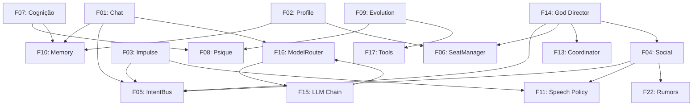

# Sensewright v2 — Especificação Técnica Completa de Recriação

> **Data:** 2026-10-01
> **Escopo:** Recriação integral do zero do mod Sensewright (The Sims 4 AI Companion & World Director).
> **Premissa:** Toda funcionalidade é especificada para construção limpa, sem heranças ou campos legados da v1.
> **Status:** Especificação Consolidada e Revisada (Arquitetura, IPC, Ciclo de Save, Motor Onírico, Cognição Híbrida, Direção Assimétrica `god.puppeteer`, Integração Nativa TS4 e UI Dual).

---

## Sumário

1. [Visão & Princípios de Engenharia](https://www.google.com/search?q=%231-vis%C3%A3o--princ%C3%ADpios-de-engenharia)
2. [Arquitetura, Threading & Relógios Duplos](https://www.google.com/search?q=%232-arquitetura-threading--rel%C3%B3gios-duplos)
3. [Contrato Wire (HTTP) & Ciclo Transacional de Save](https://www.google.com/search?q=%233-contrato-wire-http--ciclo-transacional-de-save)
4. [F01: Chat Multicanal, `Hidden SimInfo` & UI Contínua](https://www.google.com/search?q=%23f01-chat-multicanal-hidden-siminfo--ui-cont%C3%ADnua)
5. [F02: Profile Generation & Bootstrap do Minuto Zero](https://www.google.com/search?q=%23f02-profile-generation--bootstrap-do-minuto-zero)
6. [F03: Initiative / Impulse](https://www.google.com/search?q=%23f03-initiative--impulse)
7. [F04: Social Layer & Diálogo Assimétrico](https://www.google.com/search?q=%23f04-social-layer--di%C3%A1logo-assim%C3%A9trico)
8. [F05: IntentBus](https://www.google.com/search?q=%23f05-intentbus)
9. [F06: SeatManager](https://www.google.com/search?q=%23f06-seatmanager)
10. [F07: Cognição Híbrida, Agenda Nativa & Motor Onírico](https://www.google.com/search?q=%23f07-cogni%C3%A7%C3%A3o-h%C3%ADbrida-agenda-nativa--motor-on%C3%ADrico)
11. [F08: Personality System & Psique](https://www.google.com/search?q=%23f08-personality-system--psique)
12. [F09: Evolution, Demeanor & Gostos Nativos](https://www.google.com/search?q=%23f09-evolution-demeanor--gostos-nativos)
13. [F10: Memory System, FTS5 & Shadow DB Save Sync](https://www.google.com/search?q=%23f10-memory-system-fts5--shadow-db-save-sync)
14. [F11: Speech Policy (Pre-Flight) & Roteamento Visual](https://www.google.com/search?q=%23f11-speech-policy-pre-flight--roteamento-visual)
15. [F12: Presence Policy & Capability Matrix](https://www.google.com/search?q=%23f12-presence-policy--capability-matrix)
16. [F13: Coordinator & Arbitragem Assimétrica](https://www.google.com/search?q=%23f13-coordinator--arbitragem-assim%C3%A9trica)
17. [F14: God Director, Influência Suave & `god.puppeteer](https://www.google.com/search?q=%23f14-god-director-influ%C3%AAncia-suave--godpuppeteer)`
18. [F15: LLM Provider Chain, TPM & Prevenção de Idioma](https://www.google.com/search?q=%23f15-llm-provider-chain-tpm--preven%C3%A7%C3%A3o-de-idioma)
19. [F16: ModelRouter, Tiers, Scheduler & ContextAssembler](https://www.google.com/search?q=%23f16-modelrouter-tiers-scheduler--contextassembler)
20. [F17: Tools, Levers, `ArchetypeResolver` & Hooks Nativos](https://www.google.com/search?q=%23f17-tools-levers-archetyperesolver--hooks-nativos)
21. [F18: Sistema i18n & Compilação Automática de STBL](https://www.google.com/search?q=%23f18-sistema-i18n--compila%C3%A7%C3%A3o-autom%C3%A1tica-de-stbl)
22. [F19: Observability, Trace ID & Rotação de Logs](https://www.google.com/search?q=%23f19-observability-trace-id--rota%C3%A7%C3%A3o-de-logs)
23. [F20: Build, Deploy & Autoboot Silencioso](https://www.google.com/search?q=%23f20-build-deploy--autoboot-silencioso)
24. [F21: Arquitetura de UI Dual (Quick Menu + Web Studio)](https://www.google.com/search?q=%23f21-arquitetura-de-ui-dual-quick-menu--web-studio)
25. [F22: World Layer & Epidemiologia de Rumores](https://www.google.com/search?q=%23f22-world-layer--epidemiologia-de-rumores)
26. [Catálogo Canônico dos 33 Propósitos](https://www.google.com/search?q=%23cat%C3%A1logo-can%C3%B4nico-dos-33-prop%C3%B3sitos)
27. [Marcos de Implementação, Cortes & Safety Nets](https://www.google.com/search?q=%23marcos-de-implementa%C3%A7%C3%A3o-cortes--safety-nets)

---

## 1. Visão & Princípios de Engenharia

### 1.1 Missão

Transformar cada Sim em um agente soberano com vida interior, sonhos, rotina acoplada ao motor nativo do *The Sims 4*, memória transacional sincronizada ao save do jogador e narrativa emergente guiada por um Diretor de Mundo que atua por influência suave nos agentes e controle ativo sobre NPCs catalisadores — tudo sem custo financeiro obrigatório.

### 1.2 Princípios de Design

| # | Princípio | Regra de Engenharia |
| --- | --- | --- |
| **P1** | **Dois Processos, Zero Bloqueio** | Mod (Python 3.7, stdlib + S4CL + Lot 51) ↔ Worker Thread HTTP ↔ Sidecar (Python 3.12+, FastAPI, SQLite FTS5). A Main Thread do jogo (`GAME_TICK`) nunca executa I/O de rede. |
| **P2** | **Propósitos e Intents, não Comandos Crus** | O LLM emite Intents semânticos; o `ArchetypeResolver` e o `GameLever` no Mod traduzem para Tuning IDs de 64 bits e situações nativas do TS4. |
| **P3** | **Simbiose Diegética com o TS4** | A IA não compete com a autonomia, carreira ou UI do jogo; ela alimenta Moodlets, Sentimentos, Gostos/Desgostos, Caixa de Correio, Espelhos, Lápides, Diário e Relacionamentos nativos. |
| **P4** | **Direção Assimétrica (Soberania do Agente)** | O `God Director` jamais sequestra a vontade de Sims da família ativa (neles aplica apenas *Soft Influence* via sonhos, subtexto e inclinação). O controle rígido (`god.puppeteer`) atua sobre NPCs catalisadores inseridos na cena para provocar reações genuínas nos agentes. |
| **P5** | **Fidelidade Temporal e Transacional** | O banco SQLite avança ou faz *rollback* exatamente junto com o Save nativo do jogo (`Shadow DB`) e escala todos os tempos de gameplay pelo relógio do jogo (`clock_speed`). |
| **P6** | **Prevenção Estrutural de Idioma** | Sem detectores léxicos pós-geração (`lexicon.json` eliminado). A resposta no idioma correto é garantida por enums traduzidos na entrada, exemplos *1-shot* nativos e trava de recência na última linha do prompt. |
| **P7** | **Configuração em Duas Camadas & Fallback 0-Key** | Camada 1 = provedores, segredos e limites de API (RPM/RPD/TPM). Camada 2 = rotas, tiers e orçamentos de jogo. Todo gerador possui fallback determinístico localizado para operar mesmo sem chave de API. |

---

## 2. Arquitetura, Threading & Relógios Duplos

```
┌─ The Sims 4 (Processo Jogo - Python 3.7) ────────────────┐      ┌─ Sidecar (FastAPI, 127.0.0.1:8765 - Python 3.12+) ──────┐
│ Main Thread (GAME_TICK - Lot 51):                        │      │  routers/          → lifecycle / chat / autonomy / god  │
│  ├─ state_collector (deltas de pulso, census, eventos)   │      │  LLMScheduler      → fila única, tiers, SLOs, deep win  │
│  ├─ tool_executor   (GameLever, ArchetypeResolver)       │      │  ContextAssembler  → fatiamento de perfil e teto de TPM │
│  ├─ native_hooks    (SimInfo Oculto, Diário, Sentimentos)│      │  ModelRouter       → purpose → RoutePlan                │
│  ├─ ui_manager      (4 canais visuais, Chat encadeado)   │      │  ProviderChain     → RPM/RPD/TPM, circuit breaker, swap │
│  └─ queues em RAM   (outbound_q / inbound_intents_q)     │      │  SaveVault         → Working DB ↔ Committed DB + FTS5   │
│         │▲ ( < 0.1ms lock-free )                         │      │  WebStudio (/ui)   → Inspector SPA, Roteiro e Setup     │
│ Worker Thread (Daemon HTTP I/O):                         │ HTTP │                                                         │
│  └─ urllib.request ──────────────────────────────────────┼─────▶│                                                         │
└──────────────────────────────────────────────────────────┘      └─────────────────────────────────────────────────────────┘

```

### Requisitos de Arquitetura (`REQ-ARCH-*`)

* **REQ-ARCH-01 (Isolamento de Thread no Mod):** O callback `GAME_TICK` na Main Thread do TS4 apenas deposita payloads na `outbound_q` (`queue.Queue`) e consome `inbound_intents_q` (`get_nowait()`). Toda comunicação HTTP ocorre em uma única `Worker Thread` daemon secundária.
* **REQ-ARCH-02 (Restrições Python 3.7):** O código em `sensewright_mod` não pode conter `:=` (walrus), `match/case`, union types (`int | str`), `from __future__ import annotations` nem bibliotecas de terceiros fora de S4CL e Lot 51 Core.
* **REQ-ARCH-03 (Regra de Relógios Duplos):**
* **Wall-Clock (Segundos Reais):** Usado exclusivamente para infraestrutura (timeouts HTTP, SLO de tiers, rate limits RPM/RPD/TPM e circuit breaker).
* **Sim-Clock (`world_sim_tick` / `sim_minutes`):** Usado para toda mecânica de jogo (atraso entre balões `delay_sim_minutes`, duração de cenas, cooldown social, TTL de Intents e decaimento de memória/psique).


* **REQ-ARCH-04 (Congelamento em Pausa):** Quando `clock_speed == 0` (jogo pausado), o despachante de Intents no Mod congela a contagem de atrasos e suspende o envio de pulsos de autonomia.
* **REQ-ARCH-05 (Injeção de Interações):** Como o Mod possui dependência estrutural em `S4CL` e `Lot 51 Core`, as injeções programáticas de interações devem utilizar primariamente os mecanismos nativos dessas bibliotecas (ex: *Interaction Registration* e *Snippet Injections*). No entanto, o `XML Injector` permanece como uma opção válida e permitida como fallback caso seja necessário fazer injeções puramente via XML Tuning sem script.

---

## 3. Contrato Wire (HTTP) & Ciclo Transacional de Save

### 3.1 Tabela Completa de Endpoints (`/v1/*` + `/ui`)

| Endpoint | Método | Payload de Entrada | Resposta |
| --- | --- | --- | --- |
| `/v1/lifecycle/attach` | POST | `{game_pid}` | `{ok: true}` (arma watchdog de encerramento) |
| `/v1/lifecycle/session-start` | POST | `{player_id, save_id, world_sim_tick, lang}` | `{ok, restored_tick, bootstrap_needed, recap_job_id}` |
| `/v1/lifecycle/zone-transition` | POST | `{player_id, save_id, new_zone_id, world_sim_tick}` | `{ok, cleared_spatial_intents}` |
| `/v1/lifecycle/save` | POST | `{player_id, save_id, previous_save_id?, world_sim_tick}` | `{ok, committed_tick, snapshot_rev}` |
| `/v1/census` | POST | `{player_id, save_id, world_sim_tick, sims[{sim_id, name, species, age_stage, traits, likes, dislikes, career, schedule_blocks, family_links, household_id, is_player}], households[], relationships[]}` | `{ok, hydrated_count}` |
| `/v1/autonomy/tick` | POST | `{trace_id, player_id, save_id, world_sim_tick, clock_speed, active_sim_id, player_confidant_sim_id, sims_delta[{sim_id, mood, needs, room_id, pos, activity, queue, is_sleeping, is_off_lot_duty, wants, obligatory_tasks}], lang}` | `{ok, scheduled, intents[], social_sessions[]}` |
| `/v1/autonomy/intents` | GET | `?player_id=&save_id=&world_sim_tick=` | `{intents[]}` |
| `/v1/chat` | POST | `{trace_id, sim_id, channel("phone_sms"|"pc_chat"|"pc_email"), player_id, save_id, world_sim_tick, message, lang}` | `{response, thought, intents[], trust_delta, deferred:bool, message_key?}` |
| `/v1/hey` | POST | Alias rápido de `/v1/chat` (`channel="phone_sms"`) | Mesmo de `/v1/chat` |
| `/v1/events` | POST | `{trace_id, sim_id, target_sim_id?, player_id, save_id, world_sim_tick, event_category, content{}, impact, witnesses[], lang}` | `{ok, salience, triggered_jobs[]}` |
| `/v1/profile` | POST | `{sim_id, player_id, save_id, seed?, force_interactive:bool, lang}` | `{profile{}}` |
| `/v1/evolve` | POST | `{sim_id, player_id, save_id, world_sim_tick, trigger("sleep"|"mirror"), lang}` | `{reflection{}, demeanor_drift?, preference_change?, trait_proposal?}` |
| `/v1/memory/consolidate` | POST | `{sim_id, player_id, save_id, world_sim_tick, lang}` | `{consolidated{}}` |
| `/v1/god/tick` | POST | `{trace_id, player_id, save_id, world_sim_tick, lang}` | `{directives[], active_arc{}, active_catalyst_leases[]}` |
| `/v1/god/direct-scene` | POST | `{player_id, save_id, world_sim_tick, catalyst_sim_ids[], target_sim_ids[], prompt_text, mode("soft_catalyst"|"sandbox_full"), lang}` | `{ok, scene_id, intents[]}` |
| `/v1/god/arc/steer` | POST | `{player_id, save_id, action("approve_beat"|"skip_beat"|"rewrite_beat"|"abort_arc"), beat_id?, custom_instruction?, lang}` | `{ok, updated_arc{}}` |
| `/v1/god/controls` | GET/POST | GET: — / POST: `{key, value}` | `{controls[{key, category, type, value, options, label, description}]}` |
| `/v1/god/zeitgeist` | POST | `{player_id, save_id, zeitgeist_text, lang}` | `{tags[], preset, weather_preference}` |
| `/v1/agency/seats` | GET/POST | POST: `{seats: int}` | `{seats[{sim_id, role, tier, lease_expires_tick}], pool}` |
| `/v1/config/player-activity` | POST | `{player_id, save_id, idle: bool, clock_speed: int}` | `{deep_window_open: bool}` |
| `/v1/health` | GET | — | `{status: "ok", version, game_pid}` |
| `/v1/status` | GET | — | `{chain[], providers{}, limits{}, pool{}, routes{}, tiers{}, queue{}, active_save}` |
| `/ui` | GET | — | Serve o `Sensewright Web Studio` (SPA HTML/JS/CSS local) |

### Requisitos do Contrato Wire (`REQ-WIRE-*`)

* **REQ-WIRE-01 (Delta Tick + Pull Integrado):** O endpoint `POST /v1/autonomy/tick` trafega apenas os dados voláteis (`sims_delta`) e já retorna a lista de `intents[]` prontos na própria resposta, eliminando round-trip HTTP duplicado. Dados estáticos (`traits`, `career`, `species`, `age_stage`) trafegam apenas em `/v1/census` ou quando sofrem alteração.
* **REQ-WIRE-02 (Sanitização Estrita):** Todo payload passa por `_sanitize_payload` garantindo apenas tipos primitivos JSON (`int`, `float`, `str`, `bool`, `list`, `dict`), 1 chave canônica por argumento (zero aliases) e código de idioma `lang` obrigatório.

---

## F01: Chat Multicanal, `Hidden SimInfo` & UI Contínua

### Descrição

O jogador atua no universo do jogo como um **Confidente Digital Remoto** (amigo virtual/conselheiro de fora da cidade) representado nativamente na engine por um `SimInfo` oculto (Modelo A), conversando com os Sims via **Celular (`phone_sms`)** ou **Computador (`pc_chat` / `pc_email`)**.

### Construção Detalhada

#### 1. Representação Nativa (`Hidden Household SimInfo` — Modelo A)

* No bootstrap do save, o Mod cria (ou recupera) um `SimInfo` especial em um Household oculto (`hidden = True`) com a trait de bloqueio de spawn físico `Trait_Hidden_NoWalkby` e proteção contra *culling* (`player_confidant_sim_id`).
* **Integração Nativa Automática:**
* Aparece na aba de **Relacionamentos** dos Sims com o nome escolhido pelo jogador.
* Conversar no chat sobe nativamente a barra de necessidade **Social (`motive_social`)** e **Diversão** do Sim.
* A barra de amizade nativa sobe ou desce conforme o `trust_delta` da conversa e exibe **Sentimentos Nativos (*Sentiments*)** do Sim em relação ao jogador (*Adoração, Proximidade, Magoado, Rancor*).
* O motor de Desejos (*Wants*) do TS4 gera espontaneamente o desejo nativo *"Mandar mensagem para [Jogador]"* quando o Sim está tenso, triste ou solitário.


#### 2. Canais & Fatiamento de Perfil (`Context Slicing`)

| Canal | Ação Física no TS4 | Template de Perfil Carregado | Comportamento |
| --- | --- | --- | --- |
| **`phone_sms`** | Sim pega o celular na mão (`phone_Text`) | **Micro-Profile (~250 tok):** Apenas `speech_style`, humor, atividade atual, necessidade crítica e nível de confiança com o jogador. | Resposta curta (1–2 frases coloquiais). Se o Sim estiver dormindo (`is_sleeping`) ou no trabalho/escola (`is_off_lot_duty`), retorna aviso automático de ocupado (`deferred = true`) e entrega a resposta real quando o Sim acordar/voltar. |
| **`pc_chat` / `pc_email**` | Sim senta no computador e digita (`computer_Chat`) | **Deep-Profile (~1.200 tok):** Perfil completo, `core_personality`, `current_demeanor`, `life_story`, `psyche_blocks`, `dream_residue`, `daily_plan` e memórias FTS5. | Resposta densa e confessional (2–5 frases). O Sim desabafa sobre traumas, conta o sonho da manhã, pede conselhos e pode adotar uma nova meta no `Daily Plan`. |

#### 3. Progressão Epistêmica do Vínculo (`Player Persona`)

* **Nível 1 (`Acquaintance`, Friendship < 25):** O Sim ainda conhece pouco o jogador, não revela `secrets[]` profundos e faz perguntas.
* **Nível 2 (`Confidant`, Friendship 25–65):** Compartilha dilemas do dia e fofocas do bairro. O `mem.consolidate` extrai fatos sobre o jogador (`player_facts[]`) para o Sim lembrar em conversas futuras.
* **Nível 3 (`Advisor / Soulmate`, Friendship > 65):** Compartilha traumas (`F08`), segredos ocultos e aceita sugestões diretas de mudança de meta diária (`set_goal`).

#### 4. Loop de UI Contínua & Short-Term Buffer

* **Short-Term Chat Buffer:** Mantém os últimos 8 turnos em RAM como mensagens `user`/`assistant` estruturadas até que 300s de silêncio disparem `mem.consolidate`.
* **Fluxo Encadeado na UI:**
1. Ao enviar mensagem, o Sim exibe imediatamente um balão de pensamento nativo com reticências (`...`) indicando que está digitando.
2. A resposta chega em uma notificação com retrato do Sim e o botão de ação nativo **`[↩️ Responder Agora]`** (`ui_responses`).
3. Clicar em `[Responder Agora]` reabre instantaneamente a caixa de texto `UiDialogTextInputOkCancel` trazendo **a última fala do Sim no cabeçalho do modal**, permitindo conversar por 10 turnos seguidos sem precisar clicar no Sim de novo.


### Requisitos F01 (`REQ-CHAT-*`)

* **REQ-CHAT-01:** `[thought]...[/thought]` é extraído, salvo como memória privada e jamais exibido na UI.
* **REQ-CHAT-02:** Fala limpa, sem asteriscos, respeitando o limite do canal (`phone_sms` $\le 2$ frases; `pc_chat` $\le 5$ frases).
* **REQ-CHAT-03:** Assincronia realista: Sims dormindo ou em *rabbit hole* de trabalho/escola não respondem `phone_sms` em tempo real; a resposta fica retida até o Sim ficar livre.
* **REQ-CHAT-04:** Todas as tool calls emitidas no chat são *fire-and-forget* (convertidas diretamente em Intents, sem segundo round-trip HTTP).
* **REQ-CHAT-05:** O `Hidden SimInfo` do jogador nunca pode ser instanciado fisicamente em nenhum lote (`Trait_Hidden_NoWalkby`).

---

## F02: Profile Generation & Bootstrap do Minuto Zero

### Descrição

Gera o JSON de identidade do Sim (`PROFILE_SHAPE`) separando a essência imutável (`core_personality`) da fase atual (`current_demeanor`) e hidratando lotes novos sem travar o rate limit.

### `PROFILE_SHAPE` Canônico

```json
{
  "name": "",
  "species": "HUMAN",
  "age_stage": "YOUNGADULT",
  "backstory": "",
  "core_personality": "",
  "current_demeanor": "",
  "speech_style": "",
  "goals": [],
  "secrets": [],
  "quirks": [],
  "traits": [],
  "likes": [],
  "dislikes": [],
  "source": "template|llm",
  "generated_at_tick": 0
}

```

### Requisitos F02 (`REQ-PROF-*`)

* **REQ-PROF-01:** `normalize_profile(raw)` garante que todo perfil seja sempre válido, preenchendo chaves faltantes com defaults seguros.
* **REQ-PROF-02:** Dados nativos (`traits`, `likes`, `dislikes`, `age_stage`, `career`) são *ground truth* inegociável.
* **REQ-PROF-03 (Bootstrap em Dois Estágios):** Quando novos Sims ganham assento no lote, recebem instantaneamente o `fallback_profile` determinístico (`source="template"`) no tick 0 e entram na fila **`bg`** para geração via LLM. O tier **`interactive`** só é usado se o jogador abrir um `/v1/chat` ou executar `sw.profile` naquele Sim antes do job `bg` terminar.
* **REQ-PROF-04 (Revelação Diegética):** Executar a interação social nativa **"Conhecer" (`sim_GetToKnow`)** entre dois Sims revela progressivamente itens de `secrets[]` e `backstory` na tabela `relationships.known_secrets`.

---

## F03: Initiative / Impulse

### Descrição

Pensamento autônomo e iniciativa de ação dos Sims com assento ativo em tier `full`.

### Requisitos F03 (`REQ-IMP-*`)

* **REQ-IMP-01:** O impulso `idle` gera apenas pensamento interno (`[thought]...[/thought]`) e no máximo 1 Intent não-verbal (`set_mood`, `bias_interaction`, `act_out`, `queue_interaction`). **Nunca emite fala.**
* **REQ-IMP-02:** O impulso `reaction` (disparado por eventos com `salience >= 1.5`) permite emitir Intent `speak` direcionado ao causador.
* **REQ-IMP-03 (Guarda de Sobrevivência e Pontualidade):** Se qualquer necessidade básica estiver crítica (`< -70`) ou faltar menos de **45 minutos in-game** para o início do trabalho/escola (`schedule_blocks`), o `sim.impulse` é proibido de emitir ações físicas, cedendo prioridade total à autonomia nativa do TS4.
* **REQ-IMP-04:** No tier `realtime`, `thinking_budget = 0` (sem raciocínio oculto longo) e `IMPULSE_MAX_TOKENS = 200`.
* **REQ-IMP-05:** Qualquer texto gerado fora das tags `[thought]...[/thought]` no modo `idle` é descartado por regex.

---

## F04: Social Layer & Diálogo Assimétrico

### Descrição

Gera diálogos multi-turno contextualizados entre pares de Sims que estejam conversando nativamente no jogo, suportando propagação de fofocas e embates assimétricos entre Agentes Soberanos e NPCs do Puppeteer.

### Construção Detalhada

1. **Pre-Flight Gate (Antes do LLM):** Verifica se os dois Sims são elegíveis na `Capability Matrix` (`HUMAN`, `CHILD+`), estão no mesmo `room_id`, a $\le 4.0\text{m}$ de distância, dentro do `hearing_radius` ($\le 20.0\text{m}$ do Sim ativo) e dentro do limite de falas por minuto da **F11**. Se falhar no gate de audição, registra apenas memória determinística sem chamar o LLM.
2. **Modos de Diálogo:**
* **Simétrico (`Agent` $\leftrightarrow$ `Agent`):** Ambos os Sims falam segundo suas próprias personalidades, humores e histórico de relacionamento (`P29`).
* **Assimétrico (`Sovereign Agent` $\leftrightarrow$ `Puppet NPC`):** Quando um dos Sims está sob lease de catalisador do `god.puppeteer` (`P18`), o prompt instrui o NPC a conduzir a conversa segundo o `puppeteer_objective` (ex: *tentar descobrir um segredo, fazer uma intriga, seduzir*), enquanto o Agente Soberano responde livremente de acordo com sua própria psique e valores.


3. **Cadência e Agrupamento Visual:**
* O JSON de saída `{"a_line": "...", "b_line": "...", "topic": "...", "event_summary": "...", "impact": 0.0-2.0}` gera balões com `delay_sim_minutes` escalonado no Sim B e exibe no mural um **único Card Compacto de Diálogo** contendo as duas falas juntas.


### Requisitos F04 (`REQ-SOC-*`)

* **REQ-SOC-01:** Sims nunca conversam à distância ou através de paredes (`room_id` + distância máxima de $4.0\text{m}$).
* **REQ-SOC-02:** Se o Sim A conhece um `RumorNode` (`P24`) desconhecido pelo Sim B e a interação for compatível (`friendly`, `gossip`, `mean`), o rumor entra no diálogo e contamina o Sim B ao final.
* **REQ-SOC-03:** O fechamento da sessão (`sim.social.close`) roda no tier `bg` (não bloqueando o tier `realtime`).

---

## F05: IntentBus

### Descrição

Barramento unificado pelo qual Agentes, Social Layer e God Director enviam intenções semânticas ao Mod.

### Intent Shape Canônico

```json
{
  "id": "hex-uuid",
  "trace_id": "tr_9a8f12",
  "sim_id": 12345,
  "kind": "speak | approach | set_mood | bias_interaction | prefer_target | set_goal | remember | forget | command",
  "target_sim_id": 67890,
  "params": {"text": "...", "tone": "friendly", "archetype": "..."},
  "thought": "...",
  "narration": "...",
  "delay_sim_minutes": 0.0,
  "ttl_sim_minutes": 15.0,
  "expires_on": "ttl | next_sleep | zone_transition",
  "priority": 0,
  "source": "agent | god | puppeteer | social"
}

```

### Requisitos F05 (`REQ-INT-*`)

* **REQ-INT-01:** Sem campos legados (`name`/`args` na raiz eliminados).
* **REQ-INT-02:** Intents físicos/sociais (`speak`, `approach`, `command`) expiram em `ttl_sim_minutes = 15.0` ou imediatamente em `zone_transition`. Intents cognitivos (`bias_interaction`, `prefer_target`, `set_goal`) expiram em `next_sleep`.
* **REQ-INT-03:** `command` é *escape-hatch* restrito apenas a alavancas de mundo sem mapeamento de comportamento.

---

## F06: SeatManager

### Descrição

Gerencia o pool finito de assentos de agente (`agent_seats`, default 12).

### Requisitos F06 (`REQ-SEAT-*`)

* **REQ-SEAT-01:** Prioridade estrita: Família ativa (`household`) > NPCs Catalisadores de Arco ativo (`catalyst`) > Visitantes íntimos > Visitantes comuns.
* **REQ-SEAT-02 (Proteção Anti-Thrashing):** Um visitante **nunca** sofre evicção enquanto estiver em uma `ConversationSession` ativa (F04), atuando como catalisador de cena (`god.puppeteer`) ou dentro do tempo mínimo de posse (`lease_min_sim_minutes = 60`).
* **REQ-SEAT-03 (Evicção por Distância):** Quando necessário abrir vaga no pool, o visitante removido é aquele elegível à evicção que estiver **mais distante fisicamente do Sim ativo** e sem interação social.

---

## F07: Cognição Híbrida, Agenda Nativa & Motor Onírico

### Descrição

Acopla o planejamento do Sim às obrigações nativas do TS4 (trabalho, escola, tarefas diárias, *Wants & Fears*) e utiliza o **Motor Onírico (`sim.dream`)** para introduzir entropia narrativa e quebrar loops robóticos de rotina.

### 10.1 Motor Onírico (`P07: sim.dream`)

Roda na janela de sono antes de `sim.cognition`. Combina 4 entradas ponderadas pelo índice de **Surrealismo**:


$$\text{Surrealismo} = \text{clamp}_{0..1}\left(\text{Base}_{\text{traits}} + (\text{God}_{\text{chaos}} \times 0.4) + (\text{Psyche}_{\text{trauma}} \times 0.3) + \text{Mood}_{\text{stress}}\right)$$

1. **Resíduo Diurno (0.40):** Eventos intensos das últimas 24h.
2. **Déjà Vu / Sombra (0.25):** Memória esquecida (`strength < 0.2`) resgatada da F10 ou `Psyche Block` ativo da F08.
3. **Sussurro do God (`god_whisper`, 0.20):** Presságio ou tentação injetada pelo `Arc` ativo do God Director (Influência Suave).
4. **Zeitgeist (0.15):** Tags temáticas da vizinhança.

**Saída do Sonho & Acoplamento Nativo:**

```json
{
  "archetype": "epiphany | surreal | omen | nightmare",
  "dream_narrative": "Relato em 1ª pessoa do sonho...",
  "wakeup_mood": "inspired | tense | flirty | sad | dazed",
  "dream_urge": {"goal": "Desviar da rotina para procurar Bella ou pintar algo estranho", "weight": 0.8}
}

```

* **Efeitos no Jogo Base:**
1. Altera os ícones dos balões de pensamento enquanto o Sim dorme (`balloon_requests`).
2. Ao acordar, aplica um **Moodlet Nativo Matinal** (*"Ecos de um Sonho"*, *"Pesadelo Vívido"*, *"Epifania Matinal"*) cujo **Tooltip nativo na UI** exibe o `dream_narrative` (zero pop-up intrusivo).
3. Se `dream_urge.weight > 0.7`, substitui um bloco livre do `Daily Plan` para quebrar a rotina do Sim naquele dia.


### 10.2 Arbitragem de Rotina e Autonomia em 3 Camadas (`P08: sim.cognition`)

O `sim.cognition` recebe `schedule_blocks[]` (horários de trabalho/escola), `obligatory_tasks[]` (tarefa diária da carreira/lição de casa), `native_wants[]` e o `dream_urge`:

```json
{
  "day_focus": "Terminar o quadro antes do turno das 14h, mas intrigado pelo sonho.",
  "attitude_toward_duty": "compliant | procrastinating | overwhelmed",
  "blocks": {
    "morning": {"goal": "Pintar 1 quadro (Tarefa Diária)", "linked_native": "career_daily_task", "done": false},
    "afternoon": {"goal": "Expediente de Trabalho (14h-20h)", "linked_native": "hard_schedule", "done": false},
    "evening": {"goal": "Seguir o impulso do sonho e visitar o lounge", "linked_native": "dream_urge", "done": false}
  },
  "autonomy_biases": ["painting", "social_friendly"]
}

```

### Requisitos F07 (`REQ-COG-*` & `REQ-DRM-*`)

* **REQ-DRM-01:** Todo Sim da família ativa que dorme processa `sim.dream` (com fallback determinístico em 0-key) e acorda com o Moodlet correspondente contendo o texto no tooltip.
* **REQ-COG-01:** O plano diário divide-se em blocos (`morning`, `afternoon`, `evening`), cada um com flag `"done": bool` atualizada automaticamente quando o `state_collector` detecta conclusão da tarefa diária ou *Want* nativo.
* **REQ-COG-02 (Guiagem Suave da Autonomia Nativa):** Os `autonomy_biases[]` emitem Intents `bias_interaction`, que aplicam *Commodity Buffs* ocultos do `Sensewright.package`, fazendo a própria autonomia nativa do TS4 escolher os objetos da meta no lote.
* **REQ-COG-03 (`is_off_lot_duty`):** Enquanto o Sim estiver fora do lote em trabalho/escola (*rabbit hole*), impulsos e falas locais ficam suspensos.

---

## F08: Personality System & Psique

### Descrição

Gerencia blocos psicológicos (`trauma` e `belief`) com intensidade de `0.0` a `1.0` e a biografia acumulada (`Life Story`).

### Requisitos F08 (`REQ-PSY-*`)

* **REQ-PSY-01 (Saliência por Metadados Estruturados):** A saliência nunca usa busca de palavras-chave por idioma; ela é calculada pelo peso base do `event_category` nativo (`death=2.5`, `betrayal=2.2`, `fire=2.0`, `romance=1.6`, `promotion=1.4`) somado ao `impact` emitido pelo gerador. Eventos com `salience >= 1.5` geram ou reforçam `Psyche Blocks`.
* **REQ-PSY-02:** O decaimento exponencial $I(t) = I_0 \cdot e^{-\lambda \cdot \Delta\text{dias\_sim}}$ utiliza estritamente dias do relógio interno do jogo (`sim_tick`). Blocos abaixo de `0.05` sofrem *prune*.
* **REQ-PSY-03:** `Life Story` é limitada a 20 linhas / 2.000 caracteres totais (injetando as 5 linhas mais relevantes no `ContextAssembler`).

---

## F09: Evolution, Demeanor & Gostos Nativos

### Descrição

Reflete sobre eventos vividos para evoluir a postura atual do Sim (`current_demeanor`), atualizar **Gostos e Desgostos nativos** e propor mudanças de traços de personalidade.

### Requisitos F09 (`REQ-EVO-*`)

* **REQ-EVO-01 (Imutabilidade de Essência):** `evo.reflect` roda no máximo 1x por ciclo de sono (ou quando o Sim usa a interação física **"Refletir / Acalmar-se" no Espelho**). Nunca altera `core_personality`; atualiza apenas `current_demeanor`, impedindo *model collapse* por reescritas sucessivas.
* **REQ-EVO-02 (Evolução de Gostos e Desgostos Nativos):** Quando um Sim acumula experiências muito positivas ou traumáticas em uma atividade, `evo.trait` adiciona ou remove nativamente **Gostos/Desgostos** no `trait_tracker` do Jogo Base (ex: *Gosta de Pintura*, *Não Gosta de Culinária*).
* **REQ-EVO-03 (Proposta de Swap de Traço Principal):** Quando um `Psyche Block` mantém intensidade $> 0.85$ por 3+ dias in-game, emite uma notificação `SPECIAL_MOMENT` com botões interativos **`[Aceitar Mudança]`** / **`[Recusar]`** para trocar um traço principal do Sim.

---

## F10: Memory System, FTS5 & Shadow DB Save Sync

### Descrição

Persistência em SQLite com busca textual nativa **FTS5 (BM25)**, esquecimento gradativo e sincronização transacional estrita com os Saves do *The Sims 4*.

### 13.1 Tabelas do Banco SQLite (`slot_<save_id>.db`)

* `metadata`: `{save_id, world_sim_tick, last_committed_at, schema_version}`
* `memories`: `{id, sim_id, type, content(JSON), search_text, importance, strength, created_sim_tick, last_accessed_sim_tick, consolidated, archived}` + Tabela Virtual **`memories_fts` (FTS5 BM25)** indexando `search_text`.
* `relationships`: `{sim_id, target_id, friendship, romance, known_traits(JSON), known_secrets(JSON), dynamic_label, qualitative_note, updated_sim_tick}`
* `sims`: `{sim_id, profile(JSON), background, updated_sim_tick}`
* `arcs`: `{id, theme, beats(JSON), current_beat_idx, cast(JSON), status, created_sim_tick}`
* `neighborhoods`: `{save_id, zeitgeist(JSON), chronicles(JSON), rumors(JSON), updated_sim_tick}`

### 13.2 Sincronização Transacional com o Save Nativo (`Shadow DB`)

Em `data/saves/`, cada slot de save do TS4 opera com isolamento transacional via `sqlite3.Connection.backup()` (< 5ms):

1. **`slot_<save_id>.committed.db` (Cofre):** Estado exato do último "Salvar Jogo" confirmado pelo usuário no TS4.
2. **`slot_<save_id>.working.db` (Sessão Ativa):** Cópia onde todas as leituras e escritas ocorrem durante o gameplay.
3. **`slot_<save_id>.rev1..rev3.db` (Ring Buffer):** Últimos 3 checkpoints salvos indexados por `world_sim_tick`.

### Requisitos F10 (`REQ-MEM-*`)

* **REQ-MEM-01 (Descarte em Saída sem Salvar):** Ao receber `/v1/lifecycle/session-start` (carregamento de save a partir do Menu Principal), o Sidecar descarta qualquer `.working.db` residual, clona `.committed.db` $\rightarrow$ `.working.db` e limpa todos os buffers em RAM (`IntentBus`, `Short-Term Chat Buffer`, `ConversationManager`).
* **REQ-MEM-02 (Preservação em Viagem de Lote):** Ao receber `/v1/lifecycle/zone-transition` (viagem entre lotes na mesma sessão), o `.working.db` é mantido intacto; apenas sessões e intents espaciais do lote anterior são limpos.
* **REQ-MEM-03 (Commit e "Salvar Como..."):** Ao receber `/v1/lifecycle/save`, faz flush dos buffers em RAM para o `.working.db` e promove `.working.db` $\rightarrow$ `.committed.db`. Se `previous_save_id != save_id` (*Save As*), preserva o `committed.db` antigo intocado e cria o novo par para o novo slot.
* **REQ-MEM-04 (Rewind de Backup `.ver0`):** Se no `session-start` o `world_sim_tick` do jogo for menor que o do `.committed.db`, restaura o snapshot correspondente do Ring Buffer (`rev1..rev3`) ou executa `rewind_to_tick(world_sim_tick)`.
* **REQ-MEM-05 (Busca FTS5 Zero-Dependency):** Quando `embeddings = "none"`, o recall de memórias usa `memories_fts` com ranking BM25 nativo do SQLite.
* **REQ-MEM-06 (Retenção Segura):** O prune de 180 dias in-game remove apenas registros brutos triviais (`archived = true AND importance < 1.0`). Memórias consolidadas, compactadas, diários e legados nunca são deletados.

---

## F11: Speech Policy (Pre-Flight) & Roteamento Visual

### Descrição

Filtra quando Sims podem falar visivelmente e roteia cada tipo de saída para o canal visual adequado, eliminando poluição no mural de notificações.

### Requisitos F11 (`REQ-SPE-*` & `REQ-UI-*`)

* **REQ-SPE-01 (Pre-Flight Gate):** Os limites `hearing_radius` ($20.0\text{m}$ do Sim ativo), `max_lines_per_minute` (12) e `min_interval_between_lines` (30s) são validados **antes** de submeter jobs de fala ao `LLMScheduler`.
* **REQ-SPE-02 (Roteamento Visual em 4 Canais):**
1. **Canal Silencioso (Tooltips & Objetos):** Pensamentos `idle` (`P03`), Sonhos (`P07`), Diário (`P10`), Biografia (`P11`) e Crônica (`P23`) nunca geram pop-ups no canto da tela; ficam nos Tooltips de Moodlets, Caixa de Correio e objetos.
2. **Canal Social Compacto (`visual_type = SPEECH`):** Diálogos da `F04` agrupam a fala de A e B em um único card enxuto por turno.
3. **Canal do Diretor (`visual_type = SPECIAL_MOMENT`):** Narrações do God (`P20`), Recap (`P32`), Claquete de Cena e propostas de Traço (`P31`) usam banner destacado roxo/âmbar.
4. **Canal de Telefone/PC (`information_level = SIM`):** Respostas de Chat (`F01`) e Fofocas por SMS (`P24`) exibem o retrato 2D do Sim e o botão interativo **`[Responder]`**.


---

## F12: Presence Policy & Capability Matrix

### Descrição

Define o nível de agência de visitantes (`full`, `reactive`, `off`) e restringe capacidades por espécie e faixa etária.

### Requisitos F12 (`REQ-PRE-*`)

* **REQ-PRE-01:** Visitantes com `friendship >= 20.0` nos vínculos `family`, `friend`, `romantic`, `spouse` ou `partner` são promovidos de `reactive` para `full`.
* **REQ-PRE-02 (Capability Matrix):**
* `BABY`: Excluído do `SeatManager`.
* `INFANT` / `TODDLER` e `DOG` / `CAT` / `HORSE`: Apenas pensamentos instintivos/sensoriais e `set_mood`; bloqueados em `F04 Social` verbal e `F07` de carreira.
* `CHILD`: Bloqueio absoluto (`hard-block`) em categorias sociais `flirty` e `intimate`; agenda restrita à escola e brincar.


---

## F13: Coordinator & Arbitragem Assimétrica

### Descrição

Garante que o jogador tenha prioridade absoluta, que os Agentes da família mantenham sua soberania cognitiva e que o `god.puppeteer` controle apenas os NPCs Catalisadores.

### Matriz de Concessão de Controle (`Control Leases`)

| Prioridade | Lease | Alvo Permitido | Comportamento |
| --- | --- | --- | --- |
| **1 (Máxima)** | `PLAYER_MANUAL` | Qualquer Sim | Qualquer clique manual do jogador no Sim aborta ações de IA naquele Sim e trava a autonomia por `player_lock_seconds` (15s). |
| **2 (Catalisador)** | `GOD_CATALYST_PUPPET` | **Apenas NPCs / Visitantes** escalados pelo God (`catalyst_sim_ids`) | O `god.puppeteer` assume controle direto do NPC (fazendo-o visitar o lote, abordar um Agente Soberano e conduzir um objetivo dramático na conversa). |
| **3 (Agente)** | `SOVEREIGN_AGENT` | Sims da família ativa e assentos `full` | Agem 100% por vontade própria (`sim.impulse`, `sim.reaction`, `sim.social`). Recebem do God apenas **Influência Suave (`Soft Influence`)**. |
| **4 (Sandbox)** | `SANDBOX_OVERRIDE` | Qualquer Sim selecionado pelo jogador | Ativado **somente** quando o próprio jogador usa manualmente a ferramenta *"Dirigir Cena Aqui (Modo Sandbox)"*. |

### Requisitos F13 (`REQ-COORD-*`)

* **REQ-COORD-01:** O `God Director` em modo autônomo nunca bloqueia nem sobrescreve a fila de ações de um `SOVEREIGN_AGENT`; ele atua sobre os agentes exclusivamente via *Soft Influence* e através dos NPCs Catalisadores (`GOD_CATALYST_PUPPET`).

---

## F14: God Director, Influência Suave & `god.puppeteer`

### Descrição

Diretor invisível que cria arcos narrativos, modela o clima do bairro (`Zeitgeist`), aplica **Influência Suave** nos Agentes Soberanos e controla **NPCs Catalisadores (`god.puppeteer`)** para provocar situações dramáticas orgânicas.

### 17.1 As 4 Alavancas de Influência Suave (`Soft Influence` nos Agentes Soberanos)

1. **Sussurros Oníricos (`god_whisper` $\rightarrow$ `P07: sim.dream`):** Planta presságios, tentações ou paranoias no sonho do Sim na noite anterior ao Beat.
2. **Gravidade Espacial e Temática (`prefer_target` + `bias_interaction`):** Aplica *Commodity Buffs* suaves que inclinam a autonomia nativa do Sim a procurar determinado alvo ou atividade.
3. **Injeção de Subtexto (`scene_subtext` no `ContextAssembler`):** Adiciona 1 linha de percepção ambiental no prompt do Agente (ex: *"Você sente uma tensão estranha quando {Nome} olha para o celular"*). O Agente decide sozinho como agir.
4. **Pressão de Mundo (`set_weather`, `world.gossip`):** Altera o clima para combinar com a cena ou faz um rumor chegar por SMS no celular do Sim.

### 17.2 O Fluxo "Isca & Reação" do `god.puppeteer` (`P18`)

Quando um `Beat` do arco entra em execução:

1. **Casting Inteligente (`P16: god.cast`):** Prioriza recrutar um Townie já existente no `/v1/census` compatível com o papel (evitando inflar a população do save) ou instancia um NPC novo se necessário.
2. **Inserção Física (`VisitSituation`):** Faz o NPC Catalisador caminhar pela calçada e tocar a campainha da casa (ou abordar o Sim em lote comunitário).
3. **Abordagem Dirigida (`P18: god.puppeteer`):** Sob lease `GOD_CATALYST_PUPPET`, o NPC caminha até o Agente Soberano, lança a fala/ação provocadora inicial e sustenta o `puppeteer_objective` durante a `ConversationSession` na **F04**.
4. **Adaptação Pós-Reação (`P19: god.react`):** Como o Agente Soberano é livre para aceitar, rejeitar ou brigar com o NPC Catalisador, ao final da interação o `god.react` lê o que o Sim do jogador decidiu fazer e ramifica o próximo Beat do arco de acordo com a escolha real do agente.

### 17.3 Modos de Operação do Diretor (`director_mode`)

* `AUTONOMOUS` (Espectador): O God conduz arcos e envia NPCs catalisadores sem dar spoilers prévios.
* `CO_DIRECTOR` (Showrunner): Antes de disparar um Beat com NPC Catalisador, exibe um Banner `SPECIAL_MOMENT` com botões **`[🎬 Iniciar Cena]`**, **`[⏳ Adiar]`** e **`[🔄 Mudar Rumo]`**.
* `SANDBOX` (Roteirista): O God só age quando acionado manualmente pelo jogador via *"Dirigir Cena Aqui"* ou pelo `Web Studio`.

### Requisitos F14 (`REQ-GOD-*`)

* **REQ-GOD-01:** 7 presets de gênero disponíveis (`novela`, `sitcom`, `drama`, `caos`, `terror`, `romance`, `filme_adolescente`) + 5 dials (`intervention_frequency`, `intensity`, `mood_influence`, `autonomy_degree`, `chaos_degree`).
* **REQ-GOD-02:** Reaproveitamento prioritário de Townies existentes no `god.cast` antes de criar novos `SimInfo`.
* **REQ-GOD-03:** `BackgroundScheduler` roda estritamente no tier `bg` com prioridade `PLAYER > HOUSEHOLD > ACTIVE > RELATED`.

---

## F15: LLM Provider Chain, TPM & Prevenção de Idioma

### Descrição

Cadeia resiliente de provedores (`openrouter`, `gemini`, `groq`, `ollama`, `deepseek`) com controle triplo de limites e garantia estrutural de idioma.

### Requisitos F15 (`REQ-LLM-*`)

* **REQ-LLM-01 (Rate Limiter Triplo — RPM, RPD e TPM):** `ProviderRateLimiter` rastreia Requisições por Minuto, Requisições por Dia e **Tokens por Minuto (TPM)** (estimando tokens de entrada antes do envio e reconciliando com `usage.total_tokens`). Se o job exceder o TPM restante do minuto no provedor atual, a chain pula imediatamente para o próximo provedor sem gerar erro HTTP 429.
* **REQ-LLM-02:** Circuit breaker marca o provedor como `cold` por 60s após 3 falhas consecutivas; cooldown por modelo (120s após 2 falhas) faz swap automático por modelo descoberto via `/models`.
* **REQ-LLM-03 (`free_only` Guard):** Quando `free_only = true`, bloqueia no cliente qualquer chamada a modelo pago.
* **REQ-LLM-04 (Prevenção Estrutural de Idioma — Sem `lexicon.json`):** A aderência ao idioma `lang` é garantida na entrada por:
1. Tradução prévia de todos os enums de estado (`mood`, `traits`, `activity`) antes de montar o prompt.
2. Inclusão de 1 exemplo curto (*1-shot*, ~15 tokens) do formato de saída já no idioma `lang` (`prompt.one_shot_*`).
3. Injeção da diretiva imperativa localizada (`prompt.anchor`) como a **última linha absoluta** do prompt.


---

## F16: ModelRouter, Tiers, Scheduler & ContextAssembler

### Descrição

Orquestrador central de chamadas LLM com separação em 2 camadas de configuração, orçamento de tokens de entrada por tier (`ContextAssembler`) e proteção de cotas.

### Tabela de Tiers e Orçamento do `ContextAssembler`

| Tier | SLO (Wall) | Teto de Input (`ContextAssembler`) | Concorrência | Comportamento em Timeout |
| --- | --- | --- | --- | --- |
| **`interactive`** | 3s | $\le 1.500$ tokens | 4 | Timeout $\rightarrow$ Template imediato. |
| **`realtime`** | 12s | $\le 700$ tokens (perfil compacto) | 2 | Timeout $\rightarrow$ Template/Defer. `thinking_budget = 0`. |
| **`bg`** | 60s | $\le 1.500$ tokens | 1 | Retry/Backoff silencioso. |
| **`deep`** | Janela | $\le 4.000$ tokens (contexto completo) | 1 | Roda em janelas `sleep`, `idle` ou `session-start`. |

### Requisitos F16 (`REQ-SCHED-*`)

* **REQ-SCHED-01 (Configuração em 2 Camadas):** Camada 1 (`[llm.providers.*]`) contém apenas credenciais e limites técnicos. Camada 2 (`[llm.routes.*]`, `[llm.tiers.*]`) contém apenas roteamento por propósito e parâmetros de geração.
* **REQ-SCHED-02 (Regra de Refund Assimétrica):** Em caso de `LLMTimeout` ou falha de rede após o envio do request HTTP, o **Game Budget** do Sim recebe **refund** (não penaliza o jogador), mas o **Provider Rate Limit (RPM/RPD/TPM)** **não recebe refund** (pois o servidor externo já contabilizou a chamada).
* **REQ-SCHED-03:** Deduplicação obrigatória na fila via `dedup_key = player:save:scope:id:purpose`.

---

## F17: Tools, Levers, `ArchetypeResolver` & Hooks Nativos

### Descrição

Conjunto de alavancas de ação do Sim e do Mundo, traduzidas por um resolvedor semântico (`ArchetypeResolver`) e conectadas aos objetos nativos do *The Sims 4* (Jogo Base).

### 20.1 `ArchetypeResolver` (Fim de Tuning IDs Crus no LLM)

O LLM emite apenas categorias semânticas padronizadas (`mood: "flirty"`, `activity: "painting"`, `sentiment: "bitter"`, `weather: "thunderstorm"`). O `ArchetypeResolver` no Mod mapeia cada categoria para os Tuning IDs de 64 bits instalados no jogo ou para os recursos compilados no `Sensewright.package`.

### 20.2 Matriz de Acoplamento com Objetos Nativos do Jogo Base

| Sistema / Propósito | Recurso Nativo no TS4 (Jogo Base) | Implementação Técnica (`native_hooks.py` / `tool_executor.py`) |
| --- | --- | --- |
| **Chat (`F01`)** | Celular, Computador + Aba Relacionamentos | `Hidden SimInfo` + ganho nativo de `motive_social` + *Wants* |
| **Sonhos (`P07`)** | Balões de Sono + Moodlet Matinal na UI | `balloon_requests` + texto do sonho no `Tooltip` do Buff matinal |
| **Rotina (`P08`)** | Autonomia Nativa + Carreira/Escola/Wants | *Commodity Buffs* ocultos (`bias_interaction`) + `career_tracker` |
| **Diário (`P10`)** | Computador / Livro de Cabeceira (+ Diário *GP05*) | `TooltipComponent` com texto real + hook na ação **"Bisbilhotar"** |
| **Biografia (`P11`)** | Livro Físico de Autobiografia na Estante | Instancia objeto Livro real no lote que netos/visitas podem ler |
| **Passado (`P13`)** | Interação Social **"Conhecer" (`sim_GetToKnow`)** | Revela 1 memória formativa/segredo junto com o traço nativo |
| **NPCs/Cenas (`P16/P18`)** | Visita Real tocando a Campainha | `SituationManager` (`VisitSituation`) — NPC vem pela calçada |
| **Crônica/Fofoca (`P23/P24`)** | **Caixa de Correio** + **SMS no Celular** | Menu *"Histórias da Vizinhança"* na Caixa de Correio + SMS de amigos |
| **Legado/Morte (`P28`)** | **Urna / Lápide Nativa** | Grava automaticamente o epitáfio poético na Lápide do Sim |
| **Relações (`P29`)** | **Sentimentos Nativos (*Sentiments*)** | Aplica *Adoração, Proximidade, Magoado, Culpa, Rancor* no perfil |
| **Evolução (`P30/P31`)** | **Gostos e Desgostos** + **Espelhos** | Atualiza preferências no `trait_tracker` + reflexão no Espelho |

### Requisitos F17 (`REQ-TOOL-*`)

* **REQ-TOOL-01:** Todas as 7 antigas tools de leitura são eliminadas do tool-calling e injetadas diretamente no snapshot de contexto.
* **REQ-TOOL-02:** Todo handler em `tool_executor.py` roda protegido por `_safe_call` e `_safe_getattr` (jamais levanta exceção na Main Thread do TS4).

---

## F18: Sistema i18n & Compilação Automática de STBL

### Requisitos F18 (`REQ-I18N-*`)

* **REQ-I18N-01:** `en` (source of truth) e `pt-BR` completos de fábrica tanto em `mod/locales/` quanto em `sidecar/locales_content/`.
* **REQ-I18N-02:** Nenhum código Python referencia códigos de idioma fixos; a resolução usa o `manifest.json` (compatível com leitura dentro do arquivo `.ts4script` zipado).
* **REQ-I18N-03 (Geração Automática de STBL no Build):** O script `mod/build_package.py` extrai todas as chaves `stbl.*` e `pie_menu.*` dos arquivos `mod/locales/<code>.json` e compila automaticamente os recursos binários STBL (`0x00` ENG_US, `0x11` POR_BR) dentro do `dist/Sensewright.package`.

---

## F19: Observability, Trace ID & Rotação de Logs

### Requisitos F19 (`REQ-OBS-*`)

* **REQ-OBS-01 (`trace_id` Unificado):** Cada pulso ou chat gera um `trace_id` de 8 caracteres hexadecimais no Mod, propagado no header/payload HTTP até os logs do Sidecar (`llm.route`, `llm.job`, `llm.attempt`, `audit.jsonl`) e de volta no `Intent`, permitindo reconstruir qualquer sessão com um único `grep <trace_id>`.
* **REQ-OBS-02 (Rotação de Disco):** Todos os loggers do Mod e do Sidecar utilizam `RotatingFileHandler` com limite de **10 MB por arquivo e máximo de 3 backups**, impedindo crescimento infinito em sessões longas.

---

## F20: Build, Deploy & Autoboot Silencioso

### Requisitos F20 (`REQ-BLD-*`)

* **REQ-BLD-01:** `mod/build.py` gera `dist/Sensewright.ts4script` com bytecode Python 3.7 (`magic 42 0d 0d 0a`); `mod/build_package.py` gera `dist/Sensewright.package` (DBPF com Tuning XML comprimido via zlib + STBL).
* **REQ-BLD-02 (Autoboot Silencioso sem Janela Preta):** Na carga do Mod, a Worker Thread faz `GET /v1/health` (timeout 0.5s). Se o Sidecar não estiver rodando, inicia o processo lendo `sidecar/python.txt` via `subprocess.Popen` com a flag **`CREATE_NO_WINDOW` (`0x08000000`)** no Windows, sem piscar janela de console sobre o jogo.
* **REQ-BLD-03 (Watchdog de Processo):** O Sidecar monitora o `game_pid` anexado via `/v1/lifecycle/attach`; quando o processo do TS4 encerra, o Sidecar fecha o SQLite com segurança e termina imediatamente.

---

## F21: Arquitetura de UI Dual (Quick Menu + Web Studio)

### Descrição

Elimina o inferno de modais aninhados da v1 dividindo a operação em duas superfícies: um **Quick Menu In-Game** minimalista (máximo 2 cliques) e o **`Sensewright Web Studio`** servido localmente pelo Sidecar em `[http://127.0.0.1:8765/ui](http://127.0.0.1:8765/ui)`.

### 24.1 Superfície 1: Quick Menu In-Game (S4CL) e Pie Menu Limpo

1. **Pie Menu no Sim:** Apenas 1 entrada raiz `✨ Sensewright...` contendo no máximo 3 ações:
* `💬 Conversar / Mandar SMS` (abre seletor visual de retratos `UiSimPicker` se acionado pelo celular)
* `🎬 Provocar Cena Aqui...` (seleciona NPC Catalisador + Sim alvo + instrução de 1 linha)
* `⚙️ Menu Rápido Sensewright`


2. **Modal do Menu Rápido (`sw.panel`):**
* Exibe o cabeçalho diagnóstico ao vivo (`P33: ops.panel.summary`).
* Botões de 1 clique para trocar o **Preset do Diretor** (`Novela`, `Sitcom`, `Drama`, `Terror`, `Romance`, `Caos`, `Off`).
* Botões de 1 clique para trocar o **Modo do Diretor** (`Espectador`, `Showrunner`, `Sandbox`) e **Autonomia**.
* Botão **`🌐 Abrir Sensewright Web Studio (Painel Completo)`** (`webbrowser.open("[http://127.0.0.1:8765/ui](http://127.0.0.1:8765/ui)")`).


### 24.2 Superfície 2: `Sensewright Web Studio` (`GET /ui` no Sidecar)

Aplicação web single-page local (HTML/CSS/JS zero-dependency embutida no Sidecar):

* **Aba 1 — Mente dos Sims (Inspector & Editor):** Visualiza e edita em tempo real o Perfil de qualquer Sim, `Core Personality` vs. `Current Demeanor`, barras de intensidade de `Psyche Blocks` (traumas/crenças), o **Sonho da noite (`P07`)**, o **Plano do Dia (`P08`)**, as entradas do **Diário (`P10`)** e o grafo de **Relacionamentos (`P29`)**.
* **Aba 2 — Sala do Diretor (`God Director`):**
* Toggle **`Spoiler Shield` (Modo Sem Spoilers ON/OFF)**. Quando OFF, exibe os cartões dos `Beats` do Arco ativo permitindo editar, pular ou reescrever qualquer Beat com IA.
* Sliders contínuos para os 5 dials do God, checkboxes de poderes (`powers`), editor de tags do `Zeitgeist` e Galeria de Casting (`god.cast`).


* **Aba 3 — Provedores, Rotas & Diagnóstico:** Campos seguros para colar API Keys (Camada 1), botão **"Testar Conexão"** por provedor, medidores ao vivo de RPM/RPD/TPM e configuração de rotas por Tier (Camada 2).

### Requisitos F21 (`REQ-PNL-*`)

* **REQ-PNL-01:** Alterações feitas no Quick Menu ou nas Abas 1 e 2 do Web Studio salvam overrides em `data/panel.toml` e no `.working.db` sem corromper o `config.toml` base.
* **REQ-PNL-02:** A edição de credenciais (Camada 1) só é acessível via Web Studio local (`127.0.0.1`), nunca exposta em modais in-game nem em logs.

---

## F22: World Layer & Epidemiologia de Rumores

### Descrição

Mantém a vizinhança viva em background (`bg`), gerando histórias para Townies, crônicas diárias da família, rumores que se espalham de Sim para Sim e consequências pós-clímax.

### Requisitos F22 (`REQ-WLD-*`)

* **REQ-WLD-01:** Rumores gerados por `world.gossip` (`P24`) possuem lista `known_by_sim_ids[]`. Um Sim só pode comentar ou enviar SMS sobre um rumor se o seu `sim_id` já estiver na lista de conhecedores daquele rumor.
* **REQ-WLD-02:** A Crônica da Família (`P23`) e os rumores ativos ficam disponíveis para leitura diegética clicando na **Caixa de Correio** do lote.

---

## Catálogo Canônico dos 33 Propósitos

Nenhum propósito gera dados órfãos. Todos possuem contrato de entrada no `ContextAssembler`, schema JSON de saída, fallback 0-Key, destino no SQLite e consumidor ativo no jogo:

### Domínio 1: `sim.*` — Agência, Sonhos, Rotina e Vida Interior (13)

| # | Purpose | Tier | Orçamento Tok (In / Out) | Gatilho | Artefato & Destino | Consumidor / Veículo Nativo no TS4 |
| --- | --- | --- | --- | --- | --- | --- |
| **P01** | `sim.chat` | 🟢 `interactive` | 1.500 / 250 | Celular / PC (`sw.chat`) | Memória `thought` + Fala + Intents | Card de Chat c/ botão `[Responder]` + `Hidden SimInfo` |
| **P02** | `sim.profile` | 🟣 `bg` / 🟢 `int` | 600 / 400 | Novo assento (`bg`) / Chat (`int`) | `sims.profile` (`PROFILE_SHAPE`) | Todos os prompts do Sim + Ação *"Conhecer"* |
| **P03** | `sim.impulse` | 🔵 `realtime` | 700 / 200 | Zone pulse (`full` tier) | Memória `thought` + 1 Intent não-verbal | Humor/Ação do Sim no lote (`thinking_budget=0`) |
| **P04** | `sim.reaction` | 🔵 `realtime` | 700 / 200 | Evento com `salience >= 1.5` | Memória `thought` + Intent `speak` | Reação imediata ao causador do evento |
| **P05** | `sim.social` | 🔵 `realtime` | 800 / 220 | Par em conversa (Pre-Flight OK) | JSON `{a_line, b_line, topic, impact}` | Card Compacto de Diálogo (com suporte a Puppet NPC) |
| **P06** | `sim.social.close` | 🟣 `bg` | 500 / 120 | Fim de `ConversationSession` | Memória social + contágio de rumor | Histórico social + `world.gossip` |
| **P07** | `sim.dream` | 🟠 `deep` | 900 / 250 | Início do sono (1x/noite) | Memória `dream` + `dream_urge` | Balões de sono + **Tooltip do Moodlet matinal** |
| **P08** | `sim.cognition` | 🟠 `deep` | 1.000 / 300 | Pós-sonho / Bootstrap | `profile.daily_plan` + Biases | *Commodity Buffs* na Autonomia Nativa + Web Studio |
| **P09** | `sim.sleep` | 🟠 `deep` | 1.200 / 350 | Sono (se houve evento saliente) | `profile.psyche_blocks` | Prompts do Sim + gatilho de `evo.trait` |
| **P10** | `sim.diary` | 🟣 `bg` | 800 / 200 | Escrever no Diário / Fim do dia | Memória `diary` (voz em 1ª pessoa) | Tooltip do Diário/PC + Ação **"Bisbilhotar"** (*Snoop*) |
| **P11** | `sim.lifestory` | 🟠 `deep` | 1.800 / 400 | A cada 7 dias sim / `mem.legacy` | `profile.life_story` (capítulos) | `ContextAssembler` + **Livro Físico na Estante** |
| **P12** | `sim.aspiration` | 🟠 `deep` | 900 / 250 | Mudança/Marco de Aspiração | `profile.ambition` | Orienta metas de médio prazo em `sim.cognition` |
| **P13** | `sim.background.expand` | 🟣 `bg` | 1.000 / 400 | 1x para família/amigos próximos | 3 memórias `backstory` (infância) | Reveladas na interação nativa **"Conhecer"** |

### Domínio 2: `god.*` — Direção Dramática, Influência Suave & Catalisadores (8)

| # | Purpose | Tier | Orçamento Tok (In / Out) | Gatilho | Artefato & Destino | Consumidor / Veículo Nativo no TS4 |
| --- | --- | --- | --- | --- | --- | --- |
| **P14** | `god.zeitgeist` | 🟣 `bg` | 600 / 200 | Onboarding / Edição no painel | `neighborhoods.zeitgeist` | Sonhos (`P07`), clima (`set_weather`), `god.plan` |
| **P15** | `god.plan` | 🟠 `deep` | 2.500 / 600 | Sem arco / Fim de arco | `arcs` (Beats + `god_whisper_hint`) | `god.scene` + Sussurros nos sonhos (`P07`) |
| **P16** | `god.cast` | 🟣 `bg` | 800 / 300 | Beat exige NPC Catalisador | `arcs.cast` (`NpcSheet` / Townie link) | Alavanca `spawn_npc` (`VisitSituation` na campainha) |
| **P17** | `god.scene` | 🟣 `bg` | 1.000 / 350 | Beat entra em estado `armed` | `beat.scene_draft` + `scene_subtext` | Prepara o objetivo do NPC Catalisador para `P18` |
| **P18** | `god.puppeteer` | 🔵 `realtime` | 1.200 / 400 | NPC Catalisador + Alvo no lote | Lease no NPC + Abordagem + Objetivo | Controla o NPC Catalisador e injeta subtexto no Agente |
| **P19** | `god.react` | 🔵 `realtime` | 900 / 250 | Fim da interação do Beat / Imprevisto | `beat` seguinte ramificado (`pivot`) | Adapta o arco à decisão livre do Agente Soberano |
| **P20** | `god.narration` | 🔵 `realtime` | 400 / 80 | Início de Beat / Intervenção | 1 frase atmosférica (≤ 80 tok) | Banner `SPECIAL_MOMENT` do Diretor |
| **P21** | `god.background` | 🟣 `bg` | 800 / 300 | Fila do `BackgroundScheduler` | `sims.background` (Lote/Família) | Contexto de cena e crônicas |

### Domínio 3: `world.*` — Ecossistema e Vizinhança Viva (4)

| # | Purpose | Tier | Orçamento Tok (In / Out) | Gatilho | Artefato & Destino | Consumidor / Veículo Nativo no TS4 |
| --- | --- | --- | --- | --- | --- | --- |
| **P22** | `world.npc.backstory` | 🟣 `bg` | 600 / 250 | Townie recorrente sem história | `sims.background` (NPC) | Semente para `sim.profile` e `god.cast` |
| **P23** | `world.household.chronicle` | 🟣 `bg` | 1.200 / 300 | Fim do dia in-game | `neighborhoods.chronicles` | **Caixa de Correio** + `ops.recap` + `god.plan` |
| **P24** | `world.gossip` | 🟣 `bg` | 700 / 200 | Evento público saliente / Bisbilhotar | `RumorNode` em `neighborhoods` | Diálogos de `sim.social` + **SMS no Celular** |
| **P25** | `world.aftermath` | 🟣 `bg` | 1.000 / 300 | Pós-clímax (`salience >= 2.0`) | Intents duradouros + Zeitgeist shift | Altera relações e clima após grandes eventos |

### Domínio 4: `mem.*` — Consolidação, FTS5 e Legado (4)

| # | Purpose | Tier | Orçamento Tok (In / Out) | Gatilho | Artefato & Destino | Consumidor / Veículo Nativo no TS4 |
| --- | --- | --- | --- | --- | --- | --- |
| **P26** | `mem.consolidate` | 🟣 `bg` | 1.200 / 300 | 300s silêncio chat / Troca zona | Memória `consolidated` + `player_facts` | Índice FTS5 + evolução do vínculo com o jogador |
| **P27** | `mem.compact` | 🟠 `deep` | 2.000 / 400 | $\ge 20$ memórias consolidadas | Memória `compact` (arquiva 15 antigas) | Mantém janela de contexto enxuta |
| **P28** | `mem.legacy` | 🟠 `deep` | 1.200 / 300 | Morte, casamento, nascimento | Memória `legacy` (imune a decay) | Dispara `sim.lifestory` + **Epitáfio na Lápide** |
| **P29** | `mem.relationship.review` | 🟠 `deep` | 1.000 / 250 | Janela deep (arestas ativas no dia) | `relationships.qualitative_note` | Concede **Sentimentos Nativos** + Chat/Social |

### Domínio 5: `evo.*` — Evolução Psicológica e Preferências (2)

| # | Purpose | Tier | Orçamento Tok (In / Out) | Gatilho | Artefato & Destino | Consumidor / Veículo Nativo no TS4 |
| --- | --- | --- | --- | --- | --- | --- |
| **P30** | `evo.reflect` | 🟠 `deep` | 1.200 / 300 | Sono ($\ge 8$ ev) / **Espelho** | Atualiza `current_demeanor` | Muda fase/postura do Sim preservando `core_personality` |
| **P31** | `evo.trait` | 🟠 `deep` | 1.000 / 250 | Trauma/Crença $> 0.85$ / Hábito | Atualiza **Gostos/Desgostos** / Swap | `trait_tracker` nativo + Banner c/ botão `[Aceitar]` |

### Domínio 6: `ops.*` — Meta-Narrativa e Operação (2)

| # | Purpose | Tier | Orçamento Tok (In / Out) | Gatilho | Artefato & Destino | Consumidor / Veículo Nativo no TS4 |
| --- | --- | --- | --- | --- | --- | --- |
| **P32** | `ops.recap` | 🟣 `bg` | 1.000 / 200 | `/v1/lifecycle/session-start` | JSON `{headline, recap_text}` | Banner *"Anteriormente em..."* ao abrir o save |
| **P33** | `ops.panel.summary` | 🟣 `bg` | 600 / 120 | Mudança de estado / Abertura painel | Resumo diagnóstico de 2 linhas | Cabeçalho do Quick Menu (`sw.panel`) e Web Studio |

---

## Marcos de Implementação, Cortes & Safety Nets

### 27.1 Cortes Definitivos (v1 $\rightarrow$ v2.2)

* **Eliminado `lexicon.json` e retry por idioma:** Substituído por enums traduzidos na entrada + exemplo 1-shot nativo + trava de recência na última linha do prompt.
* **Eliminadas 7 tools de leitura do tool-calling:** Dados básicos vêm direto no snapshot, tornando todas as tools *fire-and-forget*.
* **Eliminados campos legados no `Intent Shape` (`name`, `args` na raiz) e endpoint `/v1/autonomy/directives`:** Tudo unificado no `IntentBus` retornado no próprio `/v1/autonomy/tick`.
* **Eliminadas duplicatas de propósitos:** `#10 sim.reflect` fundido em `P30: evo.reflect`; `#11 sim.relationship.review` e `#29 mem.relationship.graph` fundidos em `P29: mem.relationship.review`.
* **Eliminados modais aninhados profundos de configuração no TS4:** Substituídos pelo par **Quick Menu (1 clique)** + **`Sensewright Web Studio` (`/ui`)**.

### 27.2 Safety Nets Inegociáveis

1. **`Shadow DB` (`working` vs. `committed`):** Sair sem salvar ou sofrer crash nunca corrompe nem avança o histórico do save.
2. **Worker Thread Assíncrona no Mod:** Oscilação de rede ou lentidão de LLM nunca trava o FPS do *The Sims 4*.
3. **Soberania do Jogador e do Agente (`PLAYER_MANUAL` & `SOVEREIGN_AGENT`):** Clique do jogador cancela qualquer cena imediatamente; o God nunca sequestra a mente dos Sims da família ativa.
4. **`FallbackMemory` & Templates 0-Key:** Se o SQLite falhar ou nenhuma API key estiver configurada, 100% dos 33 propósitos respondem com templates localizados determinísticos.

### 27.3 Sequência de Marcos de Construção (M0 $\rightarrow$ M8)

| Marco | Foco | Entregáveis Principais |
| --- | --- | --- |
| **M0** | **Fundação, IPC & Save Vault** | Worker Thread HTTP no Mod; Dual-Clock (`sim_tick`); `SaveVault` (`working` ↔ `committed` + Ring Buffer); endpoints `/v1/lifecycle/*`. |
| **M1** | **Roteamento, TPM & Idioma** | Config em 2 camadas; `ModelRouter`; `ProviderChain` com RPM/RPD/TPM; âncoras 1-shot em `locales_content` (`en` e `pt-BR`). |
| **M2** | **Scheduler, ContextAssembler & Intents** | `LLMScheduler` único; Refund assimétrico (Game Budget vs. API Rate Limit); `ContextAssembler` por tier; `SeatManager` anti-thrashing; `IntentBus`. |
| **M3** | **Cognição Híbrida, Sonhos & FTS5** | Tabelas SQLite com `FTS5`; coleta de agenda/wants nativos (`F07`); Motor Onírico (`P07: sim.dream`); `P08: sim.cognition`; `F08` e `F09`. |
| **M4** | **God Director & Catalisadores (`god.puppeteer`)** | `Coordinator` com concessão assimétrica; Arcos e Beats (`P15`–`P20`); controle de NPCs Catalisadores (`GOD_CATALYST_PUPPET`) + *Soft Influence* nos Agentes. |
| **M5** | **Levers, `ArchetypeResolver` & Hooks Base Game** | Mapeador de Tuning IDs; `Sensewright.package` (Commodity Buffs, Moodlets de Sonho, Trait Oculta); `VisitSituation`; Espelho, Sentimentos, Gostos e Lápides. |
| **M6** | **Chat `Hidden SimInfo`, Diário & Mundo** | `Hidden SimInfo` do jogador (Modelo A); canais `phone_sms` e `pc_chat`; Loop de UI encadeado c/ botão `[Responder]`; Diário c/ *"Bisbilhotar"*; Caixa de Correio e SMS de fofoca. |
| **M7** | **UI Dual (Quick Menu + Web Studio) & Logs** | Modal rápido `sw.panel`; `Sensewright Web Studio` em `GET /ui` (Inspector, Sala de Roteiro c/ *Spoiler Shield* e Setup de Keys); `trace_id` e `RotatingFileHandler`. |
| **M8** | **Validação In-Game & Release** | Testes de transição de lote, *Save As*, *Alt+F4* rollback, autoboot invisível (`CREATE_NO_WINDOW`), compilação automática de STBL e documentação final. |

---

# ANÁLISE DE VIABILIDADE E AJUSTES

# Sensewright v2 — Análise de Viabilidade, Coesão e Propostas de Ajuste

> **Analista:** Antigravity AI  
> **Data:** 2026-10-01  
> **Documento Base:** [sensewright-v2-requirements.md](file:///c:/workspace/sensewright/sensewright-v2-requirements.md)

---

## 1. Veredito Geral

> [!IMPORTANT]
> **O plano é ambicioso, mas fundamentalmente viável.** A arquitetura dual-process (Mod ↔ Sidecar) é a decisão mais acertada possível para esse tipo de integração. Os 33 propósitos estão bem justificados e sem propósitos órfãos. Porém, há **7 pontos de risco alto** e **12 ajustes recomendados** para evitar armadilhas durante a implementação.

### Resumo de Coesão

| Dimensão | Nota | Comentário |
|---|---|---|
| Coerência Arquitetural | ✅ Excelente | Dual-process com HTTP local é o padrão correto. Separação de relógios é elegante. |
| Coesão entre Features | ✅ Muito Boa | Os 33 propósitos se referem mutuamente sem dependências circulares. |
| Viabilidade Técnica TS4 | ⚠️ Boa com Ressalvas | 5 integrações nativas requerem validação in-game e possíveis workarounds. |
| Viabilidade Sidecar | ✅ Excelente | Python 3.12 + FastAPI + SQLite FTS5 é uma stack sólida e comprovada. |
| Viabilidade LLM | ✅ Muito Boa | O tier system com fallback 0-key é robusto. TPM tracking é sofisticado e necessário. |
| Sequência de Marcos | ⚠️ Boa com Ajustes | M5 e M6 têm acoplamento excessivo; M8 precisa de critérios de aceitação explícitos. |
| Completude | ⚠️ Faltam Detalhes | Testes, error handling, e onboarding do usuário precisam de especificação. |

---

## 2. Análise de Viabilidade por Camada

### 2.1 Arquitetura Dual-Process (REQ-ARCH-01 a 04) — ✅ VIÁVEL

**Pontos Fortes:**
- A separação Mod (Python 3.7) ↔ Sidecar (Python 3.12+) é a **única arquitetura correta** para este caso. O Python embedded no TS4 é extremamente limitado e single-threaded.
- O uso de `urllib.request` na Worker Thread (stdlib do Python 3.7) é factível — `threading.Thread(daemon=True)` com `queue.Queue` lock-free é padrão e funciona no TS4.
- A escolha de FastAPI no Sidecar com SQLite FTS5 é uma stack madura e performática.

**Riscos e Ajustes:**

> [!WARNING]
> **RISCO ALTO — `subprocess.Popen` dentro do Mod TS4 (REQ-BLD-02):**  
> A pesquisa confirma que o `subprocess` module está tecnicamente disponível no Python do TS4, mas é **altamente desencorajado**. O ambiente é semi-sandboxed: antivírus podem bloquear, o jogo pode travar, e processos-zumbi podem sobrar. O documento especifica `CREATE_NO_WINDOW (0x08000000)` o que é correto para Windows, mas:
> - Não há garantia de que `subprocess.Popen` funcione consistentemente em todas as máquinas dos usuários.
> - Não há tratamento para macOS (onde `CREATE_NO_WINDOW` não existe).

**Ajuste A1 — Autoboot Resiliente:**
```
PROPOSTA: Implementar autoboot em 3 camadas:
  1. Preferência: Launcher externo (executável separado que inicia o Sidecar antes do jogo)
  2. Fallback: subprocess.Popen com CREATE_NO_WINDOW (Windows) / Popen sem flag (macOS)
  3. Fallback final: Instruções ao jogador para iniciar manualmente o sidecar

O Mod deve operar em modo degradado quando o Sidecar não estiver disponível
(fallback 0-key já cobre isso — bom).
```

---

### 2.2 Restrições Python 3.7 no Mod (REQ-ARCH-02) — ✅ VIÁVEL

**Validação:** As restrições listadas são corretas e completas:
- ❌ `:=` (walrus) — Python 3.8+
- ❌ `match/case` — Python 3.10+
- ❌ `int | str` — Python 3.10+
- ❌ `from __future__ import annotations` — causa problemas com o runtime do TS4

> [!TIP]
> **Ajuste A2 — Adicionar mais restrições à lista:**
> - ❌ `f-strings` com `=` debug (ex: `f"{x=}"`) — Python 3.8+
> - ❌ `functools.cached_property` — Python 3.8+  
> - ❌ `typing.TypedDict` na forma de classe — Python 3.8+ (use `TypedDict()` funcional)
> - ❌ `asyncio.run()` — Disponível mas irrelevante (o TS4 não tem event loop)
> - ✅ `dataclasses` — Disponível no Python 3.7, pode ser útil

---

### 2.3 Relógios Duplos (REQ-ARCH-03/04) — ✅ VIÁVEL E ELEGANTE

Excelente decisão de engenharia. A separação Wall-Clock (infra) vs Sim-Clock (gameplay) resolve um problema fundamental de mods de simulação.

**Ajuste A3 — Especificar o freeze behavior em mais detalhe:**
```
O documento diz "quando clock_speed == 0, congela contagem de atrasos".
Precisa definir:
- O que acontece com Intents que têm delay_sim_minutes em andamento?
  (RECOMENDAÇÃO: pausar o timer, não cancelar)
- O que acontece com Intents que expiram durante a pausa?
  (RECOMENDAÇÃO: TTL não decai durante pausa)
- O Sidecar continua processando jobs bg/deep durante pausa?
  (RECOMENDAÇÃO: Sim, porque o jogador pode estar usando o Web Studio)
```

**Ajuste A4 — Injeção de Interações e Flexibilidade de Dependências:**
```
PROPOSTA: Dado que o projeto assumiu S4CL e Lot 51 Core como dependências base, 
pode-se utilizar os utilitários programáticos nativos dessas bibliotecas 
(ex: "Interaction Registration" e "Snippet Injections") para evitar dependências extras.
Porém, o uso do XML Injector é expressamente PERMITIDO como ferramenta de fallback ou 
preferência caso uma injeção específica seja mais bem resolvida via XML Tuning puro.
```

---

## 3. Análise Feature-by-Feature

### F01: Chat Multicanal & Hidden SimInfo — ⚠️ VIÁVEL COM RESSALVAS

| Aspecto | Status | Detalhe |
|---|---|---|
| Hidden Household SimInfo | ✅ Viável | `SimInfo` em household oculto com trait de bloqueio é uma técnica conhecida e usada por mods como MCCC |
| `Trait_Hidden_NoWalkby` | ⚠️ Validar | A trait precisa ser criada no `Sensewright.package` — não existe nativamente com esse nome. Viável via XML Tuning |
| Ganho de `motive_social` | ✅ Viável | Acessível via `statistic_component.add_value()` no `SimInfo` |
| Sentimentos Nativos | ✅ Viável | API via `RelationshipService.add_relationship_bit()` é confirmada |
| Wants nativos (*"Mandar mensagem"*) | ⚠️ Difícil | O sistema de Wants/Fears não é facilmente extensível via Python. Não existe API documentada para injetar Wants customizados. |
| `UiDialogTextInputOkCancel` encadeado | ✅ Viável | `UiDialogTextInput` é acessível via Python. O re-popup com texto anterior no cabeçalho é factível |
| Botão `[↩️ Responder Agora]` em notificação | ✅ Viável | `UiDialogNotification` suporta `ui_responses` com callbacks |

> [!WARNING]
> **RISCO MÉDIO — Wants Nativos (REQ-CHAT, seção 1):**  
> O documento diz: *"O motor de Desejos (Wants) do TS4 gera espontaneamente o desejo nativo 'Mandar mensagem para [Jogador]'"*. Isso implica registrar um Want customizado no sistema de Wants/Fears. A API interna não é documentada e pode ser instável entre patches.

**Ajuste A4 — Wants como Feature Opcional:**
```
PROPOSTA: Mover a geração de Wants nativos para um enhancement futuro (M8+).
Em vez disso, usar um Moodlet visível ("Saudade do [Jogador]") como gatilho
diegético quando o Sim está lonely/sad. Isso é muito mais simples de implementar
e igualmente eficaz narrativamente.
```

---

### F02: Profile Generation — ✅ TOTALMENTE VIÁVEL

O `PROFILE_SHAPE` é bem estruturado. O bootstrap em 2 estágios (template instantâneo + LLM em bg) é uma solução elegante para evitar travamento no carregamento.

**Sem ajustes necessários.**

---

### F03: Initiative/Impulse — ✅ VIÁVEL

A guarda de sobrevivência (REQ-IMP-03) demonstra maturidade de design — respeitar as necessidades básicas e horários do TS4 antes de agir é crítico para não quebrar a jogabilidade.

**Ajuste A5 — Clarificar `queue_interaction` em REQ-IMP-01:**
```
O Intent `queue_interaction` é listado como "não-verbal", mas dependendo do
archetype mapeado, pode resultar em uma interação que envolve fala nativa.
RECOMENDAÇÃO: Renomear para `bias_activity` para manter a semântica 
de "influência suave" e evitar confusão com fala direta.
```

---

### F04: Social Layer — ✅ VIÁVEL

A distinção Simétrico (Agent↔Agent) vs Assimétrico (Sovereign↔Puppet) é a chave do sistema e está bem especificada.

**Verificação:** 
- `room_id` — Acessível via decompilação do routing component do TS4 ✅
- Distância entre Sims — Calculável via `sim.position` (Vector3) ✅
- `hearing_radius` de 20m — Arbitrário mas razoável ✅

---

### F05: IntentBus — ✅ VIÁVEL

O Intent Shape canônico é limpo e bem definido. A eliminação de campos legados (`name`/`args`) é uma boa decisão.

**Ajuste A6 — Adicionar campo `retry_count`:**
```
Se um Intent falha na execução (ex: Sim ocupado, path bloqueado), o Mod precisa
saber se deve re-enfileirar ou descartar. Adicionar:
  "retry_count": 0,       // incrementa a cada falha
  "max_retries": 2         // default, após isso descarta
```

---

### F06: SeatManager — ✅ VIÁVEL

A proteção anti-thrashing (REQ-SEAT-02) é excelente — evita o ping-pong de concessão/evicção que queimaria tokens desnecessários.

**Sem ajustes necessários.**

---

### F07: Cognição Híbrida & Motor Onírico — ⚠️ VIÁVEL COM RESSALVAS

| Aspecto | Status | Detalhe |
|---|---|---|
| `sim.dream` com 4 entradas ponderadas | ✅ Viável | Lógica puramente no Sidecar, sem dependência do TS4 |
| Fórmula de Surrealismo | ✅ Viável | Cálculo simples no Sidecar |
| Balões de pensamento durante sono | ⚠️ Complexo | `balloon_requests` durante sleep animations requer hookar no sistema de animação |
| Moodlet Matinal com tooltip de texto do sonho | ⚠️ Complexo | Texto dinâmico em tooltip de Buff requer `TunableLocalizedStringFactory` com tokens |
| `dream_urge` substituindo bloco do Daily Plan | ✅ Viável | Lógica puramente no Sidecar |

> [!WARNING]
> **RISCO MÉDIO — Tooltip Dinâmico no Moodlet:**  
> O documento especifica que o texto do sonho aparece no tooltip nativo do Moodlet. Isso é possível via `TunableLocalizedStringFactory`, mas requer remover e re-aplicar o buff a cada sonho com novos tokens. Funciona, mas é um workaround, não uma API oficial.

**Ajuste A7 — Estratégia de Tooltip:**
```
PROPOSTA: Criar um pool de 4 Buffs pré-tuned no Sensewright.package:
  - buff_dream_epiphany (tooltip com token {0.String})
  - buff_dream_surreal
  - buff_dream_omen
  - buff_dream_nightmare

O Sidecar seleciona o archetype, o Mod aplica o buff correspondente e injeta
o dream_narrative via token {0.String}. Isso é mais robusto que um único buff
genérico com texto variável.
```

---

### F08: Personality & Psique — ✅ TOTALMENTE VIÁVEL

O decaimento exponencial $I(t) = I_0 \cdot e^{-\lambda \cdot \Delta\text{dias\_sim}}$ é elegante e eficiente. A saliência por metadados estruturados (REQ-PSY-01) em vez de NLP é uma decisão excelente — elimina a dependência de idioma.

**Sem ajustes necessários.**

---

### F09: Evolution & Demeanor — ⚠️ VIÁVEL COM RESSALVA

| Aspecto | Status | Detalhe |
|---|---|---|
| Atualizar Gostos/Desgostos nativos | ✅ Viável | `sim_info.add_trait()` / `remove_trait()` funciona para preferences |
| Proposta de Swap de Traço (REQ-EVO-03) | ✅ Viável | Notificação `SPECIAL_MOMENT` + `add_trait/remove_trait` |
| Reflexão no Espelho | ⚠️ Hookar | Requer detectar quando o Sim usa a interação "Mirror > Practice Speech" ou similar |

**Ajuste A8 — Interação Customizada no Espelho:**
```
Em vez de hookar na interação nativa do Espelho (frágil entre patches), 
ADICIONAR uma nova interação via XML Injector:
  "✨ Refletir sobre a vida" no Espelho
Isso é mais estável e dá controle total ao mod.
```

---

### F10: Memory System & Shadow DB — ✅ EXCELENTE

> [!NOTE]
> **Este é o subsistema melhor especificado do documento.** O ciclo transacional `working ↔ committed` com Ring Buffer de 3 revisões é uma solução robusta para o problema de consistência com o save do TS4. O handling de "Save As" (REQ-MEM-03) e Rewind (REQ-MEM-04) demonstram maturidade excepcional de design.

**SQLite FTS5:**
- Disponível nativamente no Python 3.12 via `sqlite3` stdlib ✅
- BM25 ranking funciona out-of-the-box ✅
- Performance excelente para os volumes esperados (centenas a milhares de memórias) ✅

**Ajuste A9 — Adicionar `VACUUM` automático:**
```
Após cada `mem.compact` (P27) que archiva 15+ memórias, executar:
  PRAGMA incremental_vacuum;
Para evitar crescimento monotônico do arquivo .db em saves muito longos.
```

---

### F11: Speech Policy — ✅ VIÁVEL

`max_lines_per_minute = 12` e `min_interval_between_lines = 30s` são limites bem calibrados. O roteamento em 4 canais visuais é claro e elimina a poluição de notificações.

**Sem ajustes necessários.**

---

### F12: Presence Policy — ✅ VIÁVEL

A Capability Matrix por espécie/idade é bem pensada. O hard-block de `CHILD` em `flirty`/`intimate` é crítico e inegociável.

**Sem ajustes necessários.**

---

### F13: Coordinator — ✅ VIÁVEL

A matriz de concessão de controle com 4 prioridades é clara e consistente com o princípio P4 (Direção Assimétrica).

**Sem ajustes necessários.**

---

### F14: God Director — ⚠️ VIÁVEL COM COMPLEXIDADE ALTA

| Aspecto | Status | Detalhe |
|---|---|---|
| 4 Alavancas de Soft Influence | ✅ Viável | Implementação puramente no Sidecar + IntentBus |
| `VisitSituation` para NPCs | ✅ Viável | `SituationManager.create_situation()` é API conhecida |
| Casting Inteligente de Townies | ✅ Viável | Leitura do Census + filtragem no Sidecar |
| `set_weather` | ⚠️ EP-Dependent | **Requer Seasons EP.** Se o jogador não tem Seasons, essa alavanca precisa de fallback. |
| 3 Modos de Operação | ✅ Viável | Configuração no Sidecar, sem dependência do TS4 |

> [!WARNING]
> **RISCO BAIXO — Dependência de Expansion Packs:**  
> `set_weather` requer Seasons. Vários hooks de Sentimentos requerem patches recentes. O documento não especifica fallbacks para jogadores sem EPs específicos.

**Ajuste A10 — Guard de Expansion Packs:**
```
PROPOSTA: Adicionar ao Census um campo `installed_packs[]`.
O Sidecar usa isso para:
  1. Desabilitar automaticamente alavancas que requerem EPs ausentes
  2. Não gerar Arcos que dependam de features de EPs não instalados
  3. Logar warning no Observability quando uma alavanca é skipped por falta de EP
```

---

### F15: LLM Provider Chain — ✅ EXCELENTE

O Rate Limiter Triplo (RPM/RPD/TPM) é sofisticado e necessário. A estimativa de tokens pré-envio com reconciliação pós-resposta é uma prática de engenharia madura.

A Prevenção Estrutural de Idioma (enums traduzidos + 1-shot + âncora final) é uma solução elegante e superior ao antigo `lexicon.json`.

**Sem ajustes necessários.**

---

### F16: ModelRouter & ContextAssembler — ✅ VIÁVEL

A tabela de Tiers com SLOs e orçamentos de tokens é clara e bem calibrada:
- `interactive` (3s / 1500 tok) → Chat do jogador
- `realtime` (12s / 700 tok) → Impulsos e reações
- `bg` (60s / 1500 tok) → Perfis, consolidação
- `deep` (janela / 4000 tok) → Sonhos, cognição

A Regra de Refund Assimétrica (REQ-SCHED-02) é brilhante — refund no Game Budget mas não no Provider Rate Limit.

**Sem ajustes necessários.**

---

### F17: Tools & ArchetypeResolver — ✅ VIÁVEL

O `ArchetypeResolver` é a peça que faz tudo funcionar — traduz semântica do LLM para Tuning IDs do TS4. A matriz de acoplamento com 11 objetos nativos do jogo base é ambiciosa mas factível.

**Ajuste A11 — Priorizar hooks por impacto:**
```
PRIORIDADE ALTA (M5):
  ✅ Moodlets/Buffs (fácil: add_buff)
  ✅ Sentimentos (RelationshipBit)
  ✅ Gostos/Desgostos (add_trait)
  ✅ VisitSituation (SituationManager)
  ✅ Autonomy Biases (Commodity Buffs via Sensewright.package)

PRIORIDADE MÉDIA (M6):
  ⚠️ Diário (requer objeto com TooltipComponent custom)
  ⚠️ Caixa de Correio (interação custom via XML Injector)
  ⚠️ Livro de Autobiografia (objeto custom no package)

PRIORIDADE BAIXA (M6+):
  ⚠️ Epitáfio na Lápide (hook na interação "Engrave Epitaph")
  ⚠️ Balões de Sono (hook no sistema de animação)
```

---

### F18: i18n & STBL — ✅ VIÁVEL

Ferramentas como `s4py` e S4TK confirmam que a compilação programática de STBL → DBPF é factível. O `build_package.py` pode usar `s4py` ou uma implementação custom do formato STBL (especificação binária é conhecida pela comunidade).

**Sem ajustes necessários.**

---

### F19: Observability — ✅ VIÁVEL

`trace_id` de 8 hex chars com `RotatingFileHandler` (10MB × 3 backups) é standard e robusto.

**Sem ajustes necessários.**

---

### F20: Build & Deploy — ⚠️ VIÁVEL COM AJUSTE

Ver Ajuste A1 sobre autoboot.

**Ajuste adicional — Verificação de magic number:**
```
REQ-BLD-01 menciona bytecode com magic "42 0d 0d 0a" (Python 3.7.x).
RECOMENDAÇÃO: O build script deve verificar o magic number do .pyc gerado
e falhar com erro claro se o desenvolvedor compilou com a versão errada.
```

---

### F21: UI Dual — ✅ VIÁVEL

A separação Quick Menu (in-game, 2 cliques) + Web Studio (browser, full control) é a decisão correta. Elimina o inferno de modais que plaga mods complexos do TS4.

O Web Studio como SPA HTML/CSS/JS zero-dependency servido pelo FastAPI é simples e elegante.

**Sem ajustes necessários.**

---

### F22: World Layer & Rumores — ✅ VIÁVEL

O modelo epidemiológico de rumores com `known_by_sim_ids[]` é inteligente e impede "informação impossível" nos diálogos.

**Sem ajustes necessários.**

---

## 4. Análise de Coesão entre Features

### 4.1 Dependências Críticas (Validadas)



> [!NOTE]
> **Não foram encontradas dependências circulares.** O grafo é um DAG válido quando se consideram as direções primárias de dados. A coesão é alta.

### 4.2 Gaps de Coesão Identificados

| Gap | Features Envolvidas | Impacto | Proposta |
|---|---|---|---|
| **Gap 1:** Nenhuma feature especifica o que acontece quando o **LLM provider muda mid-session** | F15 ↔ F01, F04 | Médio | Adicionar spec: "Swap de provider mid-session é transparente. O ContextAssembler reconstrói o prompt completo para o novo modelo." |
| **Gap 2:** `player_facts[]` extraídos em F01 (Chat) não têm spec de como são **usados** em F04 (Social) | F01 ↔ F04 | Baixo | Especificar: "O Sim pode mencionar fatos sobre o Jogador em conversas sociais se friendship ≥ 50" |
| **Gap 3:** O `Zeitgeist` (F14) alimenta `sim.dream` (F07) mas não há spec de como o **Zeitgeist é populado inicialmente** para saves novos | F14 ↔ F07 | Médio | Adicionar ao bootstrap do M0: "Zeitgeist inicial é gerado deterministicamente baseado no World/Neighborhood do save" |

---

## 5. Matriz de Risco Consolidada

| # | Risco | Probabilidade | Impacto | Feature | Mitigação |
|---|---|---|---|---|---|
| R1 | `subprocess.Popen` bloqueado por antivírus | Alta | Alto | F20 | Ajuste A1: Launcher externo |
| R2 | Wants nativos não extensíveis via API | Média | Médio | F01 | Ajuste A4: Moodlet em vez de Want |
| R3 | Tooltip dinâmico de Buff instável entre patches | Média | Médio | F07 | Ajuste A7: Pool de 4 Buffs tipados |
| R4 | Hook no Espelho quebrando em updates do jogo | Média | Baixo | F09 | Ajuste A8: Interação custom via XML Injector |
| R5 | `set_weather` sem Seasons EP | Baixa | Baixo | F14 | Ajuste A10: Guard de EP |
| R6 | macOS sem `CREATE_NO_WINDOW` | Média | Alto | F20 | Ajuste A1: Popen sem flag + fallback manual |
| R7 | Crescimento do .db em saves de 100+ dias sim | Baixa | Médio | F10 | Ajuste A9: `VACUUM` após `mem.compact` |

---

## 6. Features Complementares Sugeridas

### FC1: Onboarding Wizard (Recomendado — Adicionar ao M7)

```
O documento não especifica como um jogador novo configura o mod pela primeira vez.
PROPOSTA: Na primeira carga de um save (bootstrap_needed = true):
  1. Notificação SPECIAL_MOMENT: "✨ Sensewright está ativo! Quer configurar agora?"
  2. Opção 1: "[⚡ Modo Rápido]" → Abre Quick Menu com defaults
  3. Opção 2: "[🌐 Configurar no Navegador]" → Abre Web Studio na aba Setup
  4. Opção 3: "[🎮 Jogar Primeiro]" → Fecha, usa fallback 0-key até o jogador configurar
```

### FC2: Sim Export/Import (Futuro — M8+)

```
Permitir exportar o "pacote cognitivo" de um Sim (profile + memories + psyche)
como JSON para:
  1. Compartilhar Sims "com personalidade" entre jogadores
  2. Backup manual de Sims favoritos
  3. Restauração após corrução de save
```

### FC3: Rate of Spend Dashboard (Adicionar ao Web Studio — M7)

```
O Web Studio Aba 3 mostra RPM/RPD/TPM ao vivo, mas não mostra:
  - Custo estimado em $$$ por sessão de jogo (para provedores pagos)
  - Histórico de consumo por dia/semana
  - Projeção de quanto resta no orçamento mensal
PROPOSTA: Adicionar widget "Consumo & Custo" na Aba 3
```

### FC4: Panic Button / Emergency Disable (Adicionar ao M5)

```
Atalho de teclado (ex: Ctrl+Shift+S) que:
  1. Pausa instantaneamente todos os jobs no LLMScheduler
  2. Limpa a fila de Intents pendentes
  3. Mostra notificação "Sensewright pausado. Abra o Quick Menu para retomar."
Útil quando algo dá errado em sessão de jogo.
```

### FC5: Compatibility Layer para Mods Populares (M8+)

```
O documento não menciona interação com outros mods populares:
  - MCCC (MC Command Center): Pode conflitar com trait management
  - Wicked Whims: Pode conflitar com Social Layer e autonomia
  - Slice of Life: Pode conflitar com Moodlets customizados
PROPOSTA: Adicionar detection e compatibility warnings no Census
```

---

## 7. Ajustes na Sequência de Marcos

### Marcos Originais vs. Ajustes Propostos

| Marco | Original | Ajuste Proposto |
|---|---|---|
| **M0** | Fundação, IPC & Save Vault | ✅ OK como está. É a base de tudo. |
| **M1** | Roteamento, TPM & Idioma | ✅ OK como está. |
| **M2** | Scheduler, ContextAssembler & Intents | ✅ OK. **Adicionar:** campo `retry_count` no IntentBus (A6). |
| **M3** | Cognição, Sonhos & FTS5 | ⚠️ **Adicionar:** Pool de Buffs de Sonho no package (A7), VACUUM (A9). |
| **M4** | God Director & Catalisadores | ⚠️ **Adicionar:** Guard de EPs (A10). |
| **M5** | Levers & ArchetypeResolver | ⚠️ **Priorizar** hooks por impacto (A11). Adicionar Panic Button (FC4). |
| **M6** | Chat, Diário & Mundo | ⚠️ **Mover** Wants nativos para M8+ (A4). Moodlet de saudade como alternativa. |
| **M7** | UI Dual & Logs | ⚠️ **Adicionar:** Onboarding Wizard (FC1), Rate Dashboard (FC3). |
| **M8** | Validação & Release | ⚠️ **Adicionar:** Critérios de aceitação explícitos (ver abaixo), compat warnings (FC5). |

### Critérios de Aceitação para M8 (Faltantes no Documento)

```
Cenário de Teste          | Critério de Aceitação
--------------------------|--------------------------------------------------
Save & Reload             | Working.db descartado, Committed.db restaurado, 0 dados órfãos
Save As (novo slot)       | Novo committed.db criado, antigo intacto
Alt+F4 (crash)            | Working.db descartado na próxima sessão, 0 corrupção
Zone Transition           | Intents espaciais limpos, memórias preservadas, 0 duplicatas
10-minute AFK             | Sidecar tier deep aproveita janela, sem acúmulo infinito de jobs
Sem API Key               | 100% dos 33 propósitos respondem com templates 0-key
Network Timeout           | Game Budget refunded, FPS inalterado, fallback transparente
macOS                     | Sidecar inicia sem janela de console visível
Sessão de 6h+             | Logs rotacionados, .db < 50MB, RAM estável
12 Sims no lote           | Seat eviction funciona, sem thrashing, < 100ms no GAME_TICK
```

---

## 8. Conclusão

O **Sensewright v2** é um projeto de engenharia de software **muito bem arquitetado** para um mod de The Sims 4. Os princípios de design são sólidos, a separação dual-process é a única arquitetura correta, e o sistema de 33 propósitos com fallback 0-key demonstra maturidade de engenharia rara em projetos de modding.

Os **7 riscos identificados** são todos mitigáveis com os ajustes propostos, e nenhum deles é um blocker fundamental. As **5 features complementares** sugeridas endereçam gaps de experiência do usuário que tornariam o mod mais robusto para distribuição pública.

**Recomendação final:** Aprovar os requisitos com a incorporação dos 12 ajustes (A1–A11 + critérios M8), implementar na sequência de marcos ajustada, e tratar as features complementares como backlog priorizado.
